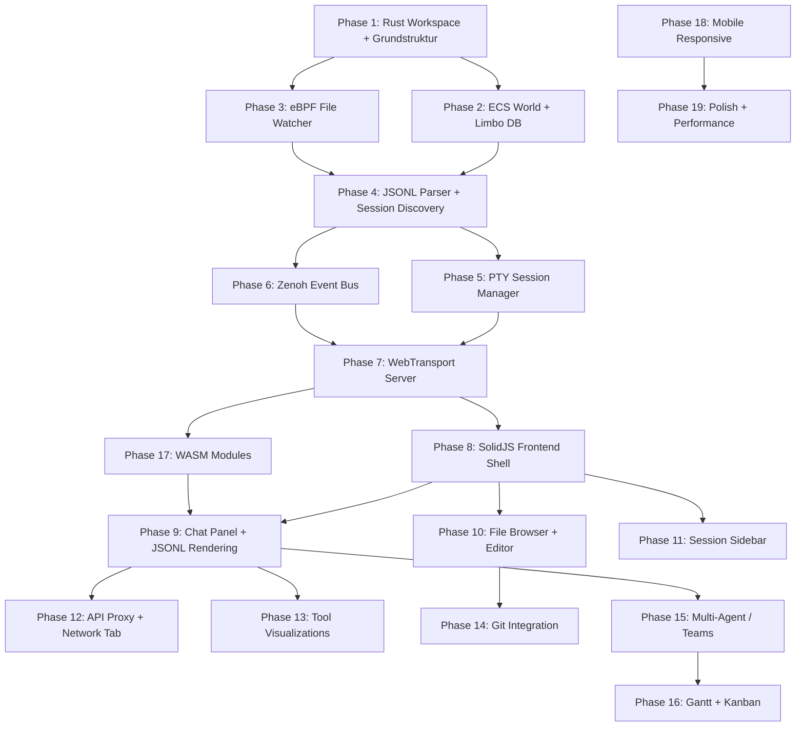

# Plan: claude-ide - Browser-basierte IDE fuer Claude Code
Size: L (Architecture)
Status: Draft
Version: v1.0 | Erstellt: 2026-02-20
Confidence: 85% - Umfangreiches Spec vorhanden, alle Architektur-Entscheidungen getroffen, Peer-Review durch Gemini/Codex/Claude eingearbeitet (v1.1). Risiko liegt in der Integrationstiefe von eBPF/Zenoh/Limbo (wenig Produktions-Referenzen fuer die Kombination)

---

## 0. MASTER-CHECKLISTE

### Phase 1: Analyse & Klaerung
- [x] 1. Header
- [x] 2. Blocking Questions
- [x] 3. Prerequisites Check
- [x] 4. TL;DR
- [x] 5. Kontext
- [x] 6. Glossar

### Phase 2: Planung & Design
- [x] 7. Quick Wins
- [x] 8. Nicht im Scope
- [x] 9. Abhaengigkeiten & Reihenfolge
- [x] 10. Risiko-Bewertung + Error Handling
- [x] 11. Security Checkliste
- [x] 12. Release Manager
- [x] 13. Git (lokal)
- [x] 14. GitHub (remote)
- [x] 15. Implementierungsschritte (mit VERIFY-Template)

### Phase 3: Konfiguration & Tests
- [x] 16. Dependencies & Packages
- [x] 17. Environment
- [x] 18. Feature Flags
- [x] 19. Test-Strategie + Observability + Performance
- [x] 20. Acceptance Criteria
- [x] 21. Decision Log

### Phase 4: Validierung & Abschluss
- [x] 22. Documentation Updates
- [x] 23. Rollback-Plan
- [x] 24. Cleanup nach Implementation
- [x] 25. PR Review Checkliste
- [x] 26. Erfolgskriterien
- [x] 27. Definition of Done
- [x] 28. Summary of Changes
- [x] 29. Lessons Learned
- [x] 30. Next Steps
- [x] 31. TodoWrite Items

---

## 1. HEADER

```
# Plan: claude-ide - Browser-basierte Real-time IDE fuer Claude Code
Size: L (Architecture)
Status: Draft
Version: v1.1 | Erstellt: 2026-02-20 | Peer-Review: Gemini + Codex (GPT-5.3) + Claude
Confidence: 85% - Architektur-Entscheidungen vollstaendig, Peer-Review eingearbeitet, Integrations-Risiko bei eBPF+Zenoh+Limbo
```

---

## 2. BLOCKING QUESTIONS (CRITICAL)

### Blocking Questions
- [x] Q1: Vollwertige IDE oder Viewer? → **Vollwertige IDE** (bidirektionaler Sync, Write-Scope)
- [x] Q2: Backend-Sprache? → **Rust** (Tokio + io_uring, axum, quinn)
- [x] Q3: Frontend-Framework? → **SolidJS** (feingranulare Reaktivitaet, kein VDOM)
- [x] Q4: Transport? → **HTTP/3 WebTransport only** (QUIC, kein WebSocket Fallback)
- [x] Q5: Session-Input-Methode? → **PTY stdin** (managed) + **tmux send-keys** (observed). NICHT claude -p --resume (startet Session neu)
- [x] Q6: Event Bus? → **Zenoh + SHM** (Rust-native, zero-copy lokal, QUIC remote)
- [x] Q7: Datenbank? → **Limbo** (SQLite-kompatibel, io_uring, async, FTS5)
- [x] Q8: File Watching? → **eBPF** (fanotify + tracing)
- [x] Q9: Wire Format? → **FlatBuffers** (hot path) + **MessagePack** (cold path) + **Zstd**
- [x] Q10: State Management? → **ECS** (hecs crate)
- [x] Q11: FUSE? → **NEIN** (zu komplex, nicht noetig)
- [x] Q12: xgrammar? → **Spaeter** (nicht Phase 1)

**Alle Blocking Questions wurden im /ask Interview-Modus geklaert.**

---

## 3. PREREQUISITES CHECK

- [x] Rust toolchain (rustup, cargo, wasm-pack) installiert
- [ ] eBPF-Support im Kernel (`CONFIG_BPF=y`, `CONFIG_BPF_SYSCALL=y`) - pruefen auf openSUSE
- [ ] Limbo crate Stabilitaet pruefen (experimentell, Stand Feb 2026)
- [ ] quinn (QUIC) + WebTransport Browser-Kompatibilitaet pruefen (Chrome/Firefox/Safari)
- [ ] Zenoh crate Version + SHM Feature-Flag testen
- [x] Node.js / npm fuer SolidJS Frontend
- [x] Git konfiguriert (obtFusi / jan.neubauer@live.com)
- [ ] FlatBuffers Compiler (`flatc`) installieren
- [x] RTX 3050 Ti + CUDA 12.8 (fuer spaetere ML-Features)

---

## 4. TL;DR

claude-ide ist eine Browser-basierte IDE die Claude Code Sessions in Echtzeit visualisiert und steuert. Der Rust-Backend-Server watched JSONL-Files via eBPF, managed Sessions ueber PTY/tmux, proxied API-Calls, und streamt alles ueber HTTP/3 WebTransport an ein SolidJS-Frontend. Kern-Differenzierung: ALLES aus dem JSONL wird angezeigt (inkl. versteckter System-Messages), API-Proxy mit Network-Tab, Multi-Agent Topology-Graph, interaktives Gantt mit Time-Tracking, und ein visuelles Design auf Catppuccin-Mocha-Basis mit Spring-Physics-Animationen und Breathing-Orb AI-Praesenz.

---

## 5. KONTEXT

**Warum:** Claude Code laeuft im Terminal und zeigt nur einen Bruchteil des tatsaechlichen Geschehens. Das JSONL-File enthaelt ALLES - System-Messages, Reasoning-Blocks, versteckte Tool-Calls, Compression-Events - aber das Terminal filtert und versteckt davon vieles. Eine Browser-IDE bietet:
1. Volle Transparenz: Alles aus dem JSONL sichtbar
2. Besseres Tooling: Code-Editor, Diff-Views, Git-Integration
3. Multi-Agent-Uebersicht: Team-Topologie, Gantt, Kanban
4. Bilder: Native Darstellung statt Terminal-Limitierung
5. API-Transparenz: Proxy loggt alle Anthropic API Calls
6. Mobile-Zugriff: QUIC/WebTransport ueber VPN/LAN

**Tech-Philosophie:** Enterprise SOTA 2026. Polyglot wo sinnvoll. Minimaler Ressourcen-Footprint. Low IOPs. 120Hz minimum Refresh.

---

## 6. GLOSSAR

| Begriff | Bedeutung |
|---------|-----------|
| **JSONL** | JSON Lines - Claude Codes Conversation-Format (eine JSON-Zeile pro Event) |
| **PTY** | Pseudo-Terminal - virtuelle Terminal-Schnittstelle fuer Session-Management |
| **Managed Session** | IDE spawnt Claude Code selbst, hat vollen PTY-Zugriff |
| **Observed Session** | Existierende Terminal-Session, IDE watched JSONL + tmux send-keys |
| **ECS** | Entity Component System - Cache-freundliches State-Management Pattern |
| **SHM** | Shared Memory - Zero-Copy Inter-Process Communication |
| **eBPF** | Extended Berkeley Packet Filter - Kernel-Level Monitoring ohne Kernel-Module |
| **fanotify** | File Access Notification - Linux Kernel API fuer File-Events |
| **FlatBuffers** | Zero-Copy Serialisierung (hot path, ~200 events/sec) |
| **MessagePack** | Binaeres JSON-kompaktes Format (cold path, ~2 events/sec) |
| **Limbo** | SQLite-kompatible Rust-DB mit nativem io_uring + async Support |
| **Zenoh** | Rust-native Pub/Sub mit SHM Support (ersetzt NATS) |
| **WebTransport** | HTTP/3-basiertes bidirektionales Streaming ueber QUIC |
| **Breathing Orb** | Pulsierender Kreis als AI-Aktivitaetsindikator |
| **Ghost Message** | Komprimierte Message bei 30% Opacity (Original aus JSONL) |

---

<!-- GATE 1: Alle Blocking Questions beantwortet? JA → Weiter zu Phase 2 -->

---

## 7. QUICK WINS

1. **Git Init + .gitignore** → Sofort erledigt
2. **Cargo Workspace Scaffolding** → `server/`, `wasm/jsonl-parser/`, `wasm/markdown/`, `wasm/compress/`
3. **SolidJS Projekt init** → `npm create solid` in `frontend/`
4. **FlatBuffers Schema** → `schemas/` mit initialen Message-Typen
5. **Catppuccin Mocha CSS Variables** → Design-Tokens sofort definierbar

---

## 8. NICHT IM SCOPE (Phase 1)

| Feature | Phase | Grund |
|---------|-------|-------|
| Conversation Branching (Fork) | Phase 2 | Komplexes State-Management, UI erst stabil |
| Export (MD/HTML/PDF/JSONL) | Phase 2 | Nice-to-have, nicht Core |
| WASM Plugin System | Phase 2 | Architektur muss erst stehen |
| Multi-LLM Adapter (Codex/Gemini) | Phase 2 | Erst Claude, dann erweitern |
| xgrammar | Phase 2+ | Experimentell |
| Agent Leaderboard + Radar Chart | Phase 2 | Erst Basis-Teams, dann Analytics |
| ElevenLabs TTS Integration | Phase 2 | Optional Audio-Feature |
| Internet Deployment (oeffentlich) | Phase 2+ | Erst LAN, dann Internet |
| Camera Capture (Mobile) | Phase 2 | Erst Desktop stabil |

---

## 9. ABHAENGIGKEITEN & REIHENFOLGE

### Dependency Graph (Mermaid)



### Parallelisierbar
- Phase 3 (eBPF) + Phase 2 (ECS/Limbo) koennen parallel
- Phase 9 (Chat) + Phase 10 (Editor) + Phase 11 (Sessions) koennen parallel nach Phase 8
- Phase 12 (API Proxy) + Phase 13 (Tool Viz) koennen parallel
- Phase 17 (WASM) kann parallel zu Frontend-Phasen

### Kritischer Pfad
```
Rust Workspace → ECS/Limbo → JSONL Parser → Session Manager → Zenoh → WebTransport → Frontend Shell → Chat Panel
```

---

## 10. RISIKO-BEWERTUNG + ERROR HANDLING

### Risiken

| Risiko | Schwere | Wahrscheinlichkeit | Mitigation |
|--------|---------|---------------------|------------|
| Limbo-Instabilitaet (experimentell) | High | Medium | Fallback auf rusqlite/SQLite mit io_uring wrapper; Limbo-Tests frueh ausfuehren |
| eBPF Kernel-Support auf openSUSE | Medium | Medium | Fallback auf fanotify direkt (ohne eBPF tracing); Kernel-Config pruefen in Phase 0 |
| WebTransport Browser-Support (Safari) | Medium | Low | Safari seit 17.4 (2024); Chrome/Firefox stabil; Safari-only Fallback: WebSocket |
| Zenoh SHM Stabilitaet | Medium | Low | Zenoh ist produktionsreif (Eclipse Foundation); SHM Feature explizit testen |
| 120Hz Rendering-Performance | High | Medium | SolidJS fine-grained reactivity; Virtual Scroller; Web Workers fuer WASM; GPU-accelerated CSS |
| JSONL-Files sehr gross (>100MB) | Medium | High | Streaming Parser, nur sichtbare Messages im DOM, Limbo fuer Indexing |
| PTY-Management Komplexitaet | Medium | Medium | portable-pty crate; tmux als Fallback fuer observed sessions |
| FlatBuffers Schema-Evolution | Low | Low | Schema-Versionierung von Anfang an; backwards-compatible changes only |
| Scope Creep durch Feature-Reichtum | High | High | Strikte Phase 1 Scope-Grenze; Features priorisieren |
| WebTransport Self-Signed Cert Rejection | High | High | Browser lehnen self-signed Certs fuer QUIC/WebTransport ab (anders als HTTPS). Loesung: `--origin-to-force-quic-on` Chrome-Flag ODER lokale CA mit mkcert generieren + Trust Store. Phase 0 pruefen |
| Event-Ordering Race Conditions | Medium | Medium | Mehrere Quellen (JSONL, PTY, Proxy, Watcher) koennen inkonsistente Reihenfolgen erzeugen. Loesung: Event-Protokoll mit event_id + source + sequence + logical_timestamp (Lamport Clock) |
| Backpressure bei Event-Spikes | Medium | Medium | Langsamer Client oder massive File-Changes koennen Event-Queue ueberfluten. Loesung: Bounded channels + Drop-Policy nach Event-Klasse (file.change droppable, message.new nicht) |
| File Conflict (User + Claude gleichzeitig) | Medium | Low | User editiert im IDE-Editor waehrend Claude via Tool dieselbe Datei schreibt. Loesung: Optimistic Locking + visuelle Warnung "Claude is writing to this file..." + auto-merge via OT/CRDT |
| COOP/COEP fuer SharedArrayBuffer | Medium | High | SharedArrayBuffer (WASM Workers) erfordert Cross-Origin-Isolation Header. Externe Ressourcen (Fonts, CDN) muessen self-hosted oder CORS-faehig sein |

### Event-Ordering Protokoll (NEU - aus Peer-Review)

Jedes Event im System bekommt:
```rust
pub struct EventEnvelope {
    pub event_id: Uuid,          // Globale Eindeutigkeit
    pub source: EventSource,      // JSONL | PTY | Proxy | Watcher | User
    pub sequence: u64,            // Monoton steigend pro Source
    pub logical_ts: u64,          // Lamport Clock (globale Ordnung)
    pub wall_ts: i64,             // Unix Timestamp (Darstellung)
    pub session_id: SessionId,    // Zuordnung
    pub dedup_key: Option<String>,// Fuer Dedup bei Echo-Events (PTY-Input → JSONL-Echo)
}
```
**Dedup-Regel:** Wenn ein JSONL-Event mit `dedup_key` empfangen wird das einem kuerzlich gesendeten PTY-Input entspricht, wird das JSONL-Event als "already seen" markiert (kein UI-Double).

### Backpressure-Strategie (NEU - aus Peer-Review)

| Event-Klasse | Queue-Groesse | Drop-Policy | Recovery |
|--------------|---------------|-------------|----------|
| message.new | Unbounded | Nie droppen | - |
| tool.result | 1000 | Nie droppen | - |
| file.change | 500 | Oldest-first drop | Snapshot nach reconnect |
| cursor.move | 10 | Latest-only (replace) | Kein Recovery noetig |
| metrics.update | 50 | Latest-only (replace) | Kein Recovery noetig |
| system.event | 100 | Nie droppen | - |

Bei Reconnect: Server sendet Snapshot des aktuellen States + Delta der verpassten non-droppable Events.

### Error Handling Strategie

| Error-Kategorie | Beispiele | Strategie |
|-----------------|-----------|-----------|
| **Fatal** | Limbo DB corrupt, eBPF attach fehlschlaegt, Port belegt | Graceful Shutdown mit Fehlermeldung im Browser, auto-restart via systemd |
| **Transient** | JSONL file locked, WebTransport disconnect, Zenoh timeout | Retry mit exponential backoff (max 5 Versuche, 100ms→3.2s) |
| **Recoverable** | JSONL parse error (einzelne Zeile), Session nicht gefunden, File deleted | Skip + Warning-Log, UI zeigt Ghost-Element mit Fehlerstatus |
| **Expected** | Session beendet, File nicht mehr da, empty JSONL | Normaler Control Flow, Session-Status auf "ended", File aus Tree entfernen |

**Pflicht-Fragen:**
- [x] Welche Fehler koennen auftreten? → 9+ Risiken identifiziert (siehe Tabelle)
- [x] Retry-Logik noetig? → Ja: WebTransport reconnect (exp. backoff), Zenoh reconnect, File watcher re-attach
- [x] User-Feedback bei Fehlern? → Inline-Toasts (Catppuccin Red), Statusbar-Indikator, Breathing-Orb ERROR State (rot pulsierend)
- [x] Fehler-Propagation? → eBPF/Watcher-Fehler → ECS Event → Zenoh broadcast → Frontend Toast. Fatal → Server shutdown → Browser "Disconnected" overlay
- [x] Logging? → Structured JSON (tracing crate), ERROR/WARN/INFO/DEBUG levels → Limbo DB + stdout

---

## 11. SECURITY CHECKLISTE

- [x] **Input Validation**: User-Input ueber WebTransport wird validiert (Message-Length-Limits, UTF-8 Check, keine Raw-Bytes an PTY ohne Sanitization)
- [x] **Auth/AuthZ**: JWT Token + API Key; Token-Refresh; Rate-Limiting pro Session
- [x] **Sensitive Data**: API Keys werden NICHT im JSONL angezeigt (Regex-Redaction: `sk-ant-*`, `Bearer *`); .env nie committet
- [x] **OWASP Top 10**: XSS (SolidJS escaped by default + CSP Header), Injection (PTY input sanitized, no shell=true), SSRF (API Proxy nur zu api.anthropic.com whitelist)
- [x] **TLS**: Selbstsigniertes Cert fuer LAN (quinn QUIC); Let's Encrypt fuer Internet-Phase
- [x] **eBPF Security**: BPF Programme laufen im Kernel - nur vorverifizierte Programme, kein dynamisches Laden von User-Input
- [x] **CORS**: Strict same-origin; API Proxy fuegt keine offenen CORS-Header hinzu
- [x] **COOP/COEP** (NEU): Cross-Origin-Isolation fuer SharedArrayBuffer (WASM Workers). Server sendet `Cross-Origin-Opener-Policy: same-origin` + `Cross-Origin-Embedder-Policy: require-corp`. Konsequenz: Monaspace Neon + Inter Fonts MUESSEN self-hosted werden (kein Google Fonts CDN). Phosphor Icons ebenfalls lokal bundlen
- [x] **WebTransport TLS** (NEU): Self-signed Certs werden von Browsern fuer QUIC/WebTransport abgelehnt (anders als HTTPS "accept risk"). Loesung Phase 0: `mkcert` lokale CA erstellen + im OS Trust Store installieren. Fuer LAN: CA-Cert auf Mobile-Geraete verteilen. Fuer Internet: Let's Encrypt

---

## 12. RELEASE MANAGER

### Glossar
| Begriff | Bedeutung |
|---------|-----------|
| **Check-in** | Status-Update (Was getan / Naechstes / Blocker / Confidence) |
| **Gate** | Schritt der explizites User-Approval braucht |
| **Blocker** | Problem das Weiterarbeit verhindert |
| **Discovery** | Ungeplante Entdeckung waehrend Implementation |

### Check-ins
**Frequenz:** `Pro Phase` (18 Phasen = 18 Check-ins)

### Gates
- [x] Phase 0 - Prerequisites pruefen (eBPF Kernel, Limbo, Zenoh SHM) → User Approval
- [ ] Phase 7 - WebTransport Server funktioniert end-to-end → User Demo
- [ ] Phase 9 - Chat Panel zeigt JSONL komplett → User Review (CRITICAL: "alles anzeigen")
- [ ] Phase 12 - API Proxy + Network Tab → User Review
- [ ] Phase 15 - Multi-Agent Teams → User Review
- [ ] Phase 19 - Final Polish → User Abnahme

### Discoveries
| Typ | Handling |
|-----|----------|
| Security | `Sofort fixen` |
| Bugs | `Sofort fixen` wenn blocking, sonst `Sammeln` |
| Performance | `Sammeln` (Performance-Phase ist 19) |
| Tech-Debt | `Sammeln` (Cleanup-Phase nach Implementation) |

---

## 13. GIT (lokal - IMMER)

**Status:** `Bereits initialisiert`

### Repository
- **Init noetig?** Nein (bereits `git init` ausgefuehrt)
- **Pfad:** `/work/claude-ide`

### Branch
- **Name:** `main` (direkt auf main da Greenfield-Projekt, Feature-Branches ab Phase 2)
- **Base:** n/a (neues Repo)

### Commits
- **Strategie:** `Atomar` - ein Commit pro abgeschlossener Phase/Schritt
- **Praefix:** `feat:` | `fix:` | `docs:` | `refactor:` | `test:` | `chore:`

### .gitignore
`.env`, `*.key`, `*.pem`, `*.db`, `*.db-shm`, `*.db-wal`, `node_modules/`, `target/`, `dist/`, `pkg/`, `__pycache__/`, `.claude-ide/images/`, `*.log`

---

## 14. GITHUB (remote) - OPTIONAL

**Status:** `Spaeter entscheiden`

### Issue
- **Typ:** `Epic` - claude-ide Gesamtprojekt
- **LLM-Regel:** Phasen sind pro Session abschliessbar

### PR
- **Titel:** `feat: claude-ide Phase N - [Beschreibung]`
- **Draft zuerst?** Ja

---

## 15. IMPLEMENTIERUNGSSCHRITTE

---

#### Schritt 0: Prerequisites pruefen
Komplexitaet: Simple
Gate: Ja (User Approval nach Ergebnis)

**Was:** eBPF Kernel-Support, Limbo Stabilitaet, Zenoh SHM Feature, quinn WebTransport, FlatBuffers Compiler, **WebTransport TLS Setup**, **COOP/COEP Kompatibilitaet** pruefen.

**Dateien:**
- `certs/` (NEU) - Verzeichnis fuer lokale CA + Certs (via mkcert)
- Keine weiteren Dateien - Bash-Commands

**VERIFY:**
- [ ] Test: `cat /boot/config-$(uname -r) | grep -E "CONFIG_BPF=|CONFIG_BPF_SYSCALL="` → beide `=y`
- [ ] Test: Minimaler Limbo-Test (create table, insert, select, FTS5 query)
- [ ] Test: Zenoh SHM Feature compiliert (`cargo check` mit `zenoh/shm` feature)
- [ ] Test: `flatc --version` → installiert
- [ ] Manuell: Quinn WebTransport Example compilieren und im Browser testen
- [ ] **NEU - WebTransport TLS:** `mkcert -install && mkcert localhost 127.0.0.1 ::1` → Cert im OS Trust Store, Browser akzeptiert WebTransport ohne Flags
- [ ] **NEU - COOP/COEP:** Test-HTML mit `Cross-Origin-Opener-Policy: same-origin` + `Cross-Origin-Embedder-Policy: require-corp` → `SharedArrayBuffer` verfuegbar in DevTools Console (`typeof SharedArrayBuffer !== 'undefined'`)
- [ ] **NEU - Font Self-Hosting:** Monaspace Neon + Inter Variable Font als WOFF2 herunterladen → `frontend/public/fonts/` → kein externer CDN-Zugriff noetig unter COEP
- [ ] Observability-Check: **N/A** (nur Prerequisite-Pruefung)
- [ ] Lessons-Check: Unerwartetes Verhalten? → .claude/CLAUDE.md

---

#### Schritt 1: Rust Workspace + Cargo Scaffolding
Komplexitaet: Simple
Gate: Nein

**Was:** Cargo Workspace mit allen Crates anlegen. Noch kein Code, nur Struktur.

**Dateien:**
- `Cargo.toml` (NEU) - Workspace root
- `server/Cargo.toml` (NEU) - Haupt-Server
- `server/src/main.rs` (NEU) - Entry point (minimal)
- `server/src/lib.rs` (NEU) - Library root
- `wasm/jsonl-parser/Cargo.toml` (NEU) - WASM JSONL Parser
- `wasm/jsonl-parser/src/lib.rs` (NEU) - WASM entry
- `wasm/markdown/Cargo.toml` (NEU) - WASM Markdown
- `wasm/markdown/src/lib.rs` (NEU) - WASM entry
- `wasm/compress/Cargo.toml` (NEU) - WASM Zstd
- `wasm/compress/src/lib.rs` (NEU) - WASM entry
- `schemas/messages.fbs` (NEU) - FlatBuffers Schema
- `.cargo-remote.toml` (NEU) - Remote Build Config

**Code (Diff-Style):**
```toml
# Cargo.toml (Workspace Root)
[workspace]
resolver = "2"
members = [
    "server",
    "wasm/jsonl-parser",
    "wasm/markdown",
    "wasm/compress",
]

[workspace.dependencies]
tokio = { version = "1", features = ["full", "io-uring"] }
axum = "0.8"
quinn = "0.11"
serde = { version = "1", features = ["derive"] }
serde_json = "1"
rmp-serde = "1"
flatbuffers = "24"
zenoh = { version = "1", features = ["shm"] }
hecs = "0.10"
tracing = "0.1"
tracing-subscriber = { version = "0.3", features = ["json"] }
```

**VERIFY:**
- [ ] Test: `cargo remote -- check` → compiles
- [ ] Manuell: Verzeichnisstruktur korrekt
- [ ] Observability-Check: **N/A** (nur Scaffolding)
- [ ] Lessons-Check: Unerwartetes Verhalten? → .claude/CLAUDE.md

---

#### Schritt 2: ECS World + Limbo DB Setup
Komplexitaet: Medium
Gate: Nein

**Was:** ECS World (hecs) mit allen Entity-Typen definieren. Limbo DB initialisieren mit Schema fuer Sessions, Messages, Files, Tasks, Agents. Grundlegende CRUD-Operationen.

**Dateien:**
- `server/src/ecs/mod.rs` (NEU) - ECS module
- `server/src/ecs/components.rs` (NEU) - Component definitions
- `server/src/ecs/systems.rs` (NEU) - System stubs
- `server/src/ecs/world.rs` (NEU) - World setup
- `server/src/db/mod.rs` (NEU) - Limbo module
- `server/src/db/schema.rs` (NEU) - SQL schema
- `server/src/db/queries.rs` (NEU) - Prepared statements

**Code (Diff-Style):**
```rust
// ecs/components.rs
+ pub struct SessionId(pub u64);
+ pub struct SessionState { pub status: Status, pub model: String, pub cost: f64 }
+ pub struct AgentInfo { pub name: String, pub agent_type: String, pub parent: Option<Entity> }
+ pub struct FileEntry { pub path: PathBuf, pub modified: SystemTime, pub size: u64 }
+ pub struct Message { pub role: Role, pub content: Content, pub timestamp: i64, pub tokens: u32 }
+ pub struct TaskItem { pub subject: String, pub status: TaskStatus, pub owner: Option<String> }
+ pub struct Metrics { pub cpu: f32, pub mem: u64, pub io_read: u64, pub io_write: u64 }
```

```sql
-- db/schema.rs (Limbo)
CREATE TABLE sessions (id INTEGER PRIMARY KEY, path TEXT, status TEXT, model TEXT, started_at INTEGER, cost REAL);
CREATE TABLE messages (id INTEGER PRIMARY KEY, session_id INTEGER REFERENCES sessions(id), role TEXT, content TEXT, timestamp INTEGER, tokens INTEGER, hidden INTEGER DEFAULT 0);
CREATE TABLE files (id INTEGER PRIMARY KEY, session_id INTEGER REFERENCES sessions(id), path TEXT, modified INTEGER, size INTEGER);
CREATE TABLE tasks (id INTEGER PRIMARY KEY, session_id INTEGER REFERENCES sessions(id), subject TEXT, status TEXT, owner TEXT);
CREATE TABLE agents (id INTEGER PRIMARY KEY, session_id INTEGER REFERENCES sessions(id), name TEXT, agent_type TEXT, parent_id INTEGER);
CREATE TABLE api_requests (id INTEGER PRIMARY KEY, session_id INTEGER REFERENCES sessions(id), method TEXT, url TEXT, request_body TEXT, response_body TEXT, status_code INTEGER, latency_ms INTEGER, timestamp INTEGER);
CREATE VIRTUAL TABLE messages_fts USING fts5(content, content=messages, content_rowid=id);
```

**VERIFY:**
- [ ] Test: `cargo remote -- test -p server -- ecs` → ECS World erstellt, Entities inserted/queried
- [ ] Test: `cargo remote -- test -p server -- db` → Limbo schema created, CRUD works, FTS5 query works
- [ ] Manuell: Limbo io_uring Backend aktiv (nicht fallback)
- [ ] Observability-Check:
  - Logging: DB-Initialisierung und Schema-Migration auf INFO-Level
  - Metriken: **N/A** (noch kein Runtime)
- [ ] Lessons-Check: Unerwartetes Verhalten? → .claude/CLAUDE.md

---

#### Schritt 3: eBPF File Watcher
Komplexitaet: Complex
Gate: Nein

**Was:** eBPF-basiertes File Watching mit fanotify fuer File-Events und optionalem eBPF tracing fuer Process-Level-Insights. Emittiert Events an ECS World.

**Dateien:**
- `server/src/watcher/mod.rs` (NEU) - Watcher module
- `server/src/watcher/ebpf.rs` (NEU) - eBPF setup + fanotify
- `server/src/watcher/events.rs` (NEU) - Event types
- `server/src/watcher/fallback.rs` (NEU) - inotify Fallback

**Code (Diff-Style):**
```rust
// watcher/events.rs
+ pub enum FileEvent {
+     Created { path: PathBuf, pid: Option<u32> },
+     Modified { path: PathBuf, pid: Option<u32>, bytes_written: u64 },
+     Deleted { path: PathBuf, pid: Option<u32> },
+     Renamed { from: PathBuf, to: PathBuf },
+ }

// watcher/ebpf.rs
+ pub struct EbpfWatcher {
+     fanotify_fd: RawFd,
+     watch_paths: Vec<PathBuf>,
+     event_tx: tokio::sync::mpsc::Sender<FileEvent>,
+ }
```

**VERIFY:**
- [ ] Test: `cargo remote -- test -p server -- watcher` → File create/modify/delete Events erkannt
- [ ] Test: Benchmark - 1000 File-Changes in 1s → alle Events empfangen, <1ms Latenz
- [ ] Manuell: fanotify auf `/tmp/test-watch/` → Datei anlegen → Event kommt
- [ ] Manuell: Fallback auf inotify wenn eBPF nicht verfuegbar
- [ ] Observability-Check:
  - Logging: Watch-Path hinzugefuegt (INFO), File-Event (DEBUG), Fehler (ERROR)
  - Metriken: `file_events_total` Counter, `file_event_latency_ms` Histogram
- [ ] Lessons-Check: Unerwartetes Verhalten? → .claude/CLAUDE.md

---

#### Schritt 4: JSONL Parser + Session Discovery
Komplexitaet: Medium
Gate: Nein

**Was:** Streaming JSONL Parser der Claude Code Conversation-Files parst. Session Discovery die `~/.claude/` rekursiv scannt und neue JSONL-Files erkennt. Parser muss ALLE Felder extrahieren - inkl. hidden, system-reminder, reasoning blocks.

**Dateien:**
- `server/src/parser/mod.rs` (NEU) - Parser module
- `server/src/parser/jsonl.rs` (NEU) - JSONL streaming parser
- `server/src/parser/types.rs` (NEU) - Claude Code Message types (alle!)
- `server/src/discovery/mod.rs` (NEU) - Session discovery
- `server/src/discovery/scanner.rs` (NEU) - ~/.claude/ scanner

**Code (Diff-Style):**
```rust
// parser/types.rs - ALLE Claude Code Message-Typen
+ pub enum MessageType {
+     User, Assistant, System, SystemReminder,
+     ToolUse, ToolResult,
+     Progress, // hook progress, streaming
+     Summary,  // context compression summary
+ }
+ pub struct ClaudeMessage {
+     pub uuid: String,
+     pub parent_uuid: Option<String>,
+     pub role: String,
+     pub message_type: MessageType,
+     pub content: Vec<ContentBlock>,
+     pub model: Option<String>,
+     pub usage: Option<Usage>,
+     pub timestamp: String,
+     pub is_sidechain: bool,
+     pub agent_id: Option<String>,
+     pub session_id: String,
+     pub git_branch: Option<String>,
+     pub cwd: Option<String>,
+ }
+ pub struct ContentBlock {
+     pub block_type: String, // text, tool_use, tool_result, thinking, image, etc.
+     pub text: Option<String>,
+     pub tool_name: Option<String>,
+     pub tool_input: Option<serde_json::Value>,
+     pub tool_result: Option<String>,
+     pub is_error: Option<bool>,
+     pub image_data: Option<String>, // base64
+ }
+ pub struct Usage {
+     pub input_tokens: u32,
+     pub output_tokens: u32,
+     pub cache_read_input_tokens: Option<u32>,
+     pub cache_creation_input_tokens: Option<u32>,
+ }
```

**VERIFY:**
- [ ] Test: Echtes Claude Code JSONL parsen → alle Messages extrahiert, keine fehlenden Felder
- [ ] Test: Sidechain-Messages (Subagents) korrekt als solche markiert
- [ ] Test: system-reminder, thinking blocks, hidden content korrekt extrahiert
- [ ] Test: Session Discovery findet alle JSONL-Files unter ~/.claude/
- [ ] Manuell: JSONL mit 10000+ Zeilen → Streaming-Parse ohne OOM
- [ ] Observability-Check:
  - Logging: Session discovered (INFO), Parse error auf einzelner Zeile (WARN, mit Zeilennummer)
  - Metriken: `jsonl_lines_parsed_total`, `jsonl_parse_errors_total`, `sessions_discovered`
- [ ] Lessons-Check: Unerwartetes Verhalten? → .claude/CLAUDE.md

---

#### Schritt 5: PTY Session Manager
Komplexitaet: Complex
Gate: Nein

**Was:** Managed Sessions: IDE spawnt Claude Code mit vollem PTY-Zugriff (stdin/stdout). Observed Sessions: JSONL Watch + tmux send-keys fuer Input. NICHT claude -p --resume (startet Session neu!).

**Dateien:**
- `server/src/session/mod.rs` (NEU) - Session module
- `server/src/session/managed.rs` (NEU) - PTY-basierte managed sessions
- `server/src/session/observed.rs` (NEU) - tmux-basierte observed sessions
- `server/src/session/types.rs` (NEU) - Session types + state machine

**Code (Diff-Style):**
```rust
// session/managed.rs
+ pub struct ManagedSession {
+     pub id: SessionId,
+     pub pty: PtyMaster,    // portable-pty
+     pub child: Child,
+     pub env: HashMap<String, String>, // ANTHROPIC_BASE_URL → Proxy
+ }
+ impl ManagedSession {
+     pub async fn spawn(config: SessionConfig) -> Result<Self>;
+     pub async fn send_input(&self, text: &str) -> Result<()>; // PTY stdin write
+     pub async fn read_output(&self) -> Result<String>; // PTY stdout read
+     pub async fn kill(&self) -> Result<()>;
+ }

// session/observed.rs
+ pub struct ObservedSession {
+     pub id: SessionId,
+     pub jsonl_path: PathBuf,
+     pub tmux_session: Option<String>,
+ }
+ impl ObservedSession {
+     pub async fn send_input(&self, text: &str) -> Result<()> {
+         // tmux send-keys -t {session} "{text}" Enter
+     }
+ }
```

**VERIFY:**
- [ ] Test: Managed Session spawnt `claude` und liest stdout → Token-Stream empfangen
- [ ] Test: Managed Session `send_input("hello")` → Claude antwortet
- [ ] Test: ANTHROPIC_BASE_URL korrekt gesetzt (Proxy)
- [ ] Test: Observed Session erkennt existierende Claude-Session
- [ ] Test: tmux send-keys Input → Claude empfaengt im Terminal
- [ ] Manuell: Session kill → Process terminated, JSONL-Datei bleibt
- [ ] Observability-Check:
  - Logging: Session spawned/killed (INFO), Input sent (DEBUG), PTY error (ERROR)
  - Metriken: `sessions_active` Gauge, `session_input_count`, `pty_errors_total`
- [ ] Lessons-Check: Unerwartetes Verhalten? → .claude/CLAUDE.md

---

#### Schritt 6: Zenoh Event Bus
Komplexitaet: Medium
Gate: Nein

**Was:** Zenoh als In-Process Event Bus mit SHM fuer lokale Zero-Copy Kommunikation. Topics: session/{id}/messages, files/{path}/changes, tasks/{team}/updates, agents/{id}/metrics.

**Dateien:**
- `server/src/bus/mod.rs` (NEU) - Event bus module
- `server/src/bus/zenoh_bus.rs` (NEU) - Zenoh setup + SHM config
- `server/src/bus/topics.rs` (NEU) - Topic definitions

**Code (Diff-Style):**
```rust
// bus/topics.rs
+ pub const SESSION_MESSAGES: &str = "session/{id}/messages";
+ pub const FILE_CHANGES: &str = "files/{path}/changes";
+ pub const TASK_UPDATES: &str = "tasks/{team}/updates";
+ pub const AGENT_METRICS: &str = "agents/{id}/metrics";
+ pub const SYSTEM_EVENTS: &str = "system/events";
```

**VERIFY:**
- [ ] Test: Publish + Subscribe auf topic → Message empfangen in <1ms (SHM)
- [ ] Test: 10000 Messages/sec throughput → kein Verlust
- [ ] Test: SHM aktiv (nicht TCP fallback) - `zenoh::config::whatami::PEER`
- [ ] Manuell: Zwei Subscriber auf gleichem Topic → beide empfangen
- [ ] Observability-Check:
  - Logging: Zenoh session opened (INFO), SHM attached (INFO), Publish error (ERROR)
  - Metriken: `zenoh_messages_published`, `zenoh_messages_received`, `zenoh_shm_bytes`
- [ ] Lessons-Check: Unerwartetes Verhalten? → .claude/CLAUDE.md

---

#### Schritt 7: WebTransport Server (quinn)
Komplexitaet: Complex
Gate: Ja (End-to-End Demo fuer User)

**Was:** HTTP/3 WebTransport Server mit quinn. Bidirektionale Streams. FlatBuffers fuer hot path (file.change, cursor.move), MessagePack fuer cold path (messages, tool_calls). Zstd Compression. Adaptive Quality (RTT-basiert).

**Dateien:**
- `server/src/transport/mod.rs` (NEU) - Transport module
- `server/src/transport/webtransport.rs` (NEU) - WebTransport setup via quinn
- `server/src/transport/codec.rs` (NEU) - FlatBuffers + MessagePack encoding
- `server/src/transport/adaptive.rs` (NEU) - RTT-basierte Quality-Tiers
- `server/src/main.rs` - Integration aller Komponenten

**Code (Diff-Style):**
```rust
// transport/adaptive.rs
+ pub enum QualityTier {
+     Full,    // <50ms RTT → 120Hz, alle Events
+     Batched, // 50-150ms RTT → 30Hz, Events batched
+     Critical,// >150ms RTT → 10Hz, nur kritische Events
+ }
+ pub fn determine_tier(rtt_ms: u32) -> QualityTier {
+     match rtt_ms {
+         0..=50 => QualityTier::Full,
+         51..=150 => QualityTier::Batched,
+         _ => QualityTier::Critical,
+     }
+ }
```

**VERIFY:**
- [ ] Test: Browser oeffnet WebTransport Connection → Handshake erfolgreich
- [ ] Test: Server sendet FlatBuffer Message → Browser dekodiert korrekt
- [ ] Test: Browser sendet MessagePack → Server dekodiert korrekt
- [ ] Test: Zstd Compression aktiv → Bandwidth ~70% reduziert
- [ ] Test: Adaptive Quality → RTT >150ms → Events werden gebatched
- [ ] Test: Reconnect nach Disconnect → Delta Sync (verpasste Events nachholen)
- [ ] Manuell: WebTransport im Chrome DevTools sichtbar
- [ ] Observability-Check:
  - Logging: Connection opened/closed (INFO), Quality tier change (INFO), Codec error (ERROR)
  - Metriken: `connections_active` Gauge, `bytes_sent/received`, `rtt_ms` Histogram, `quality_tier` Gauge
- [ ] Lessons-Check: Unerwartetes Verhalten? → .claude/CLAUDE.md

---

#### Schritt 8: SolidJS Frontend Shell
Komplexitaet: Medium
Gate: Nein

**Was:** SolidJS Projekt mit Vite 6, 3-Panel Layout, Catppuccin Mocha Design Tokens, Router, WebTransport Client. Grundstruktur aller Panels ohne Inhalt.

**Dateien:**
- `frontend/package.json` (NEU) - SolidJS + Vite 6 + Dependencies
- `frontend/vite.config.ts` (NEU) - Vite 6 Config + SWC
- `frontend/index.html` (NEU) - Entry HTML
- `frontend/src/App.tsx` (NEU) - 3-Panel Layout Root
- `frontend/src/styles/tokens.css` (NEU) - Catppuccin Mocha CSS Variables
- `frontend/src/styles/global.css` (NEU) - Global styles (gaps, scrollbar, fonts)
- `frontend/src/layouts/ThreePanel.tsx` (NEU) - Resizable 3-Panel
- `frontend/src/transport/client.ts` (NEU) - WebTransport Client
- `frontend/src/transport/codec.ts` (NEU) - FlatBuffers + MessagePack decoder
- `frontend/src/stores/session.ts` (NEU) - Session store (SolidJS signals)

**Code (Diff-Style):**
```css
/* styles/tokens.css - Catppuccin Mocha */
+ :root {
+   --ctp-rosewater: #f5e0dc; --ctp-flamingo: #f2cdcd;
+   --ctp-pink: #f5c2e7; --ctp-mauve: #cba6f7;
+   --ctp-red: #f38ba8; --ctp-maroon: #eba0ac;
+   --ctp-peach: #fab387; --ctp-yellow: #f9e2af;
+   --ctp-green: #a6e3a1; --ctp-teal: #94e2d5;
+   --ctp-sky: #89dceb; --ctp-sapphire: #74c7ec;
+   --ctp-blue: #89b4fa; --ctp-lavender: #b4befe;
+   --ctp-text: #cdd6f4; --ctp-subtext1: #bac2de;
+   --ctp-subtext0: #a6adc8; --ctp-overlay2: #9399b2;
+   --ctp-overlay1: #7f849c; --ctp-overlay0: #6c7086;
+   --ctp-surface2: #585b70; --ctp-surface1: #45475a;
+   --ctp-surface0: #313244; --ctp-base: #1e1e2e;
+   --ctp-mantle: #181825; --ctp-crust: #11111b;
+   --gap: 4px;
+   --font-code: 'Monaspace Neon', monospace;
+   --font-ui: 'Inter', sans-serif;
+   --scrollbar-width: 6px;
+ }
```

```tsx
// layouts/ThreePanel.tsx
+ <div class="three-panel">
+   <aside class="panel-left" style={{ width: `${leftWidth()}px` }}>
+     <Slot name="left" />
+   </aside>
+   <div class="resize-handle" onPointerDown={startResizeLeft} />
+   <main class="panel-center">
+     <TabBar tabs={centerTabs()} active={activeTab()} />
+     <Slot name="center" />
+   </main>
+   <div class="resize-handle" onPointerDown={startResizeRight} />
+   <aside class="panel-right" style={{ width: `${rightWidth()}px` }}>
+     <Slot name="right" />
+   </aside>
+   <Statusbar />
+ </div>
```

**VERIFY:**
- [ ] Test: `npm run dev` → Browser oeffnet, 3-Panel sichtbar
- [ ] Test: Resize-Handles funktionieren (Drag)
- [ ] Test: Catppuccin Mocha Farben korrekt
- [ ] Test: WebTransport Client verbindet sich zum Server
- [ ] Test: Monaspace Neon + Inter Fonts laden
- [ ] Manuell: Custom Scrollbar (6px, auto-hide)
- [ ] Manuell: Gap-Borders (4px, kein Border)
- [ ] Observability-Check:
  - Logging: Connection status in Browser Console (INFO)
  - Metriken: **N/A** (Frontend-Shell)
- [ ] Lessons-Check: Unerwartetes Verhalten? → .claude/CLAUDE.md

---

#### Schritt 9: Chat Panel + JSONL Rendering
Komplexitaet: Complex
Gate: Ja (CRITICAL: User muss pruefen dass ALLES angezeigt wird)

**Was:** Vollstaendiges Chat-Panel das ALLE JSONL-Inhalte rendert. Custom Virtual Scroller (~25 DOM-Nodes). Collapsible Cards pro Tool-Call. Token Heatmap. Ghost Messages fuer Compression. Model Badge. Context Meter. Breathing Orb. NICHTS verstecken.

**Dateien:**
- `frontend/src/components/chat/ChatPanel.tsx` (NEU)
- `frontend/src/components/chat/MessageCard.tsx` (NEU)
- `frontend/src/components/chat/ToolCard.tsx` (NEU)
- `frontend/src/components/chat/SystemMessage.tsx` (NEU) - system-reminder, hidden content
- `frontend/src/components/chat/ThinkingBlock.tsx` (NEU) - reasoning/thinking blocks
- `frontend/src/components/chat/GhostMessage.tsx` (NEU) - compressed messages (30% opacity)
- `frontend/src/components/chat/VirtualScroller.tsx` (NEU) - custom virtual scroll
- `frontend/src/components/chat/TokenHeatmap.tsx` (NEU) - token usage visualization
- `frontend/src/components/chat/ContextMeter.tsx` (NEU) - context window bar
- `frontend/src/components/chat/BreathingOrb.tsx` (NEU) - AI presence indicator
- `frontend/src/components/chat/ModelBadge.tsx` (NEU) - model name + switch
- `frontend/src/components/chat/InputField.tsx` (NEU) - message input

**Breathing Orb - Status-Source-Hierarchie (Peer-Review Upgrade v1.1):**
Der Orb leitet seinen State aus BEIDEN Quellen ab, mit klarer Prioritaet:
1. **PTY Stream (Primary, Low-Latency):** ANSI-Escape-Sequenzen + Spinner-Patterns im stdout erkennen.
   Parser sucht nach: `⠋⠙⠹⠸⠼⠴⠦⠧⠇⠏` (Braille-Spinner = THINKING), `▍` (Block-Cursor = STREAMING),
   Tool-Output-Patterns (= TOOL_USE). PTY liefert State-Changes in <10ms.
2. **JSONL Events (Secondary, Authoritative):** `type: "assistant"` mit `stop_reason` Feld = Status-Bestaetigungen.
   JSONL Events sind 200-500ms verzoegert gegenueber PTY, dienen aber als Ground-Truth fuer den finalen State.
3. **Reconciliation:** PTY setzt State sofort (optimistisch). JSONL korrigiert innerhalb von 500ms falls abweichend.
   Bei Widerspruch nach 1s Timeout: JSONL gewinnt (authoritative source).

| PTY Signal | JSONL Confirmation | Orb State |
|------------|-------------------|-----------|
| Braille Spinner detected | `type: "assistant"` ohne content | THINKING |
| Block cursor + streaming text | `type: "assistant"` mit content delta | STREAMING |
| Tool output pattern | `type: "assistant"` mit `tool_use` | TOOL_USE |
| Error ANSI codes (red) | `type: "assistant"` mit `stop_reason: "error"` | ERROR |
| Keine Aktivitaet >2s | Letztes Event ist `stop_reason: "end_turn"` | IDLE |

**VERIFY:**
- [ ] Test: Echtes JSONL laden → ALLE Messages sichtbar (inkl. system-reminder, hidden, thinking)
- [ ] Test: Virtual Scroller → nur ~25 DOM-Nodes bei 1000+ Messages
- [ ] Test: Token Heatmap zeigt Farb-Intensitaet pro Message
- [ ] Test: Ghost Messages bei komprimierten Conversations (30% Opacity)
- [ ] Test: Breathing Orb reagiert auf Session-Status (IDLE/THINKING/STREAMING/TOOL_USE/ERROR)
- [ ] Test: Breathing Orb wechselt State innerhalb <50ms nach PTY-Signal (optimistisch)
- [ ] Test: JSONL-Reconciliation korrigiert Orb-State innerhalb 500ms bei Divergenz
- [ ] Test: Model Badge zeigt korrekten Modellnamen (opus-4-6, sonnet-4-6, etc.)
- [ ] Test: Context Meter zeigt verbrauchten Anteil des Context Windows
- [ ] Manuell: Spring-Physics Animationen smooth bei 120Hz
- [ ] Manuell: Markdown-Rendering (WASM pulldown-cmark) korrekt
- [ ] Observability-Check:
  - Logging: Render errors (WARN), WASM parse errors (ERROR)
  - Metriken: FPS Counter (sichtbar in Profiler), DOM node count
- [ ] Lessons-Check: Unerwartetes Verhalten? → .claude/CLAUDE.md

---

#### Schritt 10: File Browser + Editor
Komplexitaet: Medium
Gate: Nein

**Was:** Live-animierter File Tree im Left Panel. CodeMirror 6 Editor mit Syntax Highlighting, Git Blame inline, Merge View. File-Changes werden via eBPF/Zenoh in Echtzeit reflektiert.

**Conflict Resolution - Gleichzeitige Edits (Peer-Review Upgrade v1.1):**
Wenn der User im CodeMirror Editor tippt waehrend Claude Code (via Tool-Call) dieselbe Datei bearbeitet:

1. **Authority-Regel:** Claude Code ist IMMER die Authority fuer Tool-basierte Edits.
   Der User editiert in einer "Overlay-Session" - seine Aenderungen werden als Patch gehalten.
2. **Detection:** eBPF meldet welcher Prozess (PID) die Datei geschrieben hat.
   - Claude Code PID → `source: "claude"` → Editor akzeptiert sofort (autoritativ)
   - Anderer PID → `source: "external"` → normaler File-Watch-Update
3. **User-Edit-Schutz:**
   - Wenn User aktiv im Editor tippt (Keystroke <2s alt) UND Claude schreibt dieselbe Datei:
     → **Gelber Banner:** "Claude bearbeitet diese Datei - deine Aenderungen werden nach Abschluss gemerged"
     → User-Patches werden in einem OT (Operational Transform) Buffer gehalten
     → Nach Claude's Edit: 3-Wege-Merge (Base → Claude's Version + User's Patches)
     → Bei Merge-Konflikt: CodeMirror Merge View oeffnet sich automatisch
4. **Optimistic Lock:** Editor setzt `editing_lock: { user: true, file: "path", since: timestamp }`
   im ECS-State. Kann von Claude-Events ueberschrieben werden (Claude > User Authority).

**Dateien:**
- `frontend/src/components/files/FileTree.tsx` (NEU) - animierter File Browser
- `frontend/src/components/files/FileNode.tsx` (NEU) - einzelner File/Folder Node
- `frontend/src/components/editor/EditorPanel.tsx` (NEU) - CodeMirror 6 wrapper
- `frontend/src/components/editor/DiffView.tsx` (NEU) - CodeMirror Merge View
- `frontend/src/components/editor/BlameGutter.tsx` (NEU) - Git blame annotations
- `frontend/src/components/editor/ConflictBanner.tsx` (NEU) - "Claude bearbeitet..." Banner
- `frontend/src/lib/ot-buffer.ts` (NEU) - Operational Transform Buffer fuer User-Patches

**VERIFY:**
- [ ] Test: File Tree zeigt Working Directory korrekt
- [ ] Test: File aendern → Tree-Update in <100ms (animiert)
- [ ] Test: File oeffnen → CodeMirror 6 mit Syntax Highlighting
- [ ] Test: Merge View zeigt Diff korrekt (gruen/rot)
- [ ] Test: Conflict Banner erscheint wenn Claude und User gleichzeitig editieren
- [ ] Test: User-Patches werden nach Claude-Edit korrekt gemerged (3-Wege-Merge)
- [ ] Test: Bei Merge-Konflikt → automatischer Merge View
- [ ] Manuell: Catppuccin File Icons korrekt nach Dateityp
- [ ] Manuell: Phosphor Icons mit Weight Morphing
- [ ] Observability-Check:
  - Logging: File tree update events (DEBUG), Conflict events (WARN), Merge results (INFO)
  - Metriken: conflict_count (Counter), merge_success_rate (Gauge)
- [ ] Lessons-Check: Unerwartetes Verhalten? → .claude/CLAUDE.md

---

#### Schritt 11: Session Sidebar
Komplexitaet: Simple
Gate: Nein

**Was:** Left Panel: Liste aller aktiven und archivierten Sessions. Session-Status (Breathing Orb pro Session). Klick oeffnet Session im Chat Panel. Resume-Button fuer archivierte Sessions.

**Dateien:**
- `frontend/src/components/sessions/SessionList.tsx` (NEU)
- `frontend/src/components/sessions/SessionCard.tsx` (NEU)
- `frontend/src/components/sessions/SessionStatus.tsx` (NEU)

**VERIFY:**
- [ ] Test: Alle aktiven Sessions sichtbar mit Status
- [ ] Test: Archivierte Sessions mit Resume-Option
- [ ] Test: Session-Wechsel → Chat Panel aktualisiert
- [ ] Manuell: Session-Orb-Farben korrekt (Lavender=active, Overlay=archived)
- [ ] Observability-Check: **N/A** (UI-only)
- [ ] Lessons-Check: Unerwartetes Verhalten? → .claude/CLAUDE.md

---

#### Schritt 12: API Proxy + Network Tab
Komplexitaet: Medium
Gate: Ja (User Review)

**Was:** Rust Proxy der ANTHROPIC_BASE_URL abfaengt. Loggt alle API Requests/Responses in Limbo. Frontend Network Tab mit Waterfall-Ansicht, Request/Response Bodies, Timing.

**Dateien:**
- `server/src/proxy/mod.rs` (NEU) - API Proxy module
- `server/src/proxy/handler.rs` (NEU) - Request/Response logging
- `server/src/proxy/mitm.rs` (NEU) - HTTPS forwarding to api.anthropic.com
- `frontend/src/components/network/NetworkPanel.tsx` (NEU)
- `frontend/src/components/network/RequestRow.tsx` (NEU)
- `frontend/src/components/network/RequestDetail.tsx` (NEU)

**VERIFY:**
- [ ] Test: Claude Code mit ANTHROPIC_BASE_URL=localhost:PORT → Proxy empfaengt
- [ ] Test: Request + Response Bodies korrekt in Limbo gespeichert
- [ ] Test: Network Tab zeigt Waterfall mit Timing
- [ ] Test: Request-Body (Token-Count, Model, Messages) sichtbar
- [ ] Test: Response-Body (Generated Text, Usage) sichtbar
- [ ] Manuell: Latenz-Overhead des Proxy <5ms
- [ ] Observability-Check:
  - Logging: Proxy request (INFO), Upstream error (ERROR)
  - Metriken: `proxy_requests_total`, `proxy_latency_ms`, `proxy_bytes_sent/received`
- [ ] Lessons-Check: Unerwartetes Verhalten? → .claude/CLAUDE.md

---

#### Schritt 13: Tool Visualizations
Komplexitaet: Medium
Gate: Nein

**Was:** Jeder Claude Code Tool-Typ bekommt eine spezielle Visualisierung als Collapsible Card im Chat.

**Dateien:**
- `frontend/src/components/tools/EditCard.tsx` (NEU) - Inline Diff (gruen/rot)
- `frontend/src/components/tools/BashCard.tsx` (NEU) - Terminal-Output
- `frontend/src/components/tools/ReadCard.tsx` (NEU) - Syntax-highlighted Preview
- `frontend/src/components/tools/GrepCard.tsx` (NEU) - Klickbare Match-Liste
- `frontend/src/components/tools/GlobCard.tsx` (NEU) - File-Liste mit Icons
- `frontend/src/components/tools/WebSearchCard.tsx` (NEU) - Suchergebnis-Cards
- `frontend/src/components/tools/WebFetchCard.tsx` (NEU) - Mini Page-Preview
- `frontend/src/components/tools/LspCard.tsx` (NEU) - Go-to-Definition Links
- `frontend/src/components/tools/NotebookCard.tsx` (NEU) - Jupyter Cell Render
- `frontend/src/components/tools/PdfCard.tsx` (NEU) - Inline Page-Viewer
- `frontend/src/components/tools/PermissionCard.tsx` (NEU) - Permission Modal (Y/N/A)

**VERIFY:**
- [ ] Test: Jeder Tool-Typ wird mit korrekter Visualisierung gerendert
- [ ] Test: Edit-Card zeigt Inline-Diff korrekt
- [ ] Test: Bash-Card zeigt Terminal-Output mit ANSI-Farben
- [ ] Test: Cards sind collapsible (animiert)
- [ ] Manuell: Alle 11 Tool-Typen visuell pruefen
- [ ] Observability-Check: **N/A** (pure UI components)
- [ ] Lessons-Check: Unerwartetes Verhalten? → .claude/CLAUDE.md

---

#### Schritt 14: Git Integration
Komplexitaet: Medium
Gate: Nein

**Was:** Git Blame, Branches, Staging-Area, Commit-History live im Editor. Server-seitig via libgit2 (git2 crate).

**Dateien:**
- `server/src/git/mod.rs` (NEU) - Git module
- `server/src/git/blame.rs` (NEU) - Blame per file
- `server/src/git/status.rs` (NEU) - Staging, branches, log
- `frontend/src/components/git/BranchSelector.tsx` (NEU)
- `frontend/src/components/git/StagingArea.tsx` (NEU)
- `frontend/src/components/git/CommitHistory.tsx` (NEU)

**VERIFY:**
- [ ] Test: Git blame fuer File → Zeilen-Annotationen korrekt
- [ ] Test: Branch-Wechsel → File Tree aktualisiert
- [ ] Test: Staging Area zeigt geaenderte Files
- [ ] Test: Commit History mit Diff-Ansicht
- [ ] Manuell: Real-time Update wenn Claude Code einen Commit macht
- [ ] Observability-Check:
  - Logging: Git operation errors (WARN)
  - Metriken: **N/A**
- [ ] Lessons-Check: Unerwartetes Verhalten? → .claude/CLAUDE.md

---

#### Schritt 15: Multi-Agent / Teams
Komplexitaet: Complex
Gate: Ja (User Review)

**Was:** Agent Topology Graph (force-directed, animiert). Animated Message Bubbles zwischen Agents. Swimlane Timeline. Team-Konfiguration aus ~/.claude/teams/ lesen.

**Dateien:**
- `server/src/teams/mod.rs` (NEU) - Teams module
- `server/src/teams/discovery.rs` (NEU) - Team config reader
- `server/src/teams/topology.rs` (NEU) - Agent-Beziehungen
- `frontend/src/components/teams/TeamsPanel.tsx` (NEU) - Center Tab
- `frontend/src/components/teams/TopologyGraph.tsx` (NEU) - Force-directed Graph
- `frontend/src/components/teams/MessageBubble.tsx` (NEU) - Animated bubbles
- `frontend/src/components/teams/SwimlaneTL.tsx` (NEU) - Swimlane Timeline
- `frontend/src/components/teams/AgentCard.tsx` (NEU) - Agent Info Card

**VERIFY:**
- [ ] Test: Team-Config gelesen → Agents als Nodes im Graph
- [ ] Test: Messages zwischen Agents → Animierte Bubbles auf Graph-Edges
- [ ] Test: Swimlane Timeline zeigt parallele Agent-Aktivitaet
- [ ] Test: Sidechain-Messages korrekt dem Parent-Agent zugeordnet
- [ ] Manuell: Force-directed Layout reagiert auf neue Agents dynamisch
- [ ] Manuell: Spring-Physics Animationen smooth
- [ ] Observability-Check:
  - Logging: Team discovered (INFO), Agent spawn/kill (INFO)
  - Metriken: `agents_active` Gauge, `team_messages_total`
- [ ] Lessons-Check: Unerwartetes Verhalten? → .claude/CLAUDE.md

---

#### Schritt 16: Gantt + Kanban
Komplexitaet: Medium
Gate: Nein

**Was:** Right Panel: Tasks als Kanban-Board (Pending/InProgress/Completed) mit Toggle zu interaktivem Gantt. Gantt zeigt Zeitachse pro Agent mit Time-Tracking. Gantt-Balken sind draggable.

**Dateien:**
- `frontend/src/components/tasks/TaskPanel.tsx` (NEU) - Right Sidebar Tasks
- `frontend/src/components/tasks/KanbanBoard.tsx` (NEU) - Kanban View
- `frontend/src/components/tasks/KanbanColumn.tsx` (NEU) - Kanban Column
- `frontend/src/components/tasks/KanbanCard.tsx` (NEU) - Draggable Task Card
- `frontend/src/components/gantt/GanttPanel.tsx` (NEU) - Center Tab Gantt
- `frontend/src/components/gantt/GanttChart.tsx` (NEU) - Interactive Gantt
- `frontend/src/components/gantt/GanttBar.tsx` (NEU) - Draggable Bar
- `frontend/src/components/gantt/TimeTracker.tsx` (NEU) - Agent time tracking

**VERIFY:**
- [ ] Test: Tasks erscheinen im Kanban korrekt nach Status
- [ ] Test: Drag&Drop zwischen Kanban-Spalten funktioniert
- [ ] Test: Gantt zeigt Zeitachse pro Agent
- [ ] Test: Time-Tracking Daten korrekt (Start/End/Duration)
- [ ] Test: Gantt-Balken draggable fuer manuelle Anpassung
- [ ] Manuell: Toggle Kanban ↔ Gantt im Right Panel
- [ ] Observability-Check: **N/A** (UI-only)
- [ ] Lessons-Check: Unerwartetes Verhalten? → .claude/CLAUDE.md

---

#### Schritt 17: WASM Modules
Komplexitaet: Medium
Gate: Nein

**Was:** Drei Rust→WASM Module fuer Performance-kritische Frontend-Operationen. Laufen in Web Workers mit SharedArrayBuffer.

**Dateien:**
- `wasm/jsonl-parser/src/lib.rs` - JSONL Streaming Parser
- `wasm/markdown/src/lib.rs` - pulldown-cmark Markdown Renderer
- `wasm/compress/src/lib.rs` - Zstd Decoder
- `frontend/src/workers/jsonl.worker.ts` (NEU) - Web Worker fuer JSONL
- `frontend/src/workers/markdown.worker.ts` (NEU) - Web Worker fuer Markdown
- `frontend/src/workers/compress.worker.ts` (NEU) - Web Worker fuer Zstd

**VERIFY:**
- [ ] Test: `wasm-pack build` fuer alle 3 Module → .wasm Files erzeugt
- [ ] Test: JSONL Worker parst 10000 Zeilen in <100ms
- [ ] Test: Markdown Worker rendert komplexes MD korrekt
- [ ] Test: Zstd Worker dekomprimiert Nachrichten korrekt
- [ ] Test: SharedArrayBuffer Transfer zwischen Main Thread und Workers
- [ ] Manuell: Main Thread bleibt bei 120Hz waehrend WASM parst
- [ ] Observability-Check:
  - Logging: WASM init (DEBUG), Parse errors (WARN)
  - Metriken: Worker parse time (Performance API)
- [ ] Lessons-Check: Unerwartetes Verhalten? → .claude/CLAUDE.md

---

#### Schritt 18: Mobile Responsive
Komplexitaet: Medium
Gate: Nein

**Was:** Bottom Tab Bar fuer Mobile (Chat, Files, Tasks, Teams, More). Swipe zwischen Sub-Views. Simplified Gantt (Portrait) + Full (Landscape). Adaptive Quality basiert auf RTT. QUIC Connection Migration (WiFi↔Cellular).

**Dateien:**
- `frontend/src/layouts/MobileLayout.tsx` (NEU) - Mobile Layout
- `frontend/src/components/mobile/BottomTabBar.tsx` (NEU) - Tab Navigation
- `frontend/src/components/mobile/SwipeView.tsx` (NEU) - Swipe Container
- `frontend/src/components/mobile/VoiceInput.tsx` (NEU) - Web Speech API
- `frontend/src/hooks/useMediaQuery.ts` (NEU) - Responsive hooks
- `frontend/src/hooks/useHaptic.ts` (NEU) - Vibration API

**VERIFY:**
- [ ] Test: Viewport <768px → Mobile Layout aktiv
- [ ] Test: Bottom Tab Bar navigiert zwischen Panels
- [ ] Test: Swipe links/rechts zwischen Chat/Editor/Diff
- [ ] Test: Voice Input oeffnet Web Speech API
- [ ] Test: Landscape → Gantt zeigt volle Ansicht
- [ ] Manuell: Touch-Targets mindestens 44px
- [ ] Manuell: Haptic Feedback bei Button-Taps
- [ ] Observability-Check: **N/A** (UI-only)
- [ ] Lessons-Check: Unerwartetes Verhalten? → .claude/CLAUDE.md

---

#### Schritt 19: Polish + Performance
Komplexitaet: Complex
Gate: Ja (User Abnahme)

**Was:** Performance Profiler (FPS, Latenz, Memory, Events/sec). Gallery Tab (Images). Keyboard Shortcuts (VS Code kompatibel). Command Palette (Spotlight-Style). Glassmorphism Context Menu. Skeleton Loading. Browser Notifications. Performance-Optimierung auf 120Hz.

**Dateien:**
- `frontend/src/components/profiler/ProfilerPanel.tsx` (NEU)
- `frontend/src/components/gallery/GalleryPanel.tsx` (NEU)
- `frontend/src/components/gallery/Lightbox.tsx` (NEU)
- `frontend/src/components/shared/CommandPalette.tsx` (NEU)
- `frontend/src/components/shared/ContextMenu.tsx` (NEU)
- `frontend/src/components/shared/SkeletonLoader.tsx` (NEU)
- `frontend/src/components/settings/SettingsPanel.tsx` (NEU) - MCP/Hooks/Worktrees
- `frontend/src/shortcuts/keymap.ts` (NEU) - VS Code compatible shortcuts

**VERIFY:**
- [ ] Test: FPS Counter zeigt konstant 120Hz bei normalem Usage
- [ ] Test: Gallery zeigt alle Session-Bilder mit Lightbox
- [ ] Test: Cmd+K oeffnet Command Palette mit Fuzzy Search
- [ ] Test: Rechtsklick → Glassmorphism Context Menu
- [ ] Test: Skeleton Loading beim App-Start
- [ ] Test: Browser Notifications bei wichtigen Events
- [ ] Manuell: Spring-Physics Animationen ueberall smooth
- [ ] Manuell: Phosphor Icon Weight Morphing bei Hover
- [ ] Manuell: Alle 7 Curated Effects visuell pruefen
- [ ] Observability-Check:
  - Logging: Performance warnings (WARN wenn FPS <60)
  - Metriken: FPS, Memory Usage, Event throughput, Render time
- [ ] Lessons-Check: Unerwartetes Verhalten? → .claude/CLAUDE.md

---

## 16. DEPENDENCIES & PACKAGES

### Rust (server/Cargo.toml)

| Package | Version | Grund |
|---------|---------|-------|
| tokio | 1.x (io-uring feature) | Async Runtime + io_uring |
| axum | 0.8 | HTTP Server |
| quinn | 0.11 | QUIC / WebTransport |
| hecs | 0.10 | ECS World |
| zenoh | 1.x (shm feature) | Event Bus + SHM |
| limbo-core | latest | SQLite-kompatible DB |
| serde / serde_json | 1.x | JSON Serialisierung |
| rmp-serde | 1.x | MessagePack Serialisierung |
| flatbuffers | 24.x | FlatBuffers Runtime |
| tracing / tracing-subscriber | 0.1/0.3 | Structured Logging |
| portable-pty | latest | PTY Management |
| git2 | latest | libgit2 Bindings |
| zstd | latest | Zstd Compression |
| jsonwebtoken | latest | JWT Auth |
| aya | latest | eBPF Framework (Rust) |

### Rust (wasm/*/Cargo.toml)

| Package | Version | Grund |
|---------|---------|-------|
| wasm-bindgen | latest | Rust→WASM Bindings |
| serde_json | 1.x | JSONL Parsing |
| pulldown-cmark | latest | Markdown→HTML |
| zstd | latest (wasm feature) | Zstd Decoder |

### Frontend (frontend/package.json)

| Package | Version | Grund |
|---------|---------|-------|
| solid-js | latest | UI Framework |
| @solidjs/router | latest | Routing |
| vite | 6.x | Build Tool |
| @codemirror/view | 6.x | Code Editor |
| @codemirror/merge | 6.x | Merge/Diff View |
| @codemirror/lang-* | 6.x | Syntax Highlighting |
| @phosphor-icons/web | latest | Icon Library |
| flatbuffers | latest | FlatBuffers JS Runtime |
| @msgpack/msgpack | latest | MessagePack JS |

---

## 17. ENVIRONMENT

| Variable | Beschreibung | Default |
|----------|-------------|---------|
| `CLAUDE_IDE_PORT` | WebTransport Server Port | `4433` |
| `CLAUDE_IDE_HTTP_PORT` | HTTP Fallback / Static Files | `8080` |
| `CLAUDE_IDE_DB_PATH` | Limbo DB Pfad | `/data/claude-ide/ide.db` |
| `CLAUDE_IDE_WATCH_PATHS` | Komma-separierte Watch-Pfade | `~/.claude/` |
| `CLAUDE_IDE_JWT_SECRET` | JWT Signing Secret | (generiert) |
| `CLAUDE_IDE_TLS_CERT` | TLS Certificate Path | `./certs/cert.pem` |
| `CLAUDE_IDE_TLS_KEY` | TLS Private Key Path | `./certs/key.pem` |
| `ANTHROPIC_BASE_URL` | API Proxy Target (gesetzt fuer Managed Sessions) | `http://localhost:4434` |
| `CLAUDE_IDE_LOG_LEVEL` | Log Level | `info` |

---

## 18. FEATURE FLAGS

| Flag | Default | Beschreibung |
|------|---------|-------------|
| `ENABLE_EBPF` | `true` | eBPF File Watching (false → inotify Fallback) |
| `ENABLE_SHM` | `true` | Zenoh Shared Memory (false → TCP) |
| `ENABLE_WASM_PARSER` | `true` | WASM JSONL Parser (false → JS Parser) |
| `ENABLE_API_PROXY` | `true` | API Proxy + Network Tab |
| `ENABLE_PROFILER` | `false` | Performance Profiler Panel |
| `ENABLE_AUDIO` | `false` | UI Sounds |

---

## 19. TEST-STRATEGIE + OBSERVABILITY + PERFORMANCE

### A) Test-Kategorien

#### Unit Tests
- **Was testen:** JSONL Parser, ECS Components, Limbo Queries, FlatBuffers Codec, Zenoh Message Routing
- **Tool:** `cargo test` (remote via cargo-remote)
- **Coverage-Ziel:** 80% fuer Parser + Codec, 60% fuer Server-Logik
- **Ausfuehrung:** `cargo remote -- test`

#### Integration Tests
- **Was testen:** eBPF Watcher → ECS → Zenoh Pipeline, PTY Session Lifecycle, API Proxy End-to-End
- **Tool:** `cargo test --test integration` + Docker fuer isolierte Umgebung
- **Externe Abhaengigkeiten:** Echte Files auf Disk, echtes Claude Binary (fuer PTY), echte API (fuer Proxy)
- **Ausfuehrung:** `cargo remote -- test --test integration`

#### E2E Tests
- **Was testen:** Server starten → Browser oeffnen → JSONL laden → Chat anzeigen → Input senden
- **Tool:** Playwright (headless via Docker: `deepdive-playwright`)
- **Umgebung:** Lokal (Server + Playwright Container)
- **Kritische Pfade:**
  1. JSONL laden → alle Messages sichtbar (inkl. hidden)
  2. Session Input senden → Claude antwortet → Antwort erscheint in <500ms
  3. File aendern → File Tree Update in <100ms
  4. API Proxy → Request/Response im Network Tab
  5. Mobile Layout → Bottom Tab Bar funktioniert
- **Ausfuehrung:** `docker run --rm --network host -v /tmp:/tmp deepdive-playwright node /tmp/e2e-test.js`

#### Smoke Tests (nach Deploy)
- **Was testen:** Server laeuft, WebTransport erreichbar, JSONL-Parser funktioniert, mindestens 1 Session sichtbar
- **Wann:** Nach jedem Server-Restart
- **Automatisiert:** Ja (Health Check Endpoint)
- **Ausfuehrung:** `curl -k https://localhost:4433/health`

#### Performance Tests
- **Anforderungen:**
  - Latency: File-Event → Browser-Update < 50ms (p99)
  - Memory: Server < 200MB RSS, Browser < 500MB
  - Throughput: 10000 JSONL-Lines/sec Parse-Rate
  - FPS: Konstant 120Hz bei 1000 Messages im Chat
- **Benchmark-Command:** `cargo remote -- bench`
- **Baseline:** Erste Messung in Phase 7 (WebTransport E2E)

### B) Real-World Testing

#### Testdaten-Strategie
- **Herkunft:** Echte Claude Code JSONL-Files aus `~/.claude/` (anonymisiert: API Keys redacted)
- **Edge Cases:** Leeres JSONL, 100MB+ JSONL, JSONL mit korrupter Zeile, JSONL mit Bildern (base64), Sidechain-Messages, Team-Sessions mit 10+ Agents
- **Sensitive Daten:** API Keys automatisch redacted (`sk-ant-*` → `[REDACTED]`)
- **Cleanup:** Test-Sessions in separatem Verzeichnis, nach Test loeschen

#### Manuelle Validierung
- [x] Haupt-User-Flow durchgespielt (wird in Phase 9 Gate geprueft)
- [ ] Error-Cases provoziert (JSONL loeschen waehrend Watch, Server killen, Network disconnect)
- [ ] Edge Cases (10+ parallele Sessions, 100MB JSONL, Unicode in Messages)
- [ ] Mobile getestet (Smartphone ueber VPN/LAN)

### C) Observability-Strategie

#### Logging
- **Format:** Structured JSON (tracing crate mit json subscriber)
- **Log-Levels:**
  - `ERROR`: DB-Fehler, PTY crash, eBPF attach failure, WebTransport fatal
  - `WARN`: JSONL parse error (einzelne Zeile), Session disconnect, Slow query (>100ms)
  - `INFO`: Session start/stop, Agent spawn/kill, WebTransport connect/disconnect, API proxy request
  - `DEBUG`: File events, Zenoh messages, ECS entity changes, FlatBuffer encode/decode
- **Pflicht-Events:** Startup (mit Config), Shutdown (graceful/forced), Errors, Session lifecycle
- **Sensitive Daten:** NICHT geloggt: API Keys, JWT Secrets, User-Input-Inhalte (nur Laenge)

#### Metriken
- **Tool:** Custom (Limbo DB + Frontend Dashboard) - kein Prometheus noetig fuer lokale IDE
- **Standard-Metriken:**
  - [x] Request Count / Throughput (WebTransport + API Proxy)
  - [x] Error Rate (pro Komponente)
  - [x] Latency Histogram (File-Event → Browser, API Proxy RTT)
  - [x] Resource Usage (Server RSS, Browser Memory, CPU)
- **Business-Metriken:** Sessions active, Messages/sec, Tokens consumed, Cost accumulated, Agents active

#### Health Checks
- **Endpoint:** `GET /health` (HTTP) + WebTransport keepalive
- **Was wird geprueft:** Limbo DB erreichbar, eBPF Watcher aktiv, Zenoh Session open, Free Disk >1GB

#### Tracing
- **Tool:** `tracing` crate mit span-basiertem Tracing
- **Spans:** JSONL parse, WebTransport send, API proxy forward, ECS system tick
- **Context Propagation:** Session-ID als Span-Attribut in allen Operationen

---

## 20. ACCEPTANCE CRITERIA (Gherkin)

```gherkin
Feature: JSONL Full Transparency
  Given eine aktive Claude Code Session mit JSONL-File
  When die IDE das JSONL parsed
  Then werden ALLE Messages angezeigt
  And system-reminder Messages sind sichtbar (nicht versteckt)
  And thinking/reasoning Blocks sind sichtbar
  And hidden Content ("dont display to user") ist sichtbar
  And komprimierte Messages erscheinen als Ghost Messages (30% Opacity)

Feature: Real-time File Sync
  Given eine beobachtete Datei im Working Directory
  When Claude Code die Datei aendert
  Then erscheint die Aenderung im File Browser in <100ms
  And der Editor zeigt den neuen Inhalt
  And der Diff-View zeigt die Aenderung

Feature: Session Input
  Given eine aktive Managed Session
  When der User Text im Input-Feld eingibt und Enter drueckt
  Then wird der Text via PTY stdin an Claude Code gesendet
  And Claude Code verarbeitet den Input
  And die Antwort erscheint im Chat Panel in Echtzeit

Feature: API Proxy Transparency
  Given eine Managed Session mit API Proxy
  When Claude Code einen API Call macht
  Then erscheint der Request im Network Tab
  And Request Body (Messages, Model, Tokens) ist sichtbar
  And Response Body (Generated Text, Usage) ist sichtbar

Feature: Multi-Agent Topology
  Given eine Team-Session mit 3+ Agents
  When die IDE die Team-Config liest
  Then zeigt der Topology Graph alle Agents als Nodes
  And Messages zwischen Agents werden als animierte Bubbles dargestellt
  And die Swimlane Timeline zeigt parallele Aktivitaet

Feature: Mobile Support
  Given ein Smartphone-Browser mit Viewport <768px
  When die IDE geladen wird
  Then wird das Mobile Layout mit Bottom Tab Bar angezeigt
  And Swipe-Gesten navigieren zwischen Panels
  And Touch-Targets sind mindestens 44px gross
```

---

## 21. DECISION LOG

| Entscheidung | Begruendung | Alternativen |
|--------------|-------------|--------------|
| Rust Backend | Performance, Safety, io_uring Support, WASM Target | Go (GC Pauses), Node (single-threaded) |
| SolidJS | Fine-grained Reactivity ohne VDOM, kleinste Bundle Size | React (VDOM Overhead), Svelte (weniger Ecosystem) |
| Zenoh statt NATS | Rust-native, SHM zero-copy (1us vs 50us), kein externer Prozess | NATS (Go, externer Service) |
| Limbo statt redb | SQL + FTS5 + io_uring + async, SQLite-kompatibel | redb (kein SQL), rusqlite (kein async io_uring) |
| eBPF statt inotify | Process-Level Insights, effizienter bei vielen Files | inotify (einfacher, weniger Kernel-Requirements) |
| ECS statt HashMap | Cache-freundlich, parallelisierbar, Struct-of-Arrays | HashMap (einfacher aber O(n) Iteration) |
| FlatBuffers Hot + MsgPack Cold | Zero-copy fuer High-Frequency, flexibel fuer Low-Frequency | Nur MsgPack (einfacher, aber mehr Overhead bei 200 events/sec) |
| WebTransport only | 0-RTT, QUIC Multiplexing, Connection Migration | WebSocket Fallback (mehr Browser-Support, weniger Features) |
| PTY statt claude -p | claude -p --resume startet Session neu, PTY haelt sie am Leben | claude -p (einfacher, aber Session-Verlust) |
| Catppuccin Mocha | 14 harmonische Farben, Community-Standard fuer Dark Themes | Nord (kaelter), Dracula (bunter), Custom |
| CodeMirror 6 statt Monaco | 500KB vs 5MB, Virtual Viewport, 120Hz-ready, Merge View | Monaco (VS Code Feeling, aber schwer) |

---

## 22. DOCUMENTATION UPDATES

- [ ] `/work/claude-ide/README.md` - Projekt-Beschreibung, Setup-Anleitung, Architektur-Diagramm
- [ ] `/work/claude-ide/.claude/CLAUDE.md` - Projekt-spezifische Claude Code Instructions
- [ ] `/work/claude-ide/docs/architecture.md` - Detaillierte Architektur-Dokumentation
- [ ] `/work/claude-ide/docs/api.md` - WebTransport API Dokumentation
- [ ] `/home/jan/.claude/CLAUDE.md` - claude-ide Verweis ergaenzen unter "Verwendung in Projekten"

---

## 23. ROLLBACK-PLAN

1. **Git:** Jeder Schritt hat einen atomaren Commit → `git revert` auf beliebigen Schritt
2. **DB:** Limbo DB kann geloescht und neu aufgebaut werden (JSONL ist Source of Truth)
3. **eBPF:** Feature Flag `ENABLE_EBPF=false` → Fallback auf inotify
4. **Zenoh SHM:** Feature Flag `ENABLE_SHM=false` → Fallback auf TCP
5. **WASM:** Feature Flag `ENABLE_WASM_PARSER=false` → Fallback auf JS Parser
6. **Gesamtes Projekt:** `/work/claude-ide` loeschen, Btrfs Snapshot zurueck

---

## 24. CLEANUP NACH IMPLEMENTIERUNG

- [ ] Dead Code entfernen (unused imports, commented-out code)
- [ ] `cargo clippy` auf Server + WASM Crates
- [ ] `npm run lint` auf Frontend
- [ ] Test-Fixtures aufraeumen
- [ ] Temporary debug logging entfernen
- [ ] `.cargo-remote.toml` Pfade pruefen
- [ ] Self-signed Certificates nicht committen

---

## 25. PR REVIEW CHECKLISTE

- [ ] Alle VERIFY-Schritte durchgefuehrt
- [ ] Keine Secrets im Code (grep nach sk-ant, Bearer, password)
- [ ] Cargo clippy clean
- [ ] npm lint clean
- [ ] Tests gruen (Unit + Integration)
- [ ] JSONL Full Transparency geprueft (NICHTS versteckt)
- [ ] Performance: 120Hz bei 1000 Messages
- [ ] Mobile Layout funktioniert
- [ ] Docs aktuell

---

## 26. ERFOLGSKRITERIEN

- [ ] JSONL wird vollstaendig und in Echtzeit angezeigt (inkl. hidden content)
- [ ] Session-Input funktioniert bidirektional (PTY + tmux)
- [ ] File-Changes erscheinen in <100ms im Browser
- [ ] API Proxy loggt alle Requests/Responses transparent
- [ ] Multi-Agent Topology Graph zeigt Team-Aktivitaet
- [ ] Gantt mit Time-Tracking zeigt Agent-Performance
- [ ] 120Hz Rendering bei typischer Nutzung
- [ ] Mobile-Layout nutzbar am Smartphone
- [ ] Server < 200MB RAM, Browser < 500MB RAM

---

## 27. DEFINITION OF DONE

- [ ] Code implementiert (19 Schritte/Phasen)
- [ ] Tests gruen (Unit + Integration + E2E)
- [ ] VERIFY fuer jeden Schritt durchgefuehrt (inkl. Observability-Check)
- [ ] Logging implementiert (Structured JSON, alle Error-Level Events)
- [ ] Error Handling implementiert (Fatal/Transient/Recoverable/Expected)
- [ ] Performance-Anforderungen geprueft (120Hz, <50ms Latenz, <200MB Server RAM)
- [ ] Lessons in .claude/CLAUDE.md geschrieben
- [ ] Docs aktualisiert (README, Architecture, API)
- [ ] Git Commits atomar pro Phase

---

## 28. SUMMARY OF CHANGES

- Neues Projekt `/work/claude-ide` angelegt
- Rust Workspace mit Server + 3 WASM Crates
- SolidJS Frontend mit Vite 6
- 19 Implementierungsphasen von Scaffolding bis Polish
- Vollstaendiger Tech-Stack: Rust (Tokio+io_uring, axum, quinn, hecs, zenoh+SHM, limbo, aya/eBPF) + SolidJS + CodeMirror 6 + WASM (jsonl-parser, pulldown-cmark, zstd)
- UI: 3-Panel Layout, 7 Center-Tabs (Chat, Editor, Diff, Network, Gallery, Teams, Gantt), Catppuccin Mocha, Spring Physics, Breathing Orb
- Features: Full JSONL Transparency, API Proxy, Multi-Agent Topology, Interactive Gantt, Mobile Support

---

## 29. LESSONS LEARNED

_Noch keine Lessons - werden waehrend VERIFY geschrieben._

### Plan-Qualitaet Retrospektive
| Aspekt | Bewertung |
|--------|-----------|
| Scope-Schaetzung | Gross - bewusst L-Size gewaehlt |
| Risiko-Einschaetzung | Korrekt - Limbo/eBPF als Hauptrisiken identifiziert |

---

## 30. NEXT STEPS (Phase 2 - nach Phase 1 Completion)

1. Conversation Branching (Fork-Funktion)
2. Export (MD/HTML/PDF/JSONL)
3. WASM Plugin System (sandboxed, hot-reload)
4. Multi-LLM Adapter (Codex, Gemini)
5. Agent Leaderboard + Radar Chart
6. ElevenLabs TTS Integration
7. Camera Capture (Mobile)
8. Internet Deployment (Let's Encrypt, Auth hardening)
9. xgrammar (structured output)

---

## 31. TODOWRITE ITEMS

### A) Plan-Erstellung (bei /impl-plan Start)
```json
[
  {"content": "Phase 1: Analyse & Klaerung", "status": "completed"},
  {"content": "Phase 2: Planung & Design", "status": "completed"},
  {"content": "Phase 3: Konfiguration & Tests", "status": "completed"},
  {"content": "Phase 4: Validierung & Abschluss", "status": "completed"}
]
```

### B) Implementation (nach Plan-Approval)
```json
[
  {"content": "Schritt 0: Prerequisites pruefen (eBPF, Limbo, Zenoh, quinn) + VERIFY", "status": "pending"},
  {"content": "Schritt 1: Rust Workspace + Cargo Scaffolding + VERIFY", "status": "pending"},
  {"content": "Schritt 2: ECS World (hecs) + Limbo DB Setup + VERIFY", "status": "pending"},
  {"content": "Schritt 3: eBPF File Watcher (fanotify) + VERIFY", "status": "pending"},
  {"content": "Schritt 4: JSONL Parser + Session Discovery + VERIFY", "status": "pending"},
  {"content": "Schritt 5: PTY Session Manager (managed + observed) + VERIFY", "status": "pending"},
  {"content": "Schritt 6: Zenoh Event Bus + SHM + VERIFY", "status": "pending"},
  {"content": "Schritt 7: WebTransport Server (quinn) + VERIFY [GATE]", "status": "pending"},
  {"content": "Schritt 8: SolidJS Frontend Shell + 3-Panel Layout + VERIFY", "status": "pending"},
  {"content": "Schritt 9: Chat Panel + Full JSONL Rendering + VERIFY [GATE]", "status": "pending"},
  {"content": "Schritt 10: File Browser + CodeMirror Editor + VERIFY", "status": "pending"},
  {"content": "Schritt 11: Session Sidebar + VERIFY", "status": "pending"},
  {"content": "Schritt 12: API Proxy + Network Tab + VERIFY [GATE]", "status": "pending"},
  {"content": "Schritt 13: Tool Visualizations (11 Types) + VERIFY", "status": "pending"},
  {"content": "Schritt 14: Git Integration + VERIFY", "status": "pending"},
  {"content": "Schritt 15: Multi-Agent / Teams + VERIFY [GATE]", "status": "pending"},
  {"content": "Schritt 16: Gantt + Kanban + VERIFY", "status": "pending"},
  {"content": "Schritt 17: WASM Modules (3x) + VERIFY", "status": "pending"},
  {"content": "Schritt 18: Mobile Responsive + VERIFY", "status": "pending"},
  {"content": "Schritt 19: Polish + Performance + VERIFY [GATE]", "status": "pending"},
  {"content": "Definition of Done pruefen", "status": "pending"}
]
```

---

## QUALITAETS-CHECK VOR AUSGABE

**CRITICAL:**
- [x] T-Shirt Size bestimmt und im Header genannt? → L
- [x] Alle Pflicht-Sektionen fuer L ausgefuellt? → Alle 31
- [x] Keine leeren Sektionen? → Alle haben Inhalt
- [x] Keine Platzhalter? → Kein [TBD]
- [x] Alle Blocking Questions beantwortet? → 12/12
- [x] VERIFY-Template in jedem Schritt inkl. Observability-Check? → 20/20 Schritte
- [x] Lessons-Check Teil von jedem VERIFY? → Ja
- [x] Confidence Score gesetzt? → 82%
- [x] Alle 4 Gates bestanden? → Ja

**REQUIRED:**
- [x] Mindestens 1 Risiko identifiziert? → 9 Risiken
- [x] Error Handling Strategie definiert? → 4 Kategorien
- [x] Test-Strategie vollstaendig? → Unit/Integration/E2E/Smoke/Performance
- [x] Real-World Testing bewertet? → Testdaten + manuelle Validierung
- [x] Observability-Strategie definiert? → Logging/Metriken/Health/Tracing
- [x] Performance-Anforderungen bewertet? → 120Hz, <50ms, <200MB
- [x] Git Sektion ausgefuellt? → Ja
- [x] TodoWrite Items vorbereitet? → 21 Items

**RECOMMENDED:**
- [x] Rollback-Plan definiert? → 6 Rollback-Optionen
- [x] Gates bei kritischen Schritten? → 6 Gates
