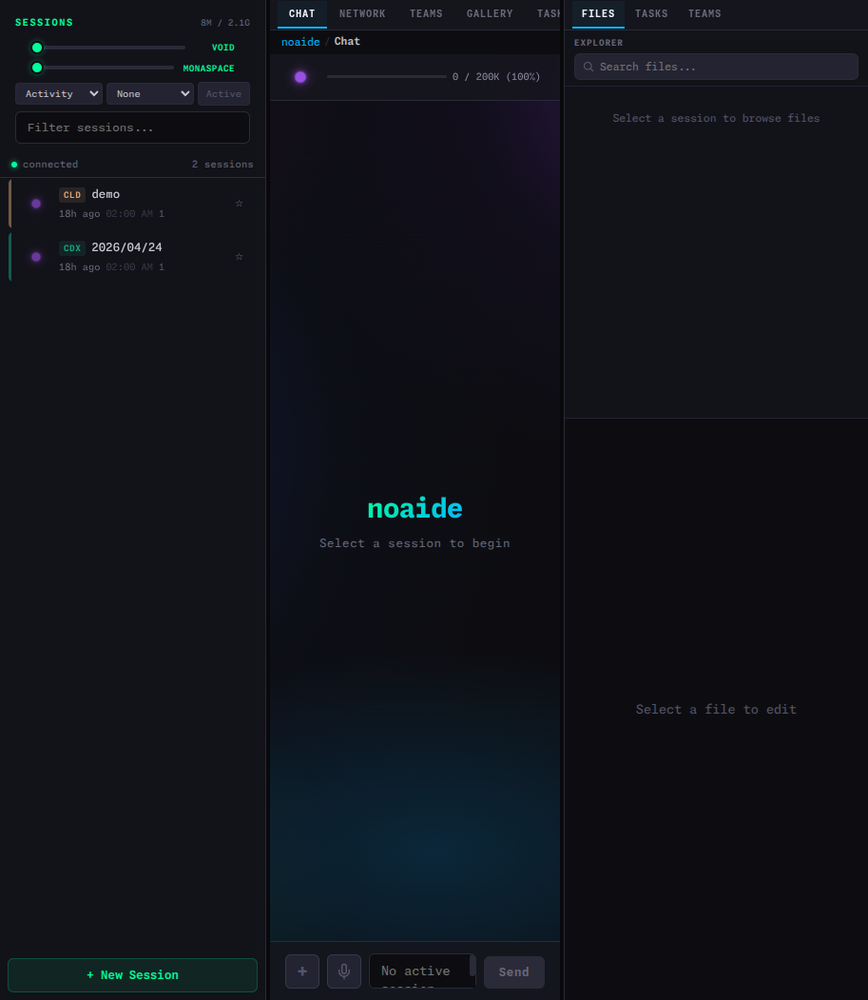
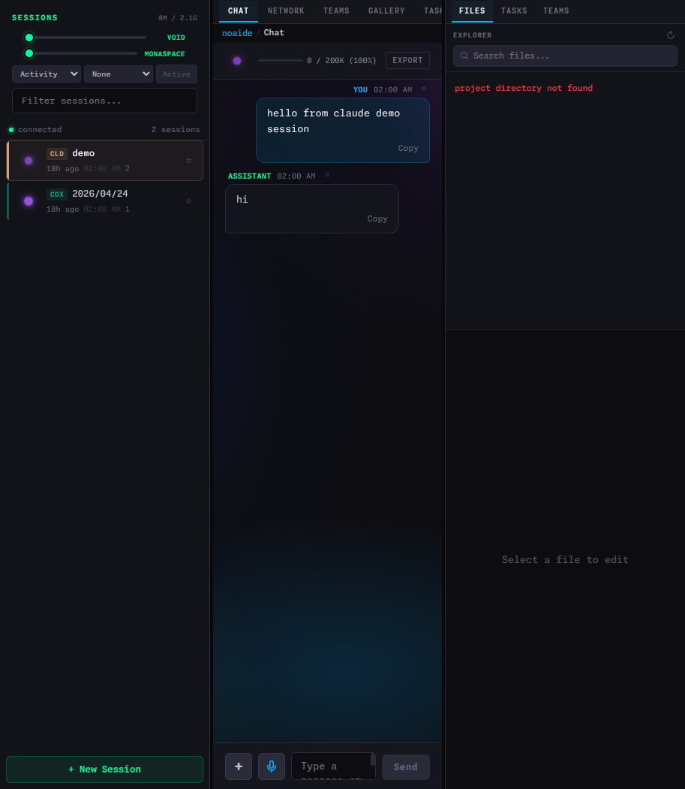
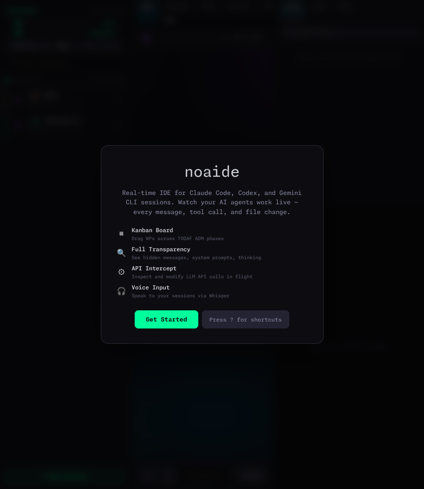

<div align="center">

# noaide

**Browser-based real-time IDE for AI coding agents**

Operator console for AI coding agents. Observe Codex / Claude Code / Gemini CLI sessions, inspect API and tool activity, gate risky requests, and export evidence.

<br>

[](https://github.com/silentspike/noaide/actions/workflows/ci.yml)
[](LICENSE)
[](#project-status)
[](https://www.rust-lang.org/)
[](https://www.solidjs.com/)
[](#tech-stack)

<br>

> **Pre-Alpha** — The application builds and runs with a functional backend and frontend.
> Active development in progress. Not production-ready. See [Project Status](#project-status) for details.

---

</div>

## The Problem

AI coding agents like [Claude Code](https://docs.anthropic.com/en/docs/claude-code), [Gemini CLI](https://github.com/google-gemini/gemini-cli), and [Codex](https://github.com/openai/codex) generate rich conversation logs (JSONL) containing system prompts, hidden instructions, thinking blocks, tool calls, and results. Their terminal UIs show roughly **60% of this data** — the rest is suppressed.

noaide makes 100% visible.

## What It Does

<table>
<tr>
<td width="50%">

### Full JSONL Transparency

Every message rendered — including `system-reminder`,
thinking blocks, and content marked "don't display."
Compressed messages shown as ghost messages at 30%
opacity. Nothing hidden, nothing filtered.

### Real-time File Watching

eBPF kernel-level file monitoring with **PID attribution**:
know exactly which process (you or Claude) wrote each
change. Sub-millisecond event detection. inotify fallback
when eBPF is unavailable.

### Session Control

Spawn managed sessions (full PTY control) or attach to
existing ones (tmux send-keys). Bidirectional — not just
a viewer. Breathing orb shows AI state in real-time.

### Conflict Resolution

When you and Claude edit the same file simultaneously:
yellow banner, OT buffer holds your changes, 3-way merge
after Claude finishes, auto Merge View on conflict.

</td>
<td width="50%">

### API Network Inspector

Transparent reverse proxy for Anthropic API calls.
Full request/response bodies, timing waterfall, token
usage — all in a browser Network tab. API keys
automatically redacted.

### Multi-Agent Teams

Force-directed topology graph showing agent hierarchies.
Animated message bubbles on edges. Swimlane timeline
for parallel agent activity. Gantt charts with per-agent
time tracking.

### 120 Hz Rendering

SolidJS fine-grained reactivity (no Virtual DOM). Virtual
scroller renders ~25 DOM nodes regardless of message count.
WASM workers for JSONL parsing and Markdown rendering.
Spring-physics animations.

### Mobile Access

Responsive layout with bottom tab bar and swipe navigation.
WebTransport QUIC with connection migration (WiFi to
cellular seamless handoff). Voice input via Web Speech API.

</td>
</tr>
</table>

## Gallery

> Screenshots captured from a local development build against seeded
> E2E fixture sessions. Shots are representative, not marketing
> renders — the real UI looks like this when you run it.

<table>
<tr>
<td align="center" width="34%">
  <a href="docs/images/hero-three-panel.png">
    
  </a>
  <br><sub><b>Three-panel overview.</b> Sessions sidebar (left), Chat
  (center) with token budget and tabs, Files explorer (right).
  Breathing orbs mark session state.</sub>
</td>
<td align="center" width="34%">
  <a href="docs/images/session-active-chat.png">
    
  </a>
  <br><sub><b>Live chat rendering.</b> User and assistant messages
  from the seeded Claude demo session. Each message shows
  timestamp, role, and a Copy action; hidden content and
  system-reminders render in the same stream.</sub>
</td>
<td align="center" width="34%">
  <a href="docs/images/welcome-screen.png">
    
  </a>
  <br><sub><b>Welcome screen.</b> First-launch overlay
  summarizing the four headline capabilities. Dismiss with
  <code>Get Started</code> or press <code>?</code> for the
  keyboard shortcut sheet.</sub>
</td>
</tr>
</table>

## UI Layout

```
 Session        Chat / Editor / Network / Teams             Files
 Sidebar        (tabbed center panel)                       & Tools

 ┌─────────┬──────────────────────────────────────┬────────────────┐
 │         │                                      │                │
 │  ● Sess │  user                                │  project/      │
 │    Proj │  > Fix the auth bug in login.ts      │  ├── src/      │
 │    4.5  │                                      │  │   ├── ...   │
 │    12m  │  assistant                    ◉ 4.5  │  │   └── ...   │
 │         │  I'll fix the authentication bug.    │  ├── tests/    │
 │  ○ Sess │  Let me read the file first.         │  └── ...       │
 │    Proj │                                      │                │
 │    4.5  │  ┌─ Read login.ts ──────────────┐    │ ────────────── │
 │    1h   │  │  export function login() {   │    │                │
 │         │  │    const token = getToken(); │    │  Token Budget  │
 │  ◌ Arch │  │    ...                       │    │  ████████░░░   │
 │    Proj │  └──────────────────────────────┘    │  45k / 200k    │
 │         │                                      │                │
 │         │  ┌─ Edit login.ts ──────────────┐    │  Model         │
 │         │  │  - const token = getToken(); │    │  claude-4.5    │
 │         │  │  + const token = await       │    │                │
 │         │  │  +   getToken(credentials);  │    │  Cost          │
 │         │  └──────────────────────────────┘    │  $0.42         │
 │         │                                      │                │
 │         │  ┌─ system-reminder ────────────┐    │                │
 │  [+ New │  │  SessionStart hook success   │    │                │
 │ Session]│  └──────────────────────────────┘    │                │
 │         │                                      │                │
 │         │  ▌                              ◉    │                │
 ├─────────┴──────────────────────────────────────┴────────────────┤
 │ [Chat] [Files] [Network] [Teams] [Tasks] [Settings]  Cmd+K     │
 └─────────────────────────────────────────────────────────────────┘
```

<sup>Three resizable panels. Left: session list with breathing orbs. Center: tabbed views (chat, editor,
network, teams). Right: file tree, token budget, model info. Bottom bar for quick navigation and
command palette.</sup>

## Architecture

```
                  ┌─────────────────────────────────────────────────┐
                  │            Browser  (SolidJS + WASM)            │
                  │                                                 │
                  │  Chat ─── Editor ─── Network ─── Teams ─── Gantt│
                  │    │         │          │          │         │   │
                  │    └─────────┴──────────┴──────────┴─────────┘   │
                  │                      │                           │
                  │          WebTransport Client (codec.ts)          │
                  └──────────────────────┬──────────────────────────┘
                                         │
                              HTTP/3 QUIC │ TLS 1.3
                              0-RTT       │ Multiplexed
                              Zstd ~70%   │ Adaptive Quality
                                         │
                  ┌──────────────────────┴──────────────────────────┐
                  │             Rust Server  (tokio + io_uring)     │
                  │                                                 │
                  │  ┌────────────┐  ┌────────────┐  ┌───────────┐ │
                  │  │eBPF Watcher│  │JSONL Parser│  │PTY Session│ │
                  │  │ PID attrib.│  │ streaming  │  │ mgr + tmux│ │
                  │  └─────┬──────┘  └─────┬──────┘  └─────┬─────┘ │
                  │        │               │               │       │
                  │        └───────────────┼───────────────┘       │
                  │                        │                       │
                  │              ┌─────────┴─────────┐             │
                  │              │  Zenoh Event Bus   │             │
                  │              │  SHM (~1us)        │             │
                  │              └─────────┬─────────┘             │
                  │                        │                       │
                  │         ┌──────────────┼──────────────┐        │
                  │         │              │              │        │
                  │    ┌────┴────┐   ┌─────┴─────┐  ┌────┴─────┐  │
                  │    │hecs ECS │   │ Limbo DB  │  │API Proxy │  │
                  │    │  SoA    │   │ io_uring  │  │ redaction│  │
                  │    │  state  │   │ FTS5      │  │ logging  │  │
                  │    └─────────┘   └───────────┘  └──────────┘  │
                  └─────────────────────────────────────────────────┘

  Data flow:  File Change ──▸ Watcher ──▸ Parser ──▸ ECS ──▸ Bus ──▸ Transport ──▸ Browser
  Input flow: Browser ──▸ WebTransport ──▸ Session Manager ──▸ PTY stdin / tmux send-keys
  Proxy flow: Claude Code ──▸ ANTHROPIC_BASE_URL ──▸ Proxy ──▸ api.anthropic.com
```

## Tech Stack

<table>
<tr><th align="left">Layer</th><th align="left">Choice</th><th align="left">Rationale</th></tr>
<tr><td><b>Backend</b></td><td>Rust + tokio + io_uring</td><td>Zero-cost abstractions, memory safety, async I/O</td></tr>
<tr><td><b>Frontend</b></td><td>SolidJS + Vite 6</td><td>Fine-grained reactivity without Virtual DOM overhead</td></tr>
<tr><td><b>Transport</b></td><td>WebTransport (HTTP/3, QUIC)</td><td>0-RTT reconnect, multiplexed streams, connection migration. Requires a Chromium-based browser. Production deployment is documented in <a href="docs/adr/001-production-deployment.md">ADR-001</a>.</td></tr>
<tr><td><b>State</b></td><td>hecs ECS (struct-of-arrays)</td><td>Cache-friendly iteration over 100+ concurrent entities</td></tr>
<tr><td><b>Database</b></td><td>Limbo (async SQLite, io_uring)</td><td>FTS5 full-text search, JSONL remains source of truth</td></tr>
<tr><td><b>File Watch</b></td><td>eBPF via aya</td><td>Kernel-level PID attribution for conflict detection</td></tr>
<tr><td><b>Event Bus</b></td><td>Zenoh + shared memory</td><td>~1us inter-component latency, zero-copy IPC</td></tr>
<tr><td><b>Editor</b></td><td>CodeMirror 6</td><td>500 KB (vs Monaco 5 MB), built-in MergeView</td></tr>
<tr><td><b>Wire Format</b></td><td>FlatBuffers + MessagePack + Zstd</td><td>Zero-copy hot path, flexible cold path, ~70% compression</td></tr>
<tr><td><b>WASM</b></td><td>jsonl-parser, markdown, compress</td><td>Off-main-thread heavy computation via Web Workers</td></tr>
<tr><td><b>Theme</b></td><td>Catppuccin Mocha</td><td>14 harmonious dark colors, community standard</td></tr>
</table>

Architectural decisions are documented as [11 ADRs in llms.txt](llms.txt). Each records the context, decision, alternatives considered, and trade-offs accepted.

## Performance — Design Goals

These are the target numbers the architecture is designed around.
The `criterion` suite under `server/benches/` covers two hot paths
(JSONL `parse_line` and ECS-cache `component_to_api_json`) and runs
nightly — fetch the latest measurements from the **`benchmark-results-*`**
artefact on the most recent
[Nightly run](https://github.com/silentspike/noaide/actions/workflows/nightly.yml).

**Latest measurements** (2026-04-26, on the build server, release
profile):

```
parse_line/user_message       2.19 µs/line   →   456k lines/sec     (goal: > 10k)
parse_line/tool_use_message   4.01 µs/line   →   249k lines/sec
component_to_api_json (text)    955 ns/msg
pagination_window/200 msgs    240   µs       =     0.24 ms          (goal: < 5 ms)
```

Both bench-covered hot paths beat their design goals by 20–45×.
End-to-end latency benchmarks (Playwright traces for the file
event → browser path, FPS at 1000+ messages) are still on the
roadmap; treat any bar without a matching bench as a design goal,
not a measurement.

```
File event to browser       ████████████████████████████░░  < 50ms p99
Message fetch (cached)      ██████████████████████████████  < 5ms
Rendering (1000+ msgs)      ██████████████████████████████  120 Hz
Server RSS (10 sessions)    █████████████░░░░░░░░░░░░░░░░░  < 200 MB
Browser memory              ████████████████░░░░░░░░░░░░░░  < 500 MB
JSONL parse rate            ██████████████████████████████  > 10k lines/s
Zenoh SHM latency           ██████████████████████████████  ~1 us
API proxy overhead          ██████████████████████████████  < 5 ms
Zstd bandwidth reduction    █████████████████████░░░░░░░░░  ~70%
```

## Prerequisites

| Dependency | Version | Notes |
|------------|---------|-------|
| Rust | 1.87+ | nightly required for io_uring features |
| Node.js | 22+ | with npm |
| wasm-pack | 0.13+ | for WASM module compilation |
| mkcert | latest | local TLS certificates for WebTransport |
| flatc | latest | FlatBuffers schema compiler |
| Linux kernel | 5.19+ | eBPF and io_uring support |

<details>
<summary><b>Optional: eBPF capabilities</b></summary>

For eBPF file watching (recommended), the kernel needs `CONFIG_BPF=y` and `CONFIG_BPF_SYSCALL=y`, and the process needs `CAP_BPF` + `CAP_PERFMON` (or `CAP_SYS_ADMIN` on kernels < 5.8). Without these, noaide falls back to inotify automatically.

Verify: `grep CONFIG_BPF /boot/config-$(uname -r)`

</details>

## Quick Start

There is no published Docker image yet — both paths below build
from source. First build takes ≈ 4–10 min depending on the path
and your machine.

### What you also need (outside noaide)

noaide watches an AI coding agent — it does not ship one. Install
at least one of these and run it the way you normally would:

- [Claude Code](https://docs.anthropic.com/en/docs/claude-code)
- [Gemini CLI](https://github.com/google-gemini/gemini-cli)
- [OpenAI Codex](https://github.com/openai/codex)

noaide reads the JSONL session files these tools write under
`~/.claude/`, `~/.gemini/`, or `~/.codex/`.

### Try it (development, hot-reload)

```bash
# Clone
git clone https://github.com/silentspike/noaide.git && cd noaide

# First-run: generate local TLS certificates (needed for WebTransport)
just certs          # or: make certs

# Start the backend in Docker (builds the image on first run)
just dev            # or: make dev  (=> docker compose up --build)

# Start the frontend dev server in a second terminal (HMR)
just dev-front      # or: make dev-front  (=> cd frontend && pnpm dev)

# Open in browser
#   http://localhost:9999/noaide/
```

### Deploy it (production, single container)

The dev workflow above is for hacking on noaide itself. To run a
production-shaped deployment (single hardened container, prebuilt
frontend bundle, BYO TLS), follow
[docs/deployment-guide.md](docs/deployment-guide.md). Short version:

```bash
# Bring your own TLS chain into ./certs/{cert.pem,key.pem}
# (LetsEncrypt, corporate CA, or mkcert for localhost — see deployment-guide)
echo "NOAIDE_JWT_SECRET=$(openssl rand -hex 32)" > .env
docker compose -f docker-compose.prod.yml up -d --build
# UI: https://<your-host>:4433/noaide/  (Chromium-only, see ADR-001)
```

### First launch — what to expect

1. Browser opens on `http://localhost:9999/noaide/` (dev) or
   `https://<host>:4433/noaide/` (prod).
2. A **welcome overlay** introduces the four headline capabilities;
   dismiss with `Get Started` or press `?` for the shortcut sheet.
3. The **session sidebar** populates with whatever JSONL files exist
   under your watched paths (default `~/.claude/`). Empty? Run any
   Claude Code / Gemini / Codex session and reload — the watcher
   picks it up live.
4. Click a session → the chat panel renders the full conversation
   (system reminders, thinking blocks, tool calls included).
5. The bottom tab bar switches between Chat, Files, Network, Teams,
   Tasks, Plan, Git, Cost, and Settings.

<details>
<summary><b>Alternative: native (no Docker) workflow</b></summary>

```bash
# Generate certificates
just certs

# Build the WASM modules
just wasm

# Run the backend natively
just dev-backend-native

# Run the frontend natively in a second terminal
just dev-front-native
```

All recipes are in [`justfile`](justfile); a `Makefile` mirror exists
for users without `just`.

</details>

<details>
<summary><b>Optional: voice input (Whisper sidecar)</b></summary>

The microphone button in the chat input is wired to a local Whisper
sidecar that runs as a separate Python process. It is **opt-in**;
nothing else in noaide depends on it. Setup, env vars, and disable
flags are documented in [docs/voice-setup.md](docs/voice-setup.md).

</details>

<details>
<summary><b>All available tasks</b></summary>

Run `just` (or `just -l`) to list every recipe. The most common ones:

| Task | Description |
|------|-------------|
| `just dev` | Start the backend via `docker compose up` |
| `just dev-front` | Start the frontend dev server (HMR) |
| `just test` | `cargo test --workspace` + `pnpm test` |
| `just test-e2e` | Playwright smoke suite |
| `just fmt` / `just lint` | Formatters and linters |
| `just audit` | `cargo audit` + `pnpm audit --audit-level=high` |
| `just bench` | `cargo bench` — performance design goals |
| `just wasm` | Build all three WASM modules |
| `just certs` | Generate local TLS certificates |
| `just demo` | Start everything + seed fixtures + open browser |

</details>

## Configuration

<details>
<summary><b>Environment variables</b></summary>

| Variable | Default | Description |
|----------|---------|-------------|
| `NOAIDE_PORT` | `4433` | WebTransport/QUIC port |
| `NOAIDE_HTTP_PORT` | `8080` | HTTP port (health endpoint, API proxy) |
| `NOAIDE_DB_PATH` | `./data/noaide/ide.db` | Limbo database path |
| `NOAIDE_WATCH_PATHS` | `~/.claude/` | Directories to watch for JSONL changes |
| `NOAIDE_TLS_CERT` | `./certs/cert.pem` | TLS certificate path |
| `NOAIDE_TLS_KEY` | `./certs/key.pem` | TLS private key path |
| `NOAIDE_LOG_LEVEL` | `info` | Log verbosity (trace/debug/info/warn/error) |

</details>

<details>
<summary><b>Feature flags</b></summary>

| Flag | Default | Description |
|------|---------|-------------|
| `ENABLE_EBPF` | `true` | eBPF file watching (false = inotify fallback) |
| `ENABLE_SHM` | `true` | Zenoh shared memory (false = TCP transport) |
| `ENABLE_WASM_PARSER` | `true` | WASM JSONL parser (false = JavaScript fallback) |
| `ENABLE_API_PROXY` | `true` | Anthropic API proxy and Network tab |
| `ENABLE_PROFILER` | `false` | Performance profiler panel |
| `ENABLE_AUDIO` | `false` | UI notification sounds |

</details>

## Development

```bash
# ── Backend ──────────────────────────────────
cargo build                              # dev build
cargo test                               # unit + integration tests
cargo clippy -- -D warnings              # lint
cargo bench                              # performance benchmarks

# ── Frontend ─────────────────────────────────
cd frontend
pnpm dev                                 # Vite dev server with HMR
pnpm build                               # production build
pnpm lint                                # ESLint

# ── WASM ─────────────────────────────────────
wasm-pack build wasm/jsonl-parser --target web
wasm-pack build wasm/markdown --target web
wasm-pack build wasm/compress --target web

# ── FlatBuffers ──────────────────────────────
flatc --rust --ts -o generated/ schemas/messages.fbs
```

See [CONTRIBUTING.md](CONTRIBUTING.md) for branch conventions, commit style, and PR process.
See [TESTING.md](TESTING.md) for the full test gate matrix and benchmark commands.

## Features

Each row points to the primary module that implements it, so the
description is easy to cross-check against the code.

| Feature | Source | Description |
|---------|--------|-------------|
| **Message Cache** | [`server/src/cache/mod.rs`](server/src/cache/mod.rs) | ECS-backed in-memory cache with incremental JSONL parsing. Designed for <5 ms cached responses (see [Performance — Design Goals](#performance--design-goals)). |
| **Pagination** | [`server/src/cache/mod.rs`](server/src/cache/mod.rs) + [`VirtualScroller.tsx`](frontend/src/components/chat/VirtualScroller.tsx) | Infinite scroll with scroll-anchor preservation. Loads 200 messages at a time. |
| **Thinking Blocks** | [`components/chat/ThinkingBlock.tsx`](frontend/src/components/chat/ThinkingBlock.tsx) | Animated collapse/expand with measured `scrollHeight`. Token count estimate. |
| **Session Pinning** | [`stores/session.ts`](frontend/src/stores/session.ts) + [`components/sessions/SessionList.tsx`](frontend/src/components/sessions/SessionList.tsx) | Star sessions, sorted pinned-first. Persisted in localStorage. |
| **Profiler Metrics** | [`components/profiler/ProfilerPanel.tsx`](frontend/src/components/profiler/ProfilerPanel.tsx) | Real-time FPS, heap usage, events/sec, render time, DOM nodes, transport RTT. |
| **Command Palette** | [`components/shared/CommandPalette.tsx`](frontend/src/components/shared/CommandPalette.tsx) | Cmd+K with scope prefixes (`>` commands, `#` sessions, `@` tabs). Fuzzy matching with highlights. |
| **Session Search** | [`components/chat/SearchBar.tsx`](frontend/src/components/chat/SearchBar.tsx) | Cmd+F in-chat search with match counter and prev/next navigation. |
| **Notifications** | [`lib/notifications.ts`](frontend/src/lib/notifications.ts) | Toasts, Browser Notification API, optional Web Audio cues (gated by `ENABLE_AUDIO`). |
| **Cost Dashboard** | [`components/cost/CostDashboard.tsx`](frontend/src/components/cost/CostDashboard.tsx) | Per-model token breakdown, cost bars, session ranking, input/output/cache ratios. |
| **Export** | [`lib/export.ts`](frontend/src/lib/export.ts) + [`components/shared/ExportDialog.tsx`](frontend/src/components/shared/ExportDialog.tsx) | Markdown, JSON, or HTML export with configurable options. Mobile Web Share API support. |
| **Session Stats API** | [`server/src/main.rs`](server/src/main.rs) | HTTP endpoint with token counts, model breakdown, duration. |
| **Subagent Tree** | [`components/teams/SubagentTree.tsx`](frontend/src/components/teams/SubagentTree.tsx) | Tree visualization of `agentId`/`parentUuid` hierarchies in the Teams panel. |

### Keyboard Shortcuts

| Shortcut | Action |
|----------|--------|
| `Cmd/Ctrl + K` | Open command palette |
| `Cmd/Ctrl + F` | Search in chat |
| `Cmd/Ctrl + 1-8` | Switch tabs (Chat, Network, Teams, Gallery, Tasks, Git, Cost, Settings) |
| `Escape` | Close overlay / search |
| `Tab` (in palette) | Cycle scope prefixes |

## Project Status

noaide is in active pre-alpha development. The application compiles, runs, and provides a functional UI for monitoring AI coding sessions.

```
Sprint 1 ── Foundation                             ██████████████  Complete
             ECS state, Limbo DB, JSONL parser,
             eBPF watcher, session manager

Sprint 2 ── Streaming Pipeline                     ██████████████  Complete
             Zenoh event bus, WebTransport,
             SolidJS shell, WASM modules

Sprint 3 ── Frontend                               ██████████████  Complete
             Chat panel, editor, sessions,
             API proxy, tools, teams, tasks

Sprint 4 ── Integration                            ██████████████  Complete
             Mobile layout, performance
             tuning, command palette, polish

RC2     ── Cache + UX Polish                       ██████████████  Complete
             Message cache, pagination, cost
             dashboard, export, search, profiler
```

<details>
<summary><b>Backend modules (see CI for current test count)</b></summary>

- ECS state engine with session, message, file, task, agent components
- Incremental JSONL parser with byte-offset caching
- eBPF file watcher with inotify fallback
- PTY session manager (spawn + tmux attach)
- Zenoh event bus with shared memory
- WebTransport server with adaptive quality tiers
- API proxy with automatic key redaction
- Git integration (branches, staging, commits, blame)
- Multi-LLM support (Claude, Gemini, Codex)
- Whisper voice-to-text sidecar integration

</details>

## Multi-LLM Support

noaide supports multiple AI coding agents out of the box:

| Agent | Status | Notes |
|-------|--------|-------|
| **Claude Code** | Supported | Full JSONL support, PTY + tmux session control, API proxy |
| **Gemini CLI** | Supported | JSON conversation parsing, PTY session management |
| **OpenAI Codex** | Supported | JSONL parsing, image injection, managed sessions |

The JSONL parser and session manager use pluggable format adapters. Core UI components (chat panel, editor, network tab) are agent-agnostic.

## Operating an Agent

These four short sections describe the supervisor experience. For the
full contract between the supervisor, the agent, and noaide, see
[AGENTS.md](AGENTS.md).

### Agent Operating Model

noaide watches agents — it does not run them. The agent (Claude Code,
Gemini CLI, Codex) is a separate process. noaide reads its JSONL log,
watches the filesystem with eBPF, hosts its PTY, and proxies its API
calls. See [AGENTS.md §1](AGENTS.md#1-operating-model).

### Supervision Boundaries

The supervisor controls session lifecycle, keyboard/text input, tool
approval, the API proxy gate (auto vs. manual), and file-edit locks
during 3-way merges. noaide enforces an API whitelist, redacts secrets,
and never spawns shells for PTY input. See
[AGENTS.md §2](AGENTS.md#2-supervision-boundaries).

### Evidence and Audit Loop

Every event crossing a component boundary is wrapped in an envelope
carrying a Lamport clock, source, PID, and session ID. JSONL is the
source of truth; the Limbo DB and ECS world are regeneratable caches.
Network, file, and git activity are rendered in place so they can be
correlated with the conversation. See
[AGENTS.md §3](AGENTS.md#3-evidence-and-audit-loop).

### Agent Contract

Agents integrate by (1) writing JSONL as they run, (2) honouring the
configured base-URL override when the supervisor enables the proxy, and
(3) accepting PTY or tmux send-keys input. See
[AGENTS.md §4](AGENTS.md#4-agent-contract) for per-agent integration
paths.

## Documentation

| Document | Scope |
|----------|-------|
| [AGENTS.md](AGENTS.md) | Contract between supervisor, agent, and noaide |
| [docs/architecture.md](docs/architecture.md) | Components, data flows, wire format, threading model |
| [docs/api.md](docs/api.md) | HTTP endpoint reference for the control plane |
| [docs/agent-operating-model.md](docs/agent-operating-model.md) | How noaide watches agents (JSONL, PTY, filesystem) |
| [docs/supervision-boundaries.md](docs/supervision-boundaries.md) | Control surfaces and what noaide does vs. does not enforce |
| [docs/security-deep-dive.md](docs/security-deep-dive.md) | Threat model, redaction rules, eBPF trust model, header rationale |
| [docs/evidence-loop-details.md](docs/evidence-loop-details.md) | EventEnvelope, Lamport clock, persistence layers, audit-log NDJSON schema |
| [docs/component-reference.md](docs/component-reference.md) | Per-module reference: what each crate/module owns, what it publishes, where its config lives |
| [docs/deployment-guide.md](docs/deployment-guide.md) | Operator guide: Docker compose, systemd, TLS, browser support |
| [docs/voice-setup.md](docs/voice-setup.md) | Optional Whisper sidecar setup for the microphone input |
| [docs/adr/001-production-deployment.md](docs/adr/001-production-deployment.md) | ADR-001: production deployment is single-process container, Chromium-only |
| [CONTRIBUTING.md](CONTRIBUTING.md) | Branch flow, commit discipline, PR checklist |
| [SECURITY.md](SECURITY.md) | Security controls in place and on the roadmap |
| [TESTING.md](TESTING.md) | Test gate matrix |
| [llms.txt](llms.txt) | 11 ADRs behind the architecture decisions |

## Security

API keys (`sk-ant-*`, `Bearer *`) are automatically redacted in all logs and UI via regex. The API proxy only forwards to `api.anthropic.com` (whitelist). All transport uses TLS 1.3 via QUIC. See [SECURITY.md](SECURITY.md) for vulnerability reporting.

## License

[MIT](LICENSE)

---

<div align="center">
<sub>Built with Rust, SolidJS, and too many late nights reading JSONL files.</sub>
</div>
