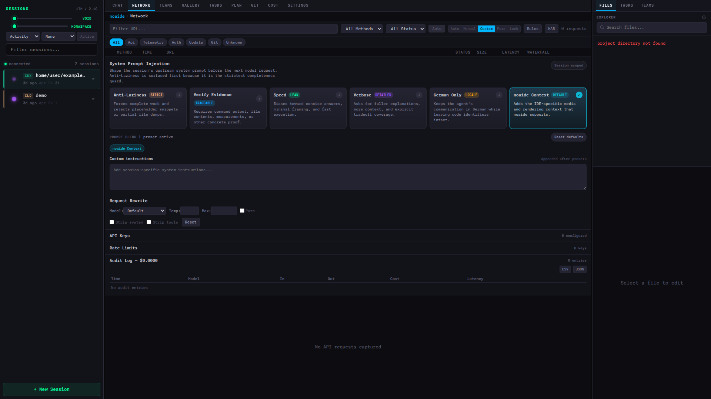
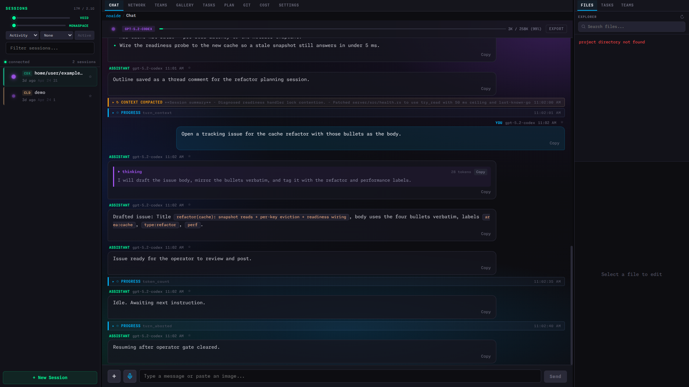

<div align="center">

# noaide

**Operator console / supervision layer for AI coding agents**

Browser-based real-time IDE: observe Codex / Claude Code / Gemini CLI sessions, inspect API and tool activity, gate risky requests, and export evidence.

> In a Codex rollout, noaide shows what the agent saw, what it changed,
> what it sent to the provider, what was approved, and what evidence
> remains for review. The same supervision pattern works for Claude Code
> and Gemini CLI sessions; provider-specific transcript artifacts are
> surfaced where available.

<br>

[](https://github.com/silentspike/noaide/actions/workflows/ci.yml)
[](LICENSE)
[](#project-status)
[](https://www.rust-lang.org/)
[](https://www.solidjs.com/)

<br>

> **Pre-Alpha** — The application builds and runs with a functional backend and frontend.
> Active development in progress. Not production-ready. See [Project Status](#project-status) for details.

---

</div>

## The Problem

AI coding agents like [Claude Code](https://docs.anthropic.com/en/docs/claude-code), [Gemini CLI](https://github.com/google-gemini/gemini-cli), and [Codex](https://github.com/openai/codex) generate rich conversation logs (JSONL) containing system prompts, provider transcript fields the official UI does not surface, intermediate transcript events, tool calls, and results. Their terminal UIs show a curated subset — system reminders, intermediate transcript events, and provider-specific transcript artifacts are suppressed by default.

noaide makes 100% visible.

## What It Does

<table>
<tr>
<td width="50%">

### Full JSONL Transparency

Every message rendered — including `system-reminder`,
intermediate transcript events, and content marked "don't display."
Compressed messages shown as ghost messages at 30%
opacity. Nothing hidden, nothing filtered.

### Real-time File Watching

eBPF kernel-level file monitoring with **PID attribution**:
know exactly which process (you or Claude) wrote each
change. Sub-millisecond event detection. inotify fallback
when eBPF is unavailable.

### Session Control

Spawn managed sessions (full PTY control) or attach to
existing ones (tmux send-keys). Bidirectional — not just
a viewer. Breathing orb shows AI state in real-time.

### Conflict Resolution

When you and Claude edit the same file simultaneously:
yellow banner, OT buffer holds your changes, 3-way merge
after Claude finishes, auto Merge View on conflict.

</td>
<td width="50%">

### API Network Inspector

Transparent reverse proxy for Anthropic API calls.
Full request/response bodies, timing waterfall, token
usage — all in a browser Network tab. API keys
automatically redacted.

### Multi-Session Orchestration

Track parallel agent sessions across feature branches.
Force-directed topology shows session relationships and
message flow; a swimlane timeline gives a single view of
multiple agents running on the same project.

### Mobile Access

Responsive layout with bottom tab bar and swipe navigation.
The browser stays attached when the network switches between
WiFi and cellular. Voice input via Web Speech API.

### Built for the operator

Performance details — design goals, measured numbers,
transport, rendering — live in [docs/performance.md](docs/performance.md).
The hero stays focused on the operator-console story.

</td>
</tr>
</table>

## 5-minute supervision demo

> A complete supervised Codex session: spawn, observe, intercept one
> request, export the audit log. Run from a fresh checkout in roughly
> five minutes.

**Setup:**

```bash
git clone https://github.com/silentspike/noaide
cd noaide
NOAIDE_WATCH_PATHS=$(pwd)/frontend/e2e/fixtures/claude-home pnpm dev
```

Then in a second shell:

```bash
export OPENAI_BASE_URL=http://localhost:4434/s/<session-id>/backend-api/codex
codex "<your task>"
```

Open `https://localhost:9999/noaide/` to watch the session, intercept
network requests, and export the audit trail as NDJSON.

Full walkthrough: [`docs/workshop-ai-coding-rollout.md`](docs/workshop-ai-coding-rollout.md).

> 📖 **Customer enablement workshop:** [`docs/workshop-ai-coding-rollout.md`](docs/workshop-ai-coding-rollout.md)
> — 45-minute hands-on agenda for engineering leadership and DevSecOps teams.

## Status

What works today versus what is on the roadmap. Pre-alpha — the buckets
will move as the project matures.

| Bucket | Definition |
|---|---|
| **Implemented** | Code on `main` and exercised by tests in CI. |
| **Demo-backed** | Code on `main` plus a screenshot or E2E fixture under `docs/images/` or `frontend/e2e/fixtures/`. |
| **Partial** | Code on `main` but with a UI gap or pending polish. |
| **Roadmap** | An open issue, no code yet. |

| Capability | Status |
|---|---|
| JSONL parser (Claude Code / Codex / Gemini CLI) | Implemented |
| Codex session spawn with `OPENAI_BASE_URL` proxy routing | Implemented |
| API proxy with provider detection (Anthropic / OpenAI / Google) | Implemented |
| eBPF file watcher with PID attribution (inotify fallback) | Implemented |
| Manual intercept gate (auto / manual / forward / drop / drain) | Demo-backed |
| Audit export endpoint (NDJSON) | Partial |
| Conflict resolution (OT buffer + 3-way merge UI) | Partial |
| Cost dashboard (token tracking; real-dollar costs pending) | Partial |
| Multi-session orchestration (topology + swimlane UI; live sub-agent wiring pending) | Partial ([#105](https://github.com/silentspike/noaide/issues/105)) |
| Multi-account control plane | Roadmap ([#108](https://github.com/silentspike/noaide/issues/108)) |
| Onboarding, keyboard help, ARIA, custom themes | Roadmap ([#107](https://github.com/silentspike/noaide/issues/107)) |

## Gallery

> Screenshots captured from a local development build against the
> seeded E2E fixtures under `frontend/e2e/fixtures/claude-home/`.
> Reproduce: run the backend with
> `NOAIDE_WATCH_PATHS=$(pwd)/frontend/e2e/fixtures/claude-home`,
> start `pnpm dev`, then open `https://localhost:9999/noaide/`.

<table>
<tr>
<td align="center" width="34%">
  <a href="docs/images/codex-network-capture.png">
    
  </a>
  <br><sub><b>Network tab — intercept gate.</b> Auto / Manual / Custom
  / Pure / Lock modes, provider filter pills (Api / Telemetry / Auth /
  Update / Git), and the request waterfall populate as live Codex
  traffic routes through <code>OPENAI_BASE_URL</code>.</sub>
</td>
<td align="center" width="34%">
  <a href="docs/images/audit-export.png">
    
  </a>
  <br><sub><b>Audit log export.</b> Per-request audit table with
  Time / Model / Input / Output / Cost / Latency columns, plus CSV
  and JSON download buttons backed by
  <code>/api/proxy/audit/export</code>.</sub>
</td>
<td align="center" width="34%">
  <a href="docs/images/hero-three-panel.png">
    
  </a>
  <br><sub><b>Three-panel overview.</b> Sessions sidebar (left), Chat
  (center) with token budget and tabs, Files explorer (right).
  Breathing orbs mark session state.</sub>
</td>
</tr>
<tr>
<td align="center" width="34%">
  <a href="docs/images/codex-session.png">
    
  </a>
  <br><sub><b>Codex rollout, end to end.</b> The seeded Codex fixture
  loaded into the chat panel: turn_context, agent_reasoning,
  agent_message, response_item with output_text, and a top-level
  compacted summary all surface in the same stream.</sub>
</td>
<td align="center" width="34%">
  <a href="docs/images/session-active-chat.png">
    
  </a>
  <br><sub><b>Live chat rendering.</b> User and assistant messages
  from the seeded Claude demo session. Each message shows
  timestamp, role, and a Copy action; system-reminders render in
  the same stream.</sub>
</td>
<td align="center" width="34%">
  <a href="docs/images/welcome-screen.png">
    
  </a>
  <br><sub><b>Welcome screen.</b> First-launch overlay
  summarizing the four headline capabilities. Dismiss with
  <code>Get Started</code> or press <code>?</code> for the
  keyboard shortcut sheet.</sub>
</td>
</tr>
</table>

## Architecture

The component map, three-panel UI layout, ASCII data-flow diagram, and
the tech-stack table live in [`docs/architecture.md`](docs/architecture.md).
Architectural decisions (11 ADRs) are in [`llms.txt`](llms.txt).

## Performance

Design goals, latest criterion measurements, the 120 Hz rendering
stack, the WebTransport / wire-format details, adaptive quality, and
the backpressure strategy live in [docs/performance.md](docs/performance.md).
Both bench-covered hot paths currently beat their design goals by
20–45×; the rest of the table is a design target, not a measurement.

## Prerequisites

| Dependency | Version | Notes |
|------------|---------|-------|
| Rust | 1.87+ | nightly required for io_uring features |
| Node.js | 22+ | with npm |
| wasm-pack | 0.13+ | for WASM module compilation |
| mkcert | latest | local TLS certificates for WebTransport |
| flatc | latest | FlatBuffers schema compiler |
| Linux kernel | 5.19+ | eBPF and io_uring support |

<details>
<summary><b>Optional: eBPF capabilities</b></summary>

For eBPF file watching (recommended), the kernel needs `CONFIG_BPF=y` and `CONFIG_BPF_SYSCALL=y`, and the process needs `CAP_BPF` + `CAP_PERFMON` (or `CAP_SYS_ADMIN` on kernels < 5.8). Without these, noaide falls back to inotify automatically.

Verify: `grep CONFIG_BPF /boot/config-$(uname -r)`

</details>

## Quick Start

There is no published Docker image yet — both paths below build
from source. First build takes ≈ 4–10 min depending on the path
and your machine.

### What you also need (outside noaide)

noaide watches an AI coding agent — it does not ship one. Install
at least one of these and run it the way you normally would:

- [Claude Code](https://docs.anthropic.com/en/docs/claude-code)
- [Gemini CLI](https://github.com/google-gemini/gemini-cli)
- [OpenAI Codex](https://github.com/openai/codex)

noaide reads the JSONL session files these tools write under
`~/.claude/`, `~/.gemini/`, or `~/.codex/`.

### Try it (development, hot-reload)

```bash
# Clone
git clone https://github.com/silentspike/noaide.git && cd noaide

# First-run: generate local TLS certificates (needed for WebTransport)
just certs          # or: make certs

# Start the backend in Docker (builds the image on first run)
just dev            # or: make dev  (=> docker compose up --build)

# Start the frontend dev server in a second terminal (HMR)
just dev-front      # or: make dev-front  (=> cd frontend && pnpm dev)

# Open in browser
#   http://localhost:9999/noaide/
```

### Deploy it (production, single container)

The dev workflow above is for hacking on noaide itself. To run a
production-shaped deployment (single hardened container, prebuilt
frontend bundle, BYO TLS), follow
[docs/deployment-guide.md](docs/deployment-guide.md). Short version:

```bash
# Bring your own TLS chain into ./certs/{cert.pem,key.pem}
# (LetsEncrypt, corporate CA, or mkcert for localhost — see deployment-guide)
echo "NOAIDE_JWT_SECRET=$(openssl rand -hex 32)" > .env
docker compose -f docker-compose.prod.yml up -d --build
# UI: https://<your-host>:4433/noaide/  (Chromium-only, see ADR-001)
```

### First launch — what to expect

1. Browser opens on `http://localhost:9999/noaide/` (dev) or
   `https://<host>:4433/noaide/` (prod).
2. A **welcome overlay** introduces the four headline capabilities;
   dismiss with `Get Started` or press `?` for the shortcut sheet.
3. The **session sidebar** populates with whatever JSONL files exist
   under your watched paths (default `~/.claude/`). Empty? Run any
   Claude Code / Gemini / Codex session and reload — the watcher
   picks it up live.
4. Click a session → the chat panel renders the full conversation
   (system reminders, intermediate transcript events, tool calls included).
5. The bottom tab bar switches between Chat, Files, Network, Teams,
   Tasks, Plan, Git, Cost, and Settings.

Native (non-Docker) workflow, every `just` recipe, and the optional
Whisper voice-input sidecar are documented in
[`justfile`](justfile), [`docs/architecture.md`](docs/architecture.md),
and [`docs/voice-setup.md`](docs/voice-setup.md) respectively.

## Configuration & development

Environment variables, feature flags, the build/test/bench command
reference, the feature → source map, and keyboard shortcuts live in
[`docs/architecture.md`](docs/architecture.md). Branch conventions and
PR process are in [`CONTRIBUTING.md`](CONTRIBUTING.md); the test gate
matrix is in [`TESTING.md`](TESTING.md).

## Project Status

noaide is in active pre-alpha development. The application compiles, runs, and provides a functional UI for monitoring AI coding sessions.

```
Sprint 1 ── Foundation                             ██████████████  Complete
             ECS state, Limbo DB, JSONL parser,
             eBPF watcher, session manager

Sprint 2 ── Streaming Pipeline                     ██████████████  Complete
             Zenoh event bus, WebTransport,
             SolidJS shell, WASM modules

Sprint 3 ── Frontend                               ██████████████  Complete
             Chat panel, editor, sessions,
             API proxy, tools, teams, tasks

Sprint 4 ── Integration                            ██████████████  Complete
             Mobile layout, performance
             tuning, command palette, polish

RC2     ── Cache + UX Polish                       ██████████████  Complete
             Message cache, pagination, cost
             dashboard, export, search, profiler
```

<details>
<summary><b>Backend modules (see CI for current test count)</b></summary>

- ECS state engine with session, message, file, task, agent components
- Incremental JSONL parser with byte-offset caching
- eBPF file watcher with inotify fallback
- PTY session manager (spawn + tmux attach)
- Zenoh event bus with shared memory
- WebTransport server with adaptive quality tiers
- API proxy with automatic key redaction
- Git integration (branches, staging, commits, blame)
- Multi-LLM support (Claude, Gemini, Codex)
- Whisper voice-to-text sidecar integration

</details>

## Multi-LLM Support

noaide supports multiple AI coding agents out of the box:

| Agent | Status | Notes |
|-------|--------|-------|
| **Claude Code** | Supported | Full JSONL support, PTY + tmux session control, API proxy |
| **Gemini CLI** | Supported | JSON conversation parsing, PTY session management |
| **OpenAI Codex** | Supported | JSONL parsing, image injection, managed sessions |

The JSONL parser and session manager use pluggable format adapters. Core UI components (chat panel, editor, network tab) are agent-agnostic.

## Operating an Agent

The supervisor contract — operating model (noaide watches, never runs),
supervision boundaries (lifecycle, input, tool approval, proxy gate,
file-edit locks), evidence loop (Lamport-clock envelopes, JSONL as
source of truth), and per-agent integration paths — lives in
[AGENTS.md](AGENTS.md). The four sections there map 1:1 onto the
operator surface; the README intentionally does not duplicate them.

## Documentation

| Document | Scope |
|----------|-------|
| [AGENTS.md](AGENTS.md) | Contract between supervisor, agent, and noaide |
| [docs/architecture.md](docs/architecture.md) | Components, data flows, wire format, threading model |
| [docs/api.md](docs/api.md) | HTTP endpoint reference for the control plane |
| [docs/agent-operating-model.md](docs/agent-operating-model.md) | How noaide watches agents (JSONL, PTY, filesystem) |
| [docs/supervision-boundaries.md](docs/supervision-boundaries.md) | Control surfaces and what noaide does vs. does not enforce |
| [docs/security-deep-dive.md](docs/security-deep-dive.md) | Threat model, redaction rules, eBPF trust model, header rationale |
| [docs/evidence-loop-details.md](docs/evidence-loop-details.md) | EventEnvelope, Lamport clock, persistence layers, audit-log NDJSON schema |
| [docs/component-reference.md](docs/component-reference.md) | Per-module reference: what each crate/module owns, what it publishes, where its config lives |
| [docs/deployment-guide.md](docs/deployment-guide.md) | Operator guide: Docker compose, systemd, TLS, browser support |
| [docs/voice-setup.md](docs/voice-setup.md) | Optional Whisper sidecar setup for the microphone input |
| [docs/workshop-ai-coding-rollout.md](docs/workshop-ai-coding-rollout.md) | 45-minute tool-agnostic workshop (Codex / Claude Code / Gemini CLI): observe, intercept, rehearse failure modes, export the audit log |
| [examples/](examples/) | Cookbook walkthroughs: spawn a session, intercept a request, export the audit log |
| [docs/adr/001-production-deployment.md](docs/adr/001-production-deployment.md) | ADR-001: production deployment is single-process container, Chromium-only |
| [CONTRIBUTING.md](CONTRIBUTING.md) | Branch flow, commit discipline, PR checklist |
| [SECURITY.md](SECURITY.md) | Security controls in place and on the roadmap |
| [TESTING.md](TESTING.md) | Test gate matrix |
| [llms.txt](llms.txt) | 11 ADRs behind the architecture decisions |

## Security

API keys (`sk-ant-*`, `Bearer *`) are automatically redacted in all logs and UI via regex. The API proxy only forwards to `api.anthropic.com` (whitelist). All transport uses TLS 1.3 via QUIC. See [SECURITY.md](SECURITY.md) for vulnerability reporting.

## License

[MIT](LICENSE)

---

<div align="center">
<sub>Built with Rust, SolidJS, and AI coding agents (Codex, Claude Code, Gemini CLI) — the same tools this repository observes and serves.</sub>
</div>
