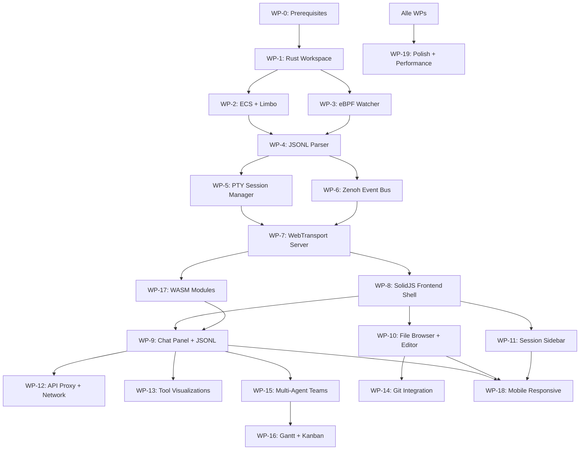

# Plan: noaide - Browser-basierte Real-time IDE fuer Claude Code

---

## MASTER-CHECKLISTE (TOGAF ADM)

### Preliminary Phase: Framework & Grundlagen
- [x] P.1 Architecture Engagement Record
- [x] P.2 Architecture Principles
- [x] P.3 Stakeholder Concerns
- [x] P.4 Prerequisites
- [x] P.5 Glossar
- [x] → **GATE 0 bestanden**

### Phase A: Architecture Vision
- [x] A.1 Vision Statement
- [x] A.2 Business Context
- [x] A.3 Stakeholder Map
- [x] A.4 Architecture Scope
- [x] A.5 Key Requirements
- [x] A.6 Building Blocks Overview
- [x] → **GATE 1 bestanden**

### Phase B: Business Architecture
- [x] B.1 Business Capabilities & Quick Wins
- [x] B.2 Business Process Flow
- [x] B.3 Acceptance Criteria

### Phase C: Information Systems Architecture
- [x] C.1 Data Architecture
- [x] C.2 Application Architecture
- [x] C.3 Error Handling Strategy
- [x] C.4 Security Architecture

### Phase D: Technology Architecture
- [x] D.1 Technology Stack
- [x] D.2 Environment Architecture
- [x] D.3 Feature Flags
- [x] D.4 Observability Architecture
- [x] D.5 Infrastructure
- [x] → **GATE 2 bestanden**

### Phase E: Opportunities & Solutions
- [x] E.1 Gap Analysis
- [x] E.2 Risk Assessment
- [x] E.3 Architecture Decision Records
- [x] E.4 Implementation Work Packages
- [x] E.5 Dependency Graph & Ordering
- [x] E.6 Git & SCM Strategy

### Phase F: Migration Planning
- [x] F.1 Test-Strategie & CI/CD Gate Architecture
- [x] F.2 Real-World Testing
- [x] F.3 Release & Deployment Plan
- [x] F.4 Rollback Architecture
- [x] F.5 Kanban Board Setup
- [x] → **GATE 3 bestanden**

### Phase G: Implementation Governance
- [x] G.1 Architecture Compliance Review
- [x] G.2 Definition of Done
- [x] G.3 Success Metrics
- [x] G.4 Post-Implementation Cleanup
- [x] G.5 Documentation Updates
- [x] → **GATE 4 bestanden**

### Phase H: Architecture Change Management
- [x] H.1 Architecture Change Log
- [x] H.2 Lessons Learned
- [x] H.3 Architecture Repository Updates
- [x] H.4 Plan-Qualitaet Retrospektive
- [x] H.5 Next Steps & Change Requests

### Requirements Management
- [x] RM.1 Requirements Register
- [x] RM.2 Change Request Log
- [x] RM.3 Traceability Matrix

### Abschluss
- [x] Qualitaets-Check durchgefuehrt
- [x] Alle Gates bestanden
- [x] Plan vollstaendig ausgegeben
- [x] HTML-Version generiert (.audit/plan-noaide.html)
- [ ] TaskCreate Items fuer Implementation vorbereitet
- [ ] GitHub Issues aus Work Packages erstellt

---

<!-- ═══════════════════════════════════════════════════════════════════════════
     PRELIMINARY PHASE
     ═══════════════════════════════════════════════════════════════════════════ -->

## P.1 Architecture Engagement Record

```
# Plan: noaide - Browser-basierte Real-time IDE fuer Claude Code
TOGAF Tailoring Level: L (Architecture)
Scope: scope:full
ADM-Iteration: 1
Status: In Progress
Version: v2.2 | Erstellt: 2026-02-20 | v2.0 TOGAF Migration + v2.1 Peer-Review Fixes + v2.2 Living Document Policy
Confidence: 88% - Architektur vollstaendig, Peer-Review v1.1+v2.0 eingearbeitet (Codex+Gemini),
             Traceability lueckenlos (16 ACs, 14 REQs), Restrisiko: eBPF+Zenoh+Limbo Integrationstiefe
Kanban WIP-Limit: 3 (L-Size)
GitHub Repo: silentspike/noaide
```

**Scope-Klassifikation:** `scope:full` — Produktivcode im realen Laufzeitpfad. KEINE Stubs/Mocks/Placeholder.

---

## P.2 Architecture Principles

| Prinzip | Rationale | Implikation |
|---------|-----------|-------------|
| **Full Transparency** | Claude Code versteckt Inhalte im Terminal (system-reminder, thinking, hidden). User verdienen volle Einsicht. | ALLES aus dem JSONL wird angezeigt. Kein Filter, kein Hide. Ghost Messages fuer Compression. **Security-Ausnahme:** API Keys (`sk-ant-*`, `Bearer *`) werden per Regex redacted (Governance-Override, siehe C.4). |
| **120Hz Minimum** | Moderne Displays laufen bei 120Hz. Jeder Frame-Drop ist spuerbar. | SolidJS (kein VDOM), Virtual Scroller (~25 DOM-Nodes), ECS (cache-friendly SoA), WASM Workers, FlatBuffers (zero-copy) |
| **System Engineering for Web** | Standard-Web-Tooling (WebSocket, REST, SQLite) reicht nicht fuer <50ms File-Event-to-Browser Latenz bei 200 events/sec. | eBPF (kernel-level), Zenoh+SHM (zero-copy IPC), WebTransport/QUIC (0-RTT), io_uring (async IO) |
| **Production-First** | Keine Mocks, keine Stubs, echte Implementierung sofort. | scope:full auf jedem Work Package. Kein "later" fuer Error Handling oder Observability. |
| **SSOT** | Eine Wahrheit pro Information. JSONL ist Source of Truth fuer Conversations. | Limbo DB ist Index/Cache, NICHT die Authority. JSONL-File kann DB jederzeit regenerieren. |
| **Bidirektional** | IDE ist NICHT nur ein Viewer — sie steuert Claude Code aktiv. | PTY stdin (managed), tmux send-keys (observed), API Proxy (ANTHROPIC_BASE_URL redirect) |
| **Mobile-First QUIC** | Smartphone-Zugriff ueber LAN/VPN mit Connection Migration (WiFi↔Cellular). | WebTransport-only (kein WebSocket Fallback), Adaptive Quality (RTT-basierte Tier: 120Hz/30Hz/10Hz) |
| **Living Documentation** | Plan und HTML-Dashboard sind lebende Dokumente, NICHT statische Artefakte. | HTML-Dashboard (`.audit/plan-noaide.html`) wird bei JEDER Plan-Aenderung aktualisiert. Plan-Version, Status, Kanban-Board, Gate-Status und Evidence muessen stets den aktuellen Stand widerspiegeln. Veraltete Dokumentation ist schlimmer als keine. |

**Standard-Prinzipien (immer gueltig):**
- Production-First: Keine Mocks, keine Stubs
- SSOT: Eine Wahrheit pro Information
- Test Honesty: Keine Claims ohne Evidence
- Latest Versions: IMMER aktuellste stabile Versionen aller Dependencies verwenden (`cargo update`, `npm update`). Keine veralteten Packages.

---

## P.3 Stakeholder Concerns

### Stakeholder Concerns (alle geklaert)
- [x] SC-1: Vollwertige IDE oder Viewer? → **Vollwertige IDE** (bidirektionaler Sync, Write-Scope)
- [x] SC-2: Backend-Sprache? → **Rust** (Tokio + io_uring, axum, quinn)
- [x] SC-3: Frontend-Framework? → **SolidJS** (feingranulare Reaktivitaet, kein VDOM)
- [x] SC-4: Transport? → **HTTP/3 WebTransport only** (QUIC, kein WebSocket Fallback)
- [x] SC-5: Session-Input-Methode? → **PTY stdin** (managed) + **tmux send-keys** (observed). NICHT `claude -p --resume` (startet Session neu!)
- [x] SC-6: Event Bus? → **Zenoh + SHM** (Rust-native, zero-copy lokal ~1us, QUIC remote)
- [x] SC-7: Datenbank? → **Limbo** (SQLite-kompatibel, io_uring, async, FTS5)
- [x] SC-8: File Watching? → **eBPF** (fanotify + process-level tracing welcher PID schreibt)
- [x] SC-9: Wire Format? → **FlatBuffers** (hot path ~200/sec) + **MessagePack** (cold path ~2/sec) + **Zstd** (~70% bandwidth)
- [x] SC-10: State Management? → **ECS** (hecs crate, Struct-of-Arrays, cache-friendly)
- [x] SC-11: FUSE? → **NEIN** (zu komplex, nicht noetig)
- [x] SC-12: xgrammar? → **Spaeter** (nicht Phase 1)

**Alle Stakeholder Concerns wurden im /ask Interview-Modus geklaert (Session d8479d5f).**

---

## P.4 Prerequisites

- [x] Rust toolchain (rustup, cargo, wasm-pack) installiert
- [ ] eBPF-Support im Kernel (`CONFIG_BPF=y`, `CONFIG_BPF_SYSCALL=y`) — pruefen auf openSUSE
- [ ] Limbo crate Stabilitaet pruefen (experimentell, Stand Feb 2026)
- [ ] quinn (QUIC) + WebTransport Browser-Kompatibilitaet pruefen (Chrome/Firefox/Safari)
- [ ] Zenoh crate Version + SHM Feature-Flag testen
- [x] Node.js / npm fuer SolidJS Frontend
- [x] Git konfiguriert (obtFusi / jan.neubauer@live.com)
- [ ] FlatBuffers Compiler (`flatc`) installieren
- [x] RTX 3050 Ti + CUDA 12.8 (fuer spaetere ML-Features)
- [ ] mkcert installiert + lokale CA fuer WebTransport TLS
- [ ] eBPF Kernel-Capabilities: `CAP_BPF` + `CAP_PERFMON` (Linux 5.8+) oder `CAP_SYS_ADMIN` (aeltere Kernel). Alternativ: `ENABLE_EBPF=false` fuer inotify-Fallback.
- [ ] COOP/COEP Browser-Kompatibilitaet (SharedArrayBuffer)
- [ ] Monaspace Neon + Inter Fonts als WOFF2 (self-hosted, kein CDN wegen COEP)

---

## P.5 Glossar

| Begriff | Definition | TOGAF-Mapping |
|---------|-----------|---------------|
| **JSONL** | JSON Lines — Claude Codes Conversation-Format (eine JSON-Zeile pro Event) | Data Entity |
| **PTY** | Pseudo-Terminal — virtuelle Terminal-Schnittstelle fuer Session-Management | SBB: Session Manager |
| **Managed Session** | IDE spawnt Claude Code selbst, hat vollen PTY-Zugriff (stdin/stdout) | Business Capability |
| **Observed Session** | Existierende Terminal-Session, IDE watched JSONL + tmux send-keys | Business Capability |
| **ECS** | Entity Component System — Cache-freundliches State-Management (Struct-of-Arrays) | ABB: State Engine |
| **SHM** | Shared Memory — Zero-Copy Inter-Process Communication (~1us Latenz) | SBB: Zenoh SHM |
| **eBPF** | Extended Berkeley Packet Filter — Kernel-Level File Monitoring ohne Kernel-Module | SBB: File Watcher |
| **fanotify** | File Access Notification — Linux Kernel API fuer File-Events | SBB: File Watcher |
| **FlatBuffers** | Zero-Copy Serialisierung (hot path, ~200 events/sec) | SBB: Wire Codec |
| **MessagePack** | Binaeres JSON-kompaktes Format (cold path, ~2 events/sec) | SBB: Wire Codec |
| **Limbo** | SQLite-kompatible Rust-DB mit nativem io_uring + async Support | SBB: Database |
| **Zenoh** | Rust-native Pub/Sub mit SHM Support (Eclipse Foundation, ersetzt NATS) | SBB: Event Bus |
| **WebTransport** | HTTP/3-basiertes bidirektionales Streaming ueber QUIC (0-RTT, Connection Migration) | SBB: Transport |
| **Breathing Orb** | Pulsierender Kreis als AI-Aktivitaetsindikator (5 States: IDLE/THINKING/STREAMING/TOOL_USE/ERROR) | UI Component |
| **Ghost Message** | Komprimierte Message bei 30% Opacity (Original aus JSONL, nach Context-Compression) | UI Component |
| **Adaptive Quality** | RTT-basierte Tier: <50ms=120Hz full, 50-150ms=30Hz batched, >150ms=10Hz critical | ABB: Quality Adapter |
| **EventEnvelope** | Wrapper fuer alle System-Events mit Lamport Clock, Source, Dedup-Key | Data Entity |

---

<!-- GATE 0: Tailoring korrekt? Principles definiert? → JA -->

---

<!-- ═══════════════════════════════════════════════════════════════════════════
     PHASE A: ARCHITECTURE VISION
     ═══════════════════════════════════════════════════════════════════════════ -->

## A.1 Vision Statement

noaide ist eine Browser-basierte IDE die Claude Code Sessions in Echtzeit visualisiert und steuert. Der Rust-Backend-Server watched JSONL-Files via eBPF, managed Sessions ueber PTY/tmux, proxied API-Calls, und streamt alles ueber HTTP/3 WebTransport an ein SolidJS-Frontend.

**Kern-Differenzierung:** ALLES aus dem JSONL wird angezeigt (inkl. versteckter System-Messages, Reasoning-Blocks, "dont display to user" Content), API-Proxy mit Network-Tab, Multi-Agent Topology-Graph, interaktives Gantt mit Time-Tracking, und ein visuelles Design auf Catppuccin-Mocha-Basis mit Spring-Physics-Animationen und Breathing-Orb AI-Praesenz.

**Erwartetes Ergebnis:** Die ultimative Developer-Experience fuer Claude Code — volle Transparenz, volle Kontrolle, von Desktop bis Mobile.

---

## A.2 Business Context

**Warum:** Claude Code laeuft im Terminal und zeigt nur einen Bruchteil des tatsaechlichen Geschehens. Das JSONL-File enthaelt ALLES — System-Messages, Reasoning-Blocks, versteckte Tool-Calls, Compression-Events — aber das Terminal filtert und versteckt davon vieles. Eine Browser-IDE bietet:

1. **Volle Transparenz:** Alles aus dem JSONL sichtbar
2. **Besseres Tooling:** Code-Editor, Diff-Views, Git-Integration
3. **Multi-Agent-Uebersicht:** Team-Topologie, Gantt, Kanban
4. **Bilder:** Native Darstellung statt Terminal-Limitierung
5. **API-Transparenz:** Proxy loggt alle Anthropic API Calls
6. **Mobile-Zugriff:** QUIC/WebTransport ueber VPN/LAN

**Tech-Philosophie:** Enterprise SOTA 2026. Polyglot wo sinnvoll. Minimaler Ressourcen-Footprint. Low IOPs. 120Hz minimum Refresh.

---

## A.3 Stakeholder Map

| Stakeholder | Rolle | Concern | Einfluss |
|------------|-------|---------|----------|
| Jan (User/Dev) | Primaer-Nutzer, Allein-Entwickler | Volle Transparenz, Performance, Mobile-Zugang | High |
| Claude Code | AI Agent (wird gesteuert) | Session-Stabilitaet, kein Session-Neustart | High |
| Anthropic API | Externer Service | Rate Limits, API-Kompatibilitaet | Medium |
| Browser (Chrome/Firefox) | Runtime-Umgebung | WebTransport Support, SharedArrayBuffer, COOP/COEP | Medium |
| Linux Kernel | System-Komponente | eBPF Support, fanotify, io_uring | Medium |

**RACI-Matrix:**

| Aktivitaet | Responsible | Accountable | Consulted | Informed |
|-----------|------------|-------------|-----------|----------|
| Architecture | Claude (LLM) | Jan | Peer-Review LLMs | - |
| Implementation | Claude (LLM) | Jan | - | - |
| Testing | Claude (LLM) | Jan | - | - |
| Deployment | Jan | Jan | - | - |

---

## A.4 Architecture Scope

**In Scope (Phase 1):**
- Rust Backend Server (Tokio + io_uring, axum, quinn WebTransport)
- SolidJS Frontend (Vite 6, CodeMirror 6, 3-Panel Layout)
- JSONL Parser (Streaming, ALLE Felder, WASM Worker)
- Session Management (Managed via PTY, Observed via tmux + JSONL watch)
- eBPF File Watcher (fanotify + PID tracing, inotify fallback)
- Zenoh Event Bus (SHM zero-copy lokal, QUIC remote)
- ECS State Engine (hecs crate)
- Limbo Database (FTS5, io_uring)
- API Proxy (ANTHROPIC_BASE_URL redirect, full request/response logging)
- WebTransport (FlatBuffers hot path, MessagePack cold path, Zstd, Adaptive Quality)
- 7 Center Tabs: Chat, Editor, Diff, Network, Gallery, Teams, Gantt
- Multi-Agent Topology Graph + Swimlane Timeline
- Interactive Gantt + Kanban (Right Panel)
- Mobile Layout (Bottom Tab Bar, Swipe, Voice Input, Haptic)
- Catppuccin Mocha Design, Spring Physics, Breathing Orb, Phosphor Icons

**Out of Scope (Phase 2+):**

| Feature | Phase | Grund |
|---------|-------|-------|
| Conversation Branching (Fork) | Phase 2 | Komplexes State-Management, UI erst stabil |
| Export (MD/HTML/PDF/JSONL) | Phase 2 | Nice-to-have, nicht Core |
| WASM Plugin System | Phase 2 | Architektur muss erst stehen |
| Multi-LLM Adapter (Codex/Gemini) | Phase 2 | Erst Claude, dann erweitern |
| xgrammar | Phase 2+ | Experimentell |
| Agent Leaderboard + Radar Chart | Phase 2 | Erst Basis-Teams, dann Analytics |
| ElevenLabs TTS Integration | Phase 2 | Optional Audio-Feature |
| Internet Deployment (oeffentlich) | Phase 2+ | Erst LAN, dann Internet |
| Camera Capture (Mobile) | Phase 2 | Erst Desktop stabil |

**Constraints:**
- Single-User lokale IDE (kein Multi-Tenant)
- openSUSE Tumbleweed als Zielplattform (Kernel 6.17+)
- RTX 3050 Ti + 16GB RAM — Server muss < 200MB RSS bleiben
- Keine externen Services ausser Anthropic API
- **Browser:** Chrome 114+ und Firefox 114+ (WebTransport). Safari ist in Phase 1 **unsupported** (ADR-8).

---

## A.5 Key Requirements

| ID | Requirement | Typ | Prioritaet | Source |
|----|------------|-----|-----------|--------|
| REQ-1 | ALLE JSONL-Inhalte anzeigen (inkl. hidden, system-reminder, thinking) | Functional | Must | Jan |
| REQ-2 | File-Event-to-Browser Latenz < 50ms (p99) | Non-Functional | Must | Tech-Philosophie |
| REQ-3 | 120Hz Rendering bei 1000+ Messages | Non-Functional | Must | Tech-Philosophie |
| REQ-4 | Bidirektionale Session-Steuerung (PTY stdin + tmux send-keys) | Functional | Must | Jan |
| REQ-5 | API Proxy mit vollstaendigem Request/Response Logging | Functional | Must | Jan |
| REQ-6 | Multi-Agent Topology Graph mit animierten Message-Bubbles | Functional | Must | Jan |
| REQ-7 | Interactive Gantt mit Time-Tracking pro Agent | Functional | Should | Jan |
| REQ-8 | Mobile Layout mit Bottom Tab Bar und Swipe | Functional | Should | Jan |
| REQ-9 | Server < 200MB RSS, Browser < 500MB | Non-Functional | Must | Hardware |
| REQ-10 | WebTransport mit Adaptive Quality (RTT-basiert) | Functional | Must | Mobile-First |
| REQ-11 | eBPF File Watching mit PID-Tracing (welcher Prozess schreibt) | Functional | Must | Conflict Resolution |
| REQ-12 | Conflict Resolution bei gleichzeitigen User+Claude Edits (OT Buffer) | Functional | Should | Peer-Review |
| REQ-13 | Event-Ordering mit Lamport Clock + Dedup | Non-Functional | Must | Peer-Review |
| REQ-14 | Backpressure mit bounded channels + Drop-Policy | Non-Functional | Must | Peer-Review |

---

## A.6 Building Blocks Overview

### Architecture Building Blocks (ABBs)

| ABB | Beschreibung | Capability |
|-----|-------------|------------|
| **Session Manager** | Verwaltet Claude Code Sessions (spawn, observe, kill, input) | Session Lifecycle |
| **JSONL Engine** | Parsed und indexiert Claude Code Conversation Files | Data Ingestion |
| **File Watcher** | Ueberwacht Filesystem-Aenderungen mit PID-Attribution | Real-time Sync |
| **Event Bus** | Pub/Sub fuer alle internen Events (zero-copy lokal, QUIC remote) | Event Distribution |
| **State Engine** | ECS-basiertes State Management (cache-friendly, 120Hz-ready) | State Management |
| **Database** | Persistenz + Volltextsuche fuer Sessions, Messages, Files, Tasks | Data Persistence |
| **Transport** | Bidirektionales Streaming zum Browser (hot/cold path, adaptive) | Client Communication |
| **Wire Codec** | Serialisierung/Deserialisierung (zero-copy hot, flexible cold) | Data Encoding |
| **API Proxy** | Intercepted Anthropic API Calls mit Logging | API Transparency |
| **Quality Adapter** | RTT-basierte Anpassung der Event-Frequenz | Adaptive Performance |
| **UI Shell** | 3-Panel Layout mit 7 Center Tabs, Responsive | User Interface |
| **Chat Renderer** | Full JSONL Rendering mit Virtual Scroll, Tools, Ghost Messages | Conversation Display |
| **Code Editor** | Syntax Highlighting, Merge View, Git Blame, Conflict Resolution | Code Editing |
| **Team Visualizer** | Agent Topology, Swimlane, Message Bubbles | Multi-Agent UI |

### Solution Building Blocks (SBBs)

| SBB | Implementiert ABB | Technologie | Status |
|-----|------------------|-------------|--------|
| PTY Manager (portable-pty) + tmux | Session Manager | Rust (portable-pty crate) | Neu |
| Streaming JSONL Parser | JSONL Engine | Rust + WASM (serde_json) | Neu |
| eBPF/fanotify Watcher (aya crate) | File Watcher | Rust (aya eBPF framework) | Neu |
| Zenoh + SHM | Event Bus | Rust (zenoh crate, Eclipse) | Neu |
| hecs ECS World | State Engine | Rust (hecs 0.10) | Neu |
| Limbo (io_uring + FTS5) | Database | Rust (limbo-core crate) | Neu |
| quinn WebTransport | Transport | Rust (quinn 0.11, HTTP/3) | Neu |
| FlatBuffers + MessagePack + Zstd | Wire Codec | Rust/JS (flatbuffers, rmp-serde, zstd) | Neu |
| axum Reverse Proxy | API Proxy | Rust (axum 0.8, hyper) | Neu |
| RTT-basierte Tiers | Quality Adapter | Rust (custom) | Neu |
| SolidJS + Vite 6 | UI Shell | TypeScript (solid-js, vite 6) | Neu |
| Virtual Scroller + WASM Workers | Chat Renderer | TypeScript + Rust→WASM | Neu |
| CodeMirror 6 + Merge View | Code Editor | TypeScript (@codemirror/*) | Neu |
| Force-directed Graph + Swimlane | Team Visualizer | TypeScript (custom SVG/Canvas) | Neu |

---

<!-- GATE 1: Vision klar? Stakeholder Concerns geklaert? → JA (12/12 Concerns resolved) -->

---

<!-- ═══════════════════════════════════════════════════════════════════════════
     PHASE B: BUSINESS ARCHITECTURE
     ═══════════════════════════════════════════════════════════════════════════ -->

## B.1 Business Capabilities & Quick Wins

**Capabilities:**

| Capability | Beschreibung | Prioritaet |
|-----------|-------------|-----------|
| Full JSONL Transparency | Alle Conversation-Inhalte sichtbar, nichts versteckt | Must |
| Bidirectional Session Control | Input senden via PTY/tmux, Output empfangen in Echtzeit | Must |
| Real-time File Sync | File-Aenderungen in <50ms im Browser reflektiert | Must |
| API Request Inspection | Alle Anthropic API Calls mit Request/Response Bodies | Must |
| Multi-Agent Visualization | Team Topology, Message Flow, Swimlane Timeline | Must |
| Code Editing + Diff | CodeMirror 6, Merge View, Git Blame, Conflict Resolution | Must |
| Task Management | Kanban Board + Interactive Gantt mit Time-Tracking | Should |
| Mobile Access | Bottom Tab Bar, Swipe, Voice Input, Haptic Feedback | Should |
| Image Gallery | Alle Session-Bilder mit Lightbox | Should |
| Semantic Search | FTS5 Volltextsuche ueber alle Messages | Should |

**Quick Wins:**
- [x] Git Init + .gitignore → Sofort erledigt
- [ ] Cargo Workspace Scaffolding → `server/`, `wasm/jsonl-parser/`, `wasm/markdown/`, `wasm/compress/`
- [ ] SolidJS Projekt init → `npm create solid` in `frontend/`
- [ ] FlatBuffers Schema → `schemas/` mit initialen Message-Typen
- [ ] Catppuccin Mocha CSS Variables → Design-Tokens sofort definierbar

---

## B.2 Business Process Flow

### Hauptprozess: Real-time JSONL Sync

```
                          ┌──────────────────────────┐
                          │    Claude Code (Terminal) │
                          │    schreibt JSONL File    │
                          └────────────┬─────────────┘
                                       │
                          ┌────────────▼─────────────┐
                          │   eBPF/fanotify Watcher  │
                          │   erkennt File-Change    │
                          │   + PID Attribution      │
                          └────────────┬─────────────┘
                                       │ FileEvent
                          ┌────────────▼─────────────┐
                          │   JSONL Streaming Parser  │
                          │   extrahiert neue Lines   │
                          └────────────┬─────────────┘
                                       │ ClaudeMessage
                          ┌────────────▼─────────────┐
                          │   ECS World (hecs)       │
                          │   updated Entities       │
                          └────────────┬─────────────┘
                                       │ StateChange
                          ┌────────────▼─────────────┐
                          │   Zenoh Event Bus (SHM)  │
                          │   publishes to topics    │
                          └────────────┬─────────────┘
                                       │ Event
                          ┌────────────▼─────────────┐
                          │   WebTransport Server    │
                          │   encodes (FlatBuf/MsgPk)│
                          │   + Zstd compress        │
                          │   + Adaptive Quality     │
                          └────────────┬─────────────┘
                                       │ Binary Stream
                          ┌────────────▼─────────────┐
                          │   SolidJS Browser Client │
                          │   decodes + renders      │
                          │   at 120Hz               │
                          └──────────────────────────┘
```

### Bidirektionaler Input

```
[User] → InputField → WebTransport → Server
                                       ├─→ Managed: PTY stdin write
                                       └─→ Observed: tmux send-keys
```

### API Proxy Flow

```
[Claude Code] → ANTHROPIC_BASE_URL=localhost:4434
                       │
              ┌────────▼────────┐
              │  Rust API Proxy │
              │  logs req/resp  │
              │  to Limbo DB    │
              └────────┬────────┘
                       │ forward
              ┌────────▼────────┐
              │ api.anthropic.com│
              └─────────────────┘
```

---

## B.3 Acceptance Criteria

### Positive Criteria

| AC-ID | Kriterium | Verify-Methode | Evidence-Artefakt | Test-Gate |
|-------|--------------------------|----------------|-------------------|-----------|
| AC-1 | ALLE JSONL Messages sichtbar (inkl. system-reminder, hidden, thinking, reasoning) | E2E Test: echtes JSONL laden, Message-Count vergleichen | Screenshot + Count-Match | PR |
| AC-2 | File-Event-to-Browser < 50ms (p99) | Benchmark: 1000 File-Changes, Latenz messen | Histogram-Output | Main |
| AC-3 | 120Hz bei 1000+ Messages im Virtual Scroller | Performance Profiler: FPS messen | FPS-Counter Screenshot | Main |
| AC-4 | Session Input via PTY → Claude antwortet → Antwort im Chat < 500ms | E2E Test: Input senden, Response-Timer | Log mit Timestamps | PR |
| AC-5 | API Proxy Request+Response Bodies im Network Tab sichtbar | E2E Test: API Call triggern, Network Tab pruefen | Screenshot | PR |
| AC-6 | Agent Topology Graph zeigt 3+ Agents mit animierten Bubbles | E2E Test: Team-Session laden | Screenshot/GIF | Main |
| AC-7 | Mobile Layout (< 768px) mit Bottom Tab Bar und Swipe | Playwright Mobile Viewport | Screenshot | Nightly |
| AC-8 | Ghost Messages bei komprimierten Conversations (30% Opacity) | E2E Test: komprimiertes JSONL | Screenshot | PR |
| AC-9 | Breathing Orb wechselt State < 50ms nach PTY-Signal | Unit Test: PTY mock → Orb state change timer | Log mit Timestamps | PR |
| AC-10 | Server < 200MB RSS nach 1h Betrieb mit 5 aktiven Sessions | Memory Profiler | `ps aux` Output | Nightly |
| AC-11 | Gantt Chart zeigt Time-Tracking pro Agent mit korrekten Zeitspannen | E2E Test: Team-Session laden, Gantt pruefen | Screenshot | Main |
| AC-12 | Adaptive Quality wechselt Tier bei RTT-Aenderung (<50ms=120Hz, 50-150ms=30Hz, >150ms=10Hz) | Integration Test: RTT simulieren, Tier pruefen | Log mit Tier-Wechsel | PR |
| AC-13 | eBPF File Watcher liefert korrekte PID-Attribution (welcher Prozess schrieb) | Integration Test: 2 Prozesse schreiben, PID korrekt | Test output mit PIDs | PR |
| AC-14 | Conflict Resolution: OT-Buffer haelt User-Edits, 3-Wege-Merge nach Claude-Edit | E2E Test: paralleler Edit, Merge pruefen | Screenshot Merge View | Main |
| AC-15 | EventEnvelope Lamport Clock ist monoton steigend, Dedup eliminiert Echo-Events | Unit Test: 100 Events, Reihenfolge + Dedup pruefen | Test output | PR |
| AC-16 | Backpressure: file.change Queue droppt oldest-first bei >500, message.new nie gedroppt | Unit Test: 1000 file.change Events, Queue-Size pruefen | Test output | PR |

### Negative Criteria

| AC-ID | Kriterium (darf NICHT eintreten) | Verify-Methode | Evidence-Artefakt |
|-------|----------------------------------|----------------|-------------------|
| AC-N1 | Kein JSONL-Inhalt darf versteckt/gefiltert werden | `diff <(jq '.role' file.jsonl) <(UI message count)` | Count-Match |
| AC-N2 | Kein Mock/Stub im Production-Pfad | `grep -r "mock\|stub\|fake" src/ --include="*.rs" --include="*.ts"` | Keine Treffer (ausser test/) |
| AC-N3 | Kein Memory Leak (Server RSS darf nicht monoton steigen) | 1h Soak Test, RSS alle 60s messen | Flat/declining RSS Graph |
| AC-N4 | Keine Secrets in Logs/UI (API Keys redacted) | `grep -r "sk-ant" logs/` | Keine Treffer |

### Gherkin-Szenarien

```gherkin
Feature: JSONL Full Transparency
  Given eine aktive Claude Code Session mit JSONL-File
  When die IDE das JSONL parsed
  Then werden ALLE Messages angezeigt
  And system-reminder Messages sind sichtbar (nicht versteckt)
  And thinking/reasoning Blocks sind sichtbar
  And hidden Content ("dont display to user") ist sichtbar
  And komprimierte Messages erscheinen als Ghost Messages (30% Opacity)

Feature: Real-time File Sync
  Given eine beobachtete Datei im Working Directory
  When Claude Code die Datei aendert
  Then erscheint die Aenderung im File Browser in <100ms
  And der Editor zeigt den neuen Inhalt
  And der Diff-View zeigt die Aenderung

Feature: Session Input
  Given eine aktive Managed Session
  When der User Text im Input-Feld eingibt und Enter drueckt
  Then wird der Text via PTY stdin an Claude Code gesendet
  And Claude Code verarbeitet den Input
  And die Antwort erscheint im Chat Panel in Echtzeit

Feature: API Proxy Transparency
  Given eine Managed Session mit API Proxy
  When Claude Code einen API Call macht
  Then erscheint der Request im Network Tab
  And Request Body (Messages, Model, Tokens) ist sichtbar
  And Response Body (Generated Text, Usage) ist sichtbar

Feature: Multi-Agent Topology
  Given eine Team-Session mit 3+ Agents
  When die IDE die Team-Config liest
  Then zeigt der Topology Graph alle Agents als Nodes
  And Messages zwischen Agents werden als animierte Bubbles dargestellt
  And die Swimlane Timeline zeigt parallele Aktivitaet

Feature: Conflict Resolution
  Given der User editiert eine Datei im CodeMirror Editor
  When Claude Code gleichzeitig dieselbe Datei via Tool-Call aendert
  Then erscheint ein gelber Banner "Claude bearbeitet diese Datei"
  And User-Aenderungen werden im OT-Buffer gehalten
  And nach Claudes Edit wird ein 3-Wege-Merge ausgefuehrt
  And bei Konflikt oeffnet sich automatisch die Merge View

Feature: Mobile Support
  Given ein Smartphone-Browser mit Viewport <768px
  When die IDE geladen wird
  Then wird das Mobile Layout mit Bottom Tab Bar angezeigt
  And Swipe-Gesten navigieren zwischen Panels
  And Touch-Targets sind mindestens 44px gross
```

---

<!-- ═══════════════════════════════════════════════════════════════════════════
     PHASE C: INFORMATION SYSTEMS ARCHITECTURE
     ═══════════════════════════════════════════════════════════════════════════ -->

## C.1 Data Architecture

### Datenmodell

| Entitaet | Felder | Beziehungen | Storage |
|---------|--------|-------------|---------|
| Session | id, path, status, model, started_at, cost | 1:N Messages, 1:N Files, 1:N Tasks, 1:N Agents | Limbo + ECS |
| Message | id, session_id, role, content, timestamp, tokens, hidden, message_type | N:1 Session, 1:N ContentBlocks | Limbo + ECS |
| ContentBlock | block_type, text, tool_name, tool_input, tool_result, is_error, image_data | N:1 Message | Embedded in Message |
| File | id, session_id, path, modified, size | N:1 Session | Limbo + ECS |
| Task | id, session_id, subject, status, owner | N:1 Session | Limbo + ECS |
| Agent | id, session_id, name, agent_type, parent_id | N:1 Session, self-referential (parent) | Limbo + ECS |
| ApiRequest | id, session_id, method, url, req_body, resp_body, status_code, latency_ms, timestamp | N:1 Session | Limbo |
| EventEnvelope | event_id, source, sequence, logical_ts, wall_ts, session_id, dedup_key | Wraps alle Events | In-Memory (ECS) |

### Limbo SQL Schema

```sql
CREATE TABLE sessions (id INTEGER PRIMARY KEY, path TEXT, status TEXT, model TEXT, started_at INTEGER, cost REAL);
CREATE TABLE messages (id INTEGER PRIMARY KEY, session_id INTEGER REFERENCES sessions(id), role TEXT, content TEXT, timestamp INTEGER, tokens INTEGER, hidden INTEGER DEFAULT 0);
CREATE TABLE files (id INTEGER PRIMARY KEY, session_id INTEGER REFERENCES sessions(id), path TEXT, modified INTEGER, size INTEGER);
CREATE TABLE tasks (id INTEGER PRIMARY KEY, session_id INTEGER REFERENCES sessions(id), subject TEXT, status TEXT, owner TEXT);
CREATE TABLE agents (id INTEGER PRIMARY KEY, session_id INTEGER REFERENCES sessions(id), name TEXT, agent_type TEXT, parent_id INTEGER);
CREATE TABLE api_requests (id INTEGER PRIMARY KEY, session_id INTEGER REFERENCES sessions(id), method TEXT, url TEXT, request_body TEXT, response_body TEXT, status_code INTEGER, latency_ms INTEGER, timestamp INTEGER);
CREATE VIRTUAL TABLE messages_fts USING fts5(content, content=messages, content_rowid=id);
```

**Datenmigration:** Nicht noetig (Greenfield). Limbo DB kann jederzeit aus JSONL regeneriert werden (JSONL = SSOT).
**Backup-Strategie:** JSONL-Files sind Source of Truth. Limbo DB ist wegwerf-Cache. Btrfs Snapshots fuer /work.

---

## C.2 Application Architecture

### Komponenten

| Komponente | Verantwortung | Schnittstellen | ABB-Mapping |
|-----------|--------------|----------------|-------------|
| `server/src/main.rs` | Entry Point, Component Wiring | Alle Module | - |
| `server/src/ecs/` | ECS World mit Components + Systems | Internal API | State Engine |
| `server/src/db/` | Limbo DB CRUD + FTS5 | Internal API | Database |
| `server/src/watcher/` | eBPF/fanotify File Watching | FileEvent → ECS | File Watcher |
| `server/src/parser/` | Streaming JSONL Parser | ClaudeMessage → ECS | JSONL Engine |
| `server/src/discovery/` | ~/.claude/ Scanner fuer Sessions | SessionInfo → ECS | JSONL Engine |
| `server/src/session/` | PTY + tmux Session Management | SessionControl API | Session Manager |
| `server/src/bus/` | Zenoh Event Bus + SHM | Pub/Sub Topics | Event Bus |
| `server/src/transport/` | WebTransport + Codecs + Adaptive | Binary Streams | Transport + Codec |
| `server/src/proxy/` | API Proxy (ANTHROPIC_BASE_URL) | HTTP forward | API Proxy |
| `server/src/git/` | libgit2 Blame/Status/Log | Git API | - |
| `server/src/teams/` | Team Config Reader + Topology | Team Events | Team Visualizer |
| `wasm/jsonl-parser/` | WASM JSONL Parser (Browser) | Web Worker | JSONL Engine |
| `wasm/markdown/` | WASM Markdown Renderer | Web Worker | Chat Renderer |
| `wasm/compress/` | WASM Zstd Decoder | Web Worker | Wire Codec |
| `frontend/src/` | SolidJS UI Application | WebTransport Client | UI Shell |

**Kommunikation:**
- Server-intern: Zenoh Pub/Sub (SHM zero-copy, ~1us)
- Server → Browser: WebTransport bidirektional (FlatBuffers hot, MessagePack cold, Zstd compressed)
- Browser → Server: WebTransport (MessagePack, User Input + Commands)
- Server → Anthropic: HTTPS (API Proxy, transparent forward)

### Event-Ordering Protokoll (Peer-Review Upgrade v1.1)

Jedes Event im System bekommt einen EventEnvelope:

```rust
pub struct EventEnvelope {
    pub event_id: Uuid,
    pub source: EventSource,      // JSONL | PTY | Proxy | Watcher | User
    pub sequence: u64,            // Monoton steigend pro Source
    pub logical_ts: u64,          // Lamport Clock (globale Ordnung)
    pub wall_ts: i64,             // Unix Timestamp (Darstellung)
    pub session_id: SessionId,
    pub dedup_key: Option<String>, // Fuer Dedup bei Echo-Events
}
```

**Dedup-Regel:** JSONL-Event mit `dedup_key` das einem kuerzlich gesendeten PTY-Input entspricht → "already seen" (kein UI-Double).

### Backpressure-Strategie (Peer-Review Upgrade v1.1)

| Event-Klasse | Queue-Groesse | Drop-Policy | Recovery |
|--------------|---------------|-------------|----------|
| message.new | Unbounded | Nie droppen | - |
| tool.result | 1000 | Nie droppen | - |
| file.change | 500 | Oldest-first drop | Snapshot nach reconnect |
| cursor.move | 10 | Latest-only (replace) | Kein Recovery noetig |
| metrics.update | 50 | Latest-only (replace) | Kein Recovery noetig |
| system.event | 100 | Nie droppen | - |

Bei Reconnect: Server sendet Snapshot des aktuellen States + Delta der verpassten non-droppable Events.

---

## C.3 Error Handling Strategy

| Error-Kategorie | Beispiele | Strategie |
|-----------------|-----------|-----------|
| **Fatal** (unrecoverable) | Limbo DB corrupt, Port belegt, kein Fallback verfuegbar | Graceful Shutdown mit Fehlermeldung im Browser, auto-restart via systemd |
| **Transient** (voruebergehend) | JSONL file locked, WebTransport disconnect, Zenoh timeout | Retry mit exponential backoff (max 5 Versuche, 100ms→3.2s) |
| **Recoverable** (behebbar) | JSONL parse error (einzelne Zeile), Session nicht gefunden, File deleted, eBPF attach fehlschlaegt (→ inotify Fallback via ENABLE_EBPF=false) | Skip + Warning-Log, UI zeigt Ghost-Element mit Fehlerstatus, automatischer Fallback wenn vorhanden |
| **Expected** (erwartbar) | Session beendet, File nicht mehr da, empty JSONL | Normaler Control Flow, Session-Status auf "ended", File aus Tree entfernen |

**Pflicht-Fragen:**
- [x] Welche Fehler koennen auftreten? → 11+ Risiken identifiziert (siehe E.2)
- [x] Retry-Logik noetig? → Ja: WebTransport reconnect (exp. backoff), Zenoh reconnect, File watcher re-attach
- [x] User-Feedback bei Fehlern? → Inline-Toasts (Catppuccin Red), Statusbar-Indikator, Breathing-Orb ERROR State (rot pulsierend)
- [x] Fehler-Propagation? → eBPF/Watcher → ECS Event → Zenoh broadcast → Frontend Toast. Fatal → Server shutdown → Browser "Disconnected" overlay
- [x] Logging? → Structured JSON (tracing crate), ERROR/WARN/INFO/DEBUG → Limbo DB + stdout

---

## C.4 Security Architecture

### Security Checkliste
- [x] **Input Validation:** User-Input ueber WebTransport validiert (Message-Length-Limits, UTF-8 Check, keine Raw-Bytes an PTY ohne Sanitization)
- [x] **Authentication:** JWT Token + API Key; Token-Refresh; Rate-Limiting pro Session
- [x] **Authorization:** Single-User, Full-Access (lokale IDE)
- [x] **Sensitive Data:** API Keys NICHT im JSONL angezeigt (Regex-Redaction: `sk-ant-*`, `Bearer *`); .env nie committet
- [x] **OWASP Top 10:** XSS (SolidJS escaped by default + CSP Header), Injection (PTY input sanitized, no shell=true), SSRF (API Proxy nur zu api.anthropic.com whitelist)
- [x] **Secrets Management:** .env file, nie in Git, nie in Logs
- [x] **Transport Security:** QUIC/TLS 1.3 (quinn), mkcert lokale CA fuer LAN, Let's Encrypt fuer Internet
- [x] **eBPF Security:** BPF Programme laufen im Kernel — nur vorverifizierte Programme, kein dynamisches Laden von User-Input
- [x] **CORS:** Strict same-origin; API Proxy fuegt keine offenen CORS-Header hinzu
- [x] **COOP/COEP:** Cross-Origin-Isolation fuer SharedArrayBuffer (WASM Workers). `Cross-Origin-Opener-Policy: same-origin` + `Cross-Origin-Embedder-Policy: require-corp`. Monaspace Neon + Inter Fonts MUESSEN self-hosted werden.
- [x] **WebTransport TLS:** Self-signed Certs von Browsern fuer QUIC abgelehnt. Loesung: `mkcert` lokale CA + OS Trust Store. Mobile: CA-Cert verteilen.

### Security Scanning Layers (geplant)

| Layer | Tool | Wann | Pflicht? |
|-------|------|------|----------|
| Source Code (SAST) | `cargo clippy` + semgrep | PR + Weekly | Ja |
| Dependencies | `cargo audit` + `npm audit` | PR | Ja |
| Secrets | gitleaks | Pre-commit | Ja |
| Unicode/Bidi | Grep-Check | Lint Step | Ja |

---

<!-- ═══════════════════════════════════════════════════════════════════════════
     PHASE D: TECHNOLOGY ARCHITECTURE
     ═══════════════════════════════════════════════════════════════════════════ -->

## D.1 Technology Stack

### Rust (server/Cargo.toml)

| Package | Version | Aktion | Grund | SBB-Mapping |
|---------|---------|--------|-------|-------------|
| tokio | 1.x (io-uring feature) | Add | Async Runtime + io_uring | Runtime |
| axum | 0.8 | Add | HTTP Server | API Proxy |
| quinn | 0.11 | Add | QUIC / WebTransport | Transport |
| hecs | 0.10 | Add | ECS World | State Engine |
| zenoh | 1.x (shm feature) | Add | Event Bus + SHM | Event Bus |
| limbo-core | latest | Add | SQLite-kompatible DB | Database |
| serde / serde_json | 1.x | Add | JSON Serialisierung | Wire Codec |
| rmp-serde | 1.x | Add | MessagePack Serialisierung | Wire Codec |
| flatbuffers | 24.x | Add | FlatBuffers Runtime | Wire Codec |
| tracing / tracing-subscriber | 0.1/0.3 | Add | Structured Logging | Observability |
| portable-pty | latest | Add | PTY Management | Session Manager |
| git2 | latest | Add | libgit2 Bindings | Git Integration |
| zstd | latest | Add | Zstd Compression | Wire Codec |
| jsonwebtoken | latest | Add | JWT Auth | Security |
| aya | latest | Add | eBPF Framework (Rust) | File Watcher |

### Rust (wasm/*/Cargo.toml)

| Package | Version | Aktion | Grund | SBB-Mapping |
|---------|---------|--------|-------|-------------|
| wasm-bindgen | latest | Add | Rust→WASM Bindings | WASM Runtime |
| serde_json | 1.x | Add | JSONL Parsing | JSONL Engine |
| pulldown-cmark | latest | Add | Markdown→HTML | Chat Renderer |
| zstd (wasm feature) | latest | Add | Zstd Decoder | Wire Codec |

### Frontend (frontend/package.json)

| Package | Version | Aktion | Grund | SBB-Mapping |
|---------|---------|--------|-------|-------------|
| solid-js | latest | Add | UI Framework | UI Shell |
| @solidjs/router | latest | Add | Routing | UI Shell |
| vite | 6.x | Add | Build Tool | Build |
| @codemirror/view | 6.x | Add | Code Editor | Code Editor |
| @codemirror/merge | 6.x | Add | Merge/Diff View | Code Editor |
| @codemirror/lang-* | 6.x | Add | Syntax Highlighting | Code Editor |
| @phosphor-icons/web | latest | Add | Icon Library | UI Shell |
| flatbuffers | latest | Add | FlatBuffers JS Runtime | Wire Codec |
| @msgpack/msgpack | latest | Add | MessagePack JS | Wire Codec |

---

## D.2 Environment Architecture

| Variable | Beschreibung | Default | Secret? |
|----------|-------------|---------|---------|
| `NOAIDE_PORT` | WebTransport Server Port | `4433` | Nein |
| `NOAIDE_HTTP_PORT` | HTTP Fallback / Static Files | `8080` | Nein |
| `NOAIDE_DB_PATH` | Limbo DB Pfad | `/data/noaide/ide.db` | Nein |
| `NOAIDE_WATCH_PATHS` | Komma-separierte Watch-Pfade | `~/.claude/` | Nein |
| `NOAIDE_JWT_SECRET` | JWT Signing Secret | (generiert) | **Ja** |
| `NOAIDE_TLS_CERT` | TLS Certificate Path | `./certs/cert.pem` | Nein |
| `NOAIDE_TLS_KEY` | TLS Private Key Path | `./certs/key.pem` | **Ja** |
| `ANTHROPIC_BASE_URL` | API Proxy Target (gesetzt fuer Managed Sessions) | `http://localhost:4434` | Nein |
| `NOAIDE_LOG_LEVEL` | Log Level | `info` | Nein |

**Deployment-Umgebungen:**

| Umgebung | Zweck | Konfiguration |
|----------|-------|---------------|
| Local/Dev | Entwicklung + Primaer-Nutzung | mkcert TLS, Limbo in /data, eBPF direkt |
| LAN | Mobile-Zugriff | Selbes Setup, CA-Cert auf Mobile verteilen |
| Internet (Phase 2) | Externer Zugriff | Let's Encrypt, Auth hardening |

---

## D.3 Feature Flags

| Flag | Default | Beschreibung | Lifecycle |
|------|---------|-------------|-----------|
| `ENABLE_EBPF` | `true` | eBPF File Watching (false → inotify Fallback) | Permanent |
| `ENABLE_SHM` | `true` | Zenoh Shared Memory (false → TCP) | Permanent |
| `ENABLE_WASM_PARSER` | `true` | WASM JSONL Parser (false → JS Parser) | Permanent |
| `ENABLE_API_PROXY` | `true` | API Proxy + Network Tab | Permanent |
| `ENABLE_PROFILER` | `false` | Performance Profiler Panel | Permanent |
| `ENABLE_AUDIO` | `false` | UI Sounds | Permanent |

---

## D.4 Observability Architecture

### Logging
- **Format:** Structured JSON (tracing crate mit json subscriber)
- **Log-Levels:**
  - `ERROR`: DB-Fehler, PTY crash, eBPF attach failure, WebTransport fatal
  - `WARN`: JSONL parse error (einzelne Zeile), Session disconnect, Slow query (>100ms), Conflict events
  - `INFO`: Session start/stop, Agent spawn/kill, WebTransport connect/disconnect, API proxy request, Merge results
  - `DEBUG`: File events, Zenoh messages, ECS entity changes, FlatBuffer encode/decode, File tree updates
- **Pflicht-Events:** Startup (mit Config), Shutdown (graceful/forced), Errors, Session lifecycle
- **Sensitive Daten:** NICHT geloggt: API Keys, JWT Secrets, User-Input-Inhalte (nur Laenge)

### Metriken
- **Tool:** Custom (Limbo DB + Frontend Dashboard) — kein Prometheus noetig fuer lokale IDE
- **Standard-Metriken:**
  - [x] Request Count / Throughput (WebTransport + API Proxy)
  - [x] Error Rate (pro Komponente)
  - [x] Latency Histogram (File-Event → Browser, API Proxy RTT)
  - [x] Resource Usage (Server RSS, Browser Memory, CPU)
- **Business-Metriken:** Sessions active, Messages/sec, Tokens consumed, Cost accumulated, Agents active, conflict_count, merge_success_rate

### Health Checks
- **Endpoint:** `GET /health` (HTTP) + WebTransport keepalive
- **Was wird geprueft:** Limbo DB erreichbar, eBPF Watcher aktiv, Zenoh Session open, Free Disk >1GB

### Tracing
- **Tool:** `tracing` crate mit span-basiertem Tracing
- **Spans:** JSONL parse, WebTransport send, API proxy forward, ECS system tick
- **Context Propagation:** Session-ID als Span-Attribut in allen Operationen

---

## D.5 Infrastructure

| Komponente | Typ | Spezifikation | Kosten |
|-----------|-----|--------------|--------|
| Dev Laptop | Bare Metal | AMD Ryzen 9 5900HS (16 cores), 16GB RAM, RTX 3050 Ti, NVMe SSD | Vorhanden |
| Rust Build Server | LXC (CT 155) | 8 Cores, 12GB RAM, Debian 12, mold Linker | Vorhanden (Proxmox) |
| Limbo DB | Local File | /data/noaide/ide.db (ext4, kein CoW) | 0 |
| TLS Certs | mkcert | Lokale CA im OS Trust Store | 0 |

---

<!-- GATE 2: Architektur vollstaendig? Risiken + Error Handling? → JA -->

---

<!-- ═══════════════════════════════════════════════════════════════════════════
     PHASE E: OPPORTUNITIES & SOLUTIONS
     ═══════════════════════════════════════════════════════════════════════════ -->

## E.1 Gap Analysis

| Bereich | Ist-Zustand (Baseline) | Soll-Zustand (Target) | Gap | Aktion |
|---------|----------------------|---------------------|-----|--------|
| JSONL Visibility | Terminal zeigt ~60% der JSONL-Inhalte | 100% Visibility | 40% hidden content | Full JSONL Parser + Ghost Messages |
| File Sync | Kein Live-Update im Browser | <50ms File-Event-to-Browser | Keine Loesung vorhanden | eBPF Watcher → Zenoh → WebTransport |
| API Transparency | Kein Einblick in API Calls | Voller Request/Response Log | Keine Loesung vorhanden | API Proxy + Network Tab |
| Multi-Agent | Keine Visualisierung | Topology Graph + Swimlane | Keine Loesung vorhanden | Teams Module + Force-directed Graph |
| Code Editing | Terminal-only | Browser CodeMirror 6 mit Conflict Resolution | Keine Loesung vorhanden | CodeMirror 6 + OT Buffer |
| Mobile Access | Nicht moeglich | Vollwertiges Mobile Layout | Keine Loesung vorhanden | Responsive Layout + QUIC Connection Migration |
| Session Control | Nur Terminal | Bidirektional (PTY + tmux) | Keine Loesung vorhanden | Session Manager |

---

## E.2 Risk Assessment

| ID | Risiko | Schwere | Wahrscheinlichkeit | Impact | Mitigation | Owner |
|----|--------|---------|---------------------|--------|------------|-------|
| R-1 | Limbo-Instabilitaet (experimentell) | High | Medium | DB-Failures, Data Loss | Fallback auf rusqlite/SQLite mit io_uring wrapper; Tests frueh | Claude |
| R-2 | eBPF Kernel-Support auf openSUSE | Medium | Medium | Feature nicht verfuegbar | Fallback auf fanotify direkt (ohne eBPF tracing); Kernel-Config check in WP-0 | Claude |
| R-3 | WebTransport Browser-Support (Safari) | Medium | Low | Safari-User ausgeschlossen | Safari offiziell **unsupported in Phase 1** (ADR-8). Chrome/Firefox stabil. Phase 2: Safari-Support evaluieren (WebSocket Fallback oder Safari WebTransport maturity). | Claude |
| R-4 | Zenoh SHM Stabilitaet | Medium | Low | Performance-Degradation | Zenoh produktionsreif (Eclipse); SHM Feature explizit testen | Claude |
| R-5 | 120Hz Rendering-Performance | High | Medium | UI ruckelt, schlechte UX | SolidJS fine-grained; Virtual Scroller; Web Workers; GPU CSS | Claude |
| R-6 | JSONL-Files >100MB | Medium | High | Langsamer Start, OOM | Streaming Parser, nur sichtbare Messages im DOM, Limbo Indexing | Claude |
| R-7 | PTY-Management Komplexitaet | Medium | Medium | Session-Instabilitaet | portable-pty crate; tmux als Fallback | Claude |
| R-8 | Scope Creep | High | High | Projekt nicht fertig | Strikte Phase 1 Scope-Grenze; Out of Scope klar definiert | Jan |
| R-9 | WebTransport Self-Signed Cert Rejection | High | High | Browser lehnt QUIC ab | mkcert lokale CA + Trust Store (WP-0) | Claude |
| R-10 | Event-Ordering Race Conditions | Medium | Medium | UI-Inkonsistenzen, Doubles | EventEnvelope mit Lamport Clock + Dedup | Claude |
| R-11 | Backpressure bei Event-Spikes | Medium | Medium | Queue-Overflow, Lag | Bounded channels + Drop-Policy (C.2) | Claude |
| R-12 | File Conflict User+Claude | Medium | Low | Datenverlust | OT Buffer + 3-Wege-Merge + Conflict Banner | Claude |
| R-13 | COOP/COEP fuer SharedArrayBuffer | Medium | High | WASM Workers nicht nutzbar | Self-hosted Fonts + COOP/COEP Headers (WP-0) | Claude |

---

## E.3 Architecture Decision Records

| ID | Entscheidung | Status | Kontext | Begruendung | Alternativen | Konsequenzen |
|----|-------------|--------|---------|-------------|-------------|-------------|
| ADR-1 | Rust Backend | Accepted | Brauchen <50ms Latenz, io_uring, WASM-Target | Performance, Safety, Zero-Cost Abstractions | Go (GC Pauses), Node (single-threaded) | Steile Lernkurve, laengere Compile-Zeiten |
| ADR-2 | SolidJS Frontend | Accepted | 120Hz ohne Frame-Drops | Fine-grained Reactivity ohne VDOM, kleinste Bundle Size | React (VDOM Overhead), Svelte (weniger Ecosystem) | Kleineres Ecosystem als React |
| ADR-3 | Zenoh statt NATS | Accepted | Zero-copy IPC noetig fuer <1us Latenz | Rust-native, SHM (~1us vs ~50us), kein externer Prozess | NATS (Go, externer Service), tokio::broadcast (kein SHM) | Zenoh Ecosystem kleiner als NATS |
| ADR-4 | Limbo statt rusqlite | Accepted | Brauchen async io_uring + FTS5 in Rust-native DB | SQL + FTS5 + io_uring + async, SQLite-kompatibel | redb (kein SQL), rusqlite (kein async io_uring) | Experimentell, Stabilitaetsrisiko |
| ADR-5 | eBPF statt inotify | Accepted | Brauchen PID-Attribution (welcher Prozess schreibt) fuer Conflict Resolution | Process-Level Insights, effizienter bei vielen Files | inotify (einfacher, kein PID) | Kernel-Abhaengigkeit, Portabilitaet |
| ADR-6 | ECS (hecs) statt HashMap | Accepted | 120Hz mit 100+ Entities (Agents, Tasks, Messages) | Cache-freundlich (SoA), parallelisierbar, kein GC | HashMap (einfacher aber O(n) Iteration) | Ungewoehnlich fuer Web-Apps |
| ADR-7 | FlatBuffers + MsgPack Dual-Codec | Accepted | Hot path (200/sec) braucht zero-copy, cold path braucht Flexibilitaet | Best of both worlds | Nur MsgPack (einfacher, mehr Overhead), Nur FlatBuf (unflexibel) | Zwei Codec-Pfade warten |
| ADR-8 | WebTransport only (kein WS Fallback) | Accepted | QUIC Connection Migration fuer Mobile, 0-RTT, Multiplexing | Modernster Transport, alle Ziel-Browser supporten es | WebSocket Fallback (mehr Browser, weniger Features) | Aeltere Browser ausgeschlossen |
| ADR-9 | PTY statt claude -p --resume | Accepted | `claude -p --resume` startet Session NEU, PTY haelt sie am Leben | Session-Kontinuitaet | `claude -p` (einfacher, Session-Verlust) | PTY-Management Komplexitaet |
| ADR-10 | Catppuccin Mocha | Accepted | Brauchen harmonisches Dark Theme | 14 harmonische Farben, Community-Standard | Nord (kaelter), Dracula (bunter) | Catppuccin-spezifisch |
| ADR-11 | CodeMirror 6 statt Monaco | Accepted | 120Hz-ready, Merge View, klein | 500KB vs 5MB, Virtual Viewport | Monaco (VS Code Feeling, aber 5MB) | Weniger Out-of-Box Features als Monaco |

---

## E.4 Implementation Work Packages

### WP-0: Prerequisites pruefen
Komplexitaet: Simple | Size: S | Scope: scope:full | Gate: Ja (User Approval)
Kanban-Status: Backlog

**Kontext:** Alle Technologie-Voraussetzungen muessen vor dem ersten Code-Zeile validiert werden. eBPF, Limbo, Zenoh SHM, quinn WebTransport, mkcert TLS, COOP/COEP.

**Zielbild:** Alle Prerequisites gruen. mkcert CA installiert. Fonts self-hosted. Browser akzeptiert WebTransport + SharedArrayBuffer.

**ABB/SBB-Bezug:** Alle SBBs (Validierung)

**In Scope:**
- `certs/` (NEU) — Verzeichnis fuer lokale CA + Certs via mkcert
- `frontend/public/fonts/` (NEU) — Monaspace Neon + Inter als WOFF2
- Bash-Commands fuer Kernel-Config, Limbo-Test, Zenoh SHM, flatc

**Out of Scope:** Kein produktiver Code

**Abhaengigkeiten:** Keine

**Spezifikation:**
1. eBPF Kernel-Support pruefen: `cat /boot/config-$(uname -r) | grep -E "CONFIG_BPF=|CONFIG_BPF_SYSCALL="`
2. Minimaler Limbo-Test (create table, insert, select, FTS5 query)
3. Zenoh SHM Feature: `cargo check` mit `zenoh/shm` feature
4. `flatc --version` → installiert
5. Quinn WebTransport Example compilieren + Browser-Test
6. `mkcert -install && mkcert localhost 127.0.0.1 ::1` → Cert im Trust Store
7. COOP/COEP Test-HTML → SharedArrayBuffer verfuegbar
8. Monaspace Neon + Inter Variable Font WOFF2 → `frontend/public/fonts/`

**Akzeptanzkriterien:**

| AC-ID | Kriterium | Verify-Methode | Evidence | Test-Gate |
|-------|-----------|----------------|----------|-----------|
| AC-WP0-1 | eBPF Kernel Support aktiv | `grep CONFIG_BPF /boot/config-*` | `=y` Output | PR |
| AC-WP0-2 | Limbo FTS5 funktioniert | Cargo test | Test output | PR |
| AC-WP0-3 | mkcert CA installiert, Browser akzeptiert WebTransport | Browser DevTools | Screenshot | PR |
| AC-WP0-N1 | Kein externer CDN-Zugriff noetig (COEP-safe) | Network Tab leer | Screenshot | PR |

**VERIFY:**
- [ ] Test: eBPF Kernel config → beide `=y`
- [ ] Test: Limbo create/insert/select/FTS5
- [ ] Test: Zenoh SHM compiles
- [ ] Test: flatc installiert
- [ ] Test: mkcert CA + WebTransport akzeptiert
- [ ] Test: COOP/COEP → SharedArrayBuffer verfuegbar
- [ ] Test: Fonts self-hosted (WOFF2)
- [ ] Observability-Check: **N/A** (nur Prerequisite-Pruefung)
- [ ] Lessons-Check: Unerwartetes Verhalten? → .claude/CLAUDE.md

---

### WP-1: Rust Workspace + Cargo Scaffolding
Komplexitaet: Simple | Size: S | Scope: scope:full | Gate: Nein
Kanban-Status: Backlog

**Kontext:** Cargo Workspace mit allen Crates anlegen. Noch kein Code, nur Struktur.

**Zielbild:** `cargo check` compiliert erfolgreich auf dem Build-Server.

**ABB/SBB-Bezug:** Alle SBBs (Grundstruktur)

**In Scope:**
- `Cargo.toml` (NEU) — Workspace root
- `server/Cargo.toml` + `server/src/main.rs` + `server/src/lib.rs` (NEU)
- `wasm/jsonl-parser/Cargo.toml` + `src/lib.rs` (NEU)
- `wasm/markdown/Cargo.toml` + `src/lib.rs` (NEU)
- `wasm/compress/Cargo.toml` + `src/lib.rs` (NEU)
- `schemas/messages.fbs` (NEU) — FlatBuffers Schema
- `.cargo-remote.toml` (NEU) — Remote Build Config

**Abhaengigkeiten:** blocked by WP-0

**Code:**
```toml
# Cargo.toml (Workspace Root)
[workspace]
resolver = "2"
members = ["server", "wasm/jsonl-parser", "wasm/markdown", "wasm/compress"]

[workspace.dependencies]
tokio = { version = "1", features = ["full", "io-uring"] }
axum = "0.8"
quinn = "0.11"
serde = { version = "1", features = ["derive"] }
serde_json = "1"
rmp-serde = "1"
flatbuffers = "24"
zenoh = { version = "1", features = ["shm"] }
hecs = "0.10"
tracing = "0.1"
tracing-subscriber = { version = "0.3", features = ["json"] }
```

**VERIFY:**
- [ ] Test: `cargo remote -- check` → compiles
- [ ] Manuell: Verzeichnisstruktur korrekt
- [ ] Observability-Check: **N/A** (nur Scaffolding)
- [ ] Lessons-Check: Unerwartetes Verhalten? → .claude/CLAUDE.md

---

### WP-2: ECS World + Limbo DB Setup
Komplexitaet: Medium | Size: M | Scope: scope:full | Gate: Nein
Kanban-Status: Backlog

**Kontext:** ECS World (hecs) mit allen Entity-Typen. Limbo DB mit Schema. Grundlegende CRUD.

**ABB/SBB-Bezug:** State Engine (hecs), Database (Limbo)

**In Scope:**
- `server/src/ecs/mod.rs`, `components.rs`, `systems.rs`, `world.rs` (NEU)
- `server/src/db/mod.rs`, `schema.rs`, `queries.rs` (NEU)

**Abhaengigkeiten:** blocked by WP-1

**VERIFY:**
- [ ] Test: `cargo remote -- test -p server -- ecs` → ECS World erstellt, Entities inserted/queried
- [ ] Test: `cargo remote -- test -p server -- db` → Limbo schema created, CRUD works, FTS5 query works
- [ ] Manuell: Limbo io_uring Backend aktiv (nicht fallback)
- [ ] Observability: DB-Init + Schema-Migration auf INFO-Level
- [ ] Lessons-Check: Unerwartetes Verhalten? → .claude/CLAUDE.md

---

### WP-3: eBPF File Watcher
Komplexitaet: Complex | Size: M | Scope: scope:full | Gate: Nein
Kanban-Status: Backlog

**Kontext:** eBPF-basiertes File Watching mit fanotify + PID-Tracing. Inotify Fallback.

**ABB/SBB-Bezug:** File Watcher (aya eBPF)

**In Scope:**
- `server/src/watcher/mod.rs`, `ebpf.rs`, `events.rs`, `fallback.rs` (NEU)

**Abhaengigkeiten:** blocked by WP-1 (parallel zu WP-2 moeglich)

**VERIFY:**
- [ ] Test: `cargo remote -- test -p server -- watcher` → File create/modify/delete Events
- [ ] Test: Benchmark — 1000 File-Changes in 1s → alle Events, <1ms Latenz
- [ ] Test: Fallback auf inotify wenn eBPF nicht verfuegbar
- [ ] Observability: `file_events_total` Counter, `file_event_latency_ms` Histogram
- [ ] Lessons-Check: Unerwartetes Verhalten? → .claude/CLAUDE.md

---

### WP-4: JSONL Parser + Session Discovery
Komplexitaet: Medium | Size: M | Scope: scope:full | Gate: Nein
Kanban-Status: Backlog

**Kontext:** Streaming JSONL Parser fuer ALLE Claude Code Message-Typen. Session Discovery scannt ~/.claude/ rekursiv.

**ABB/SBB-Bezug:** JSONL Engine

**In Scope:**
- `server/src/parser/mod.rs`, `jsonl.rs`, `types.rs` (NEU)
- `server/src/discovery/mod.rs`, `scanner.rs` (NEU)

**Abhaengigkeiten:** blocked by WP-2, WP-3

**VERIFY:**
- [ ] Test: Echtes JSONL parsen → alle Messages, keine fehlenden Felder
- [ ] Test: system-reminder, thinking blocks, hidden content korrekt
- [ ] Test: Session Discovery findet alle JSONL-Files unter ~/.claude/
- [ ] Test: 10000+ Zeilen JSONL → Streaming-Parse ohne OOM
- [ ] Test: Sidechain-Messages (isSidechain=true) korrekt als Child-Session geparst
- [ ] Test: Subagent-Messages mit agentId korrekt zugeordnet
- [ ] Observability: `jsonl_lines_parsed_total`, `jsonl_parse_errors_total`, `sessions_discovered`
- [ ] Lessons-Check: Unerwartetes Verhalten? → .claude/CLAUDE.md

---

### WP-5: PTY Session Manager
Komplexitaet: Complex | Size: M | Scope: scope:full | Gate: Nein
Kanban-Status: Backlog

**Kontext:** Managed Sessions (IDE spawnt Claude Code, voller PTY-Zugriff). Observed Sessions (JSONL Watch + tmux send-keys). NICHT `claude -p --resume`.

**ABB/SBB-Bezug:** Session Manager (portable-pty, tmux)

**In Scope:**
- `server/src/session/mod.rs`, `managed.rs`, `observed.rs`, `types.rs` (NEU)

**Abhaengigkeiten:** blocked by WP-4

**VERIFY:**
- [ ] Test: Managed Session spawnt `claude`, liest stdout
- [ ] Test: `send_input("hello")` → Claude antwortet
- [ ] Test: ANTHROPIC_BASE_URL korrekt gesetzt (Proxy)
- [ ] Test: Observed Session erkennt existierende Session
- [ ] Test: tmux send-keys Input → Claude empfaengt
- [ ] Observability: `sessions_active` Gauge, `session_input_count`, `pty_errors_total`
- [ ] Lessons-Check: Unerwartetes Verhalten? → .claude/CLAUDE.md

---

### WP-6: Zenoh Event Bus
Komplexitaet: Medium | Size: S | Scope: scope:full | Gate: Nein
Kanban-Status: Backlog

**Kontext:** Zenoh In-Process Event Bus mit SHM. Topics: session/messages, files/changes, tasks/updates, agents/metrics, system/events.

**ABB/SBB-Bezug:** Event Bus (Zenoh + SHM)

**In Scope:**
- `server/src/bus/mod.rs`, `zenoh_bus.rs`, `topics.rs` (NEU)

**Abhaengigkeiten:** blocked by WP-4 (parallel zu WP-5 moeglich)

**VERIFY:**
- [ ] Test: Publish + Subscribe → Message in <1ms (SHM)
- [ ] Test: 10000 Messages/sec → kein Verlust
- [ ] Test: SHM aktiv (nicht TCP fallback)
- [ ] Observability: `zenoh_messages_published`, `zenoh_messages_received`, `zenoh_shm_bytes`
- [ ] Lessons-Check: Unerwartetes Verhalten? → .claude/CLAUDE.md

---

### WP-7: WebTransport Server (quinn)
Komplexitaet: Complex | Size: L | Scope: scope:full | Gate: Ja (End-to-End Demo)
Kanban-Status: Backlog

**Kontext:** HTTP/3 WebTransport mit quinn. FlatBuffers (hot path), MessagePack (cold path), Zstd, Adaptive Quality.

**ABB/SBB-Bezug:** Transport (quinn), Wire Codec (FlatBuf/MsgPack/Zstd), Quality Adapter

**In Scope:**
- `server/src/transport/mod.rs`, `webtransport.rs`, `codec.rs`, `adaptive.rs` (NEU)
- `server/src/main.rs` — Integration aller Komponenten

**Abhaengigkeiten:** blocked by WP-5, WP-6

**VERIFY:**
- [ ] Test: Browser WebTransport Connection → Handshake OK
- [ ] Test: FlatBuffer encode/decode korrekt
- [ ] Test: MessagePack encode/decode korrekt
- [ ] Test: Zstd ~70% Bandwidth-Reduktion
- [ ] Test: Adaptive Quality → RTT >150ms → Events gebatched
- [ ] Test: Reconnect → Delta Sync
- [ ] Observability: `connections_active`, `bytes_sent/received`, `rtt_ms`, `quality_tier`
- [ ] Lessons-Check: Unerwartetes Verhalten? → .claude/CLAUDE.md

---

### WP-8: SolidJS Frontend Shell
Komplexitaet: Medium | Size: M | Scope: scope:full | Gate: Nein
Kanban-Status: Backlog

**Kontext:** SolidJS + Vite 6, 3-Panel Layout, Catppuccin Mocha Tokens, WebTransport Client, Router.

**ABB/SBB-Bezug:** UI Shell (SolidJS + Vite 6)

**In Scope:**
- `frontend/package.json`, `vite.config.ts`, `index.html` (NEU)
- `frontend/src/App.tsx`, `styles/tokens.css`, `styles/global.css` (NEU)
- `frontend/src/layouts/ThreePanel.tsx` (NEU)
- `frontend/src/transport/client.ts`, `codec.ts` (NEU)
- `frontend/src/stores/session.ts` (NEU)

**Abhaengigkeiten:** blocked by WP-7

**VERIFY:**
- [ ] Test: `npm run dev` → 3-Panel sichtbar
- [ ] Test: Resize-Handles, Catppuccin Farben, Fonts laden
- [ ] Test: WebTransport Client verbindet
- [ ] Observability: Connection status in Console
- [ ] Lessons-Check: Unerwartetes Verhalten? → .claude/CLAUDE.md

---

### WP-9: Chat Panel + JSONL Rendering
Komplexitaet: Complex | Size: L | Scope: scope:full | Gate: Ja (CRITICAL: ALLES anzeigen)
Kanban-Status: Backlog

**Kontext:** ALLE JSONL-Inhalte rendern. Virtual Scroller (~25 DOM-Nodes). Tool Cards, Ghost Messages, Token Heatmap, Context Meter, Breathing Orb, Model Badge.

**ABB/SBB-Bezug:** Chat Renderer

**In Scope:**
- `frontend/src/components/chat/` — ChatPanel, MessageCard, ToolCard, SystemMessage, ThinkingBlock, GhostMessage, VirtualScroller, TokenHeatmap, ContextMeter, BreathingOrb, ModelBadge, InputField (12 Dateien NEU)

**Breathing Orb Status-Source-Hierarchie:**
1. **PTY Stream (Primary, <10ms):** Braille-Spinner = THINKING, Block-Cursor = STREAMING, Tool-Pattern = TOOL_USE
2. **JSONL Events (Secondary, 200-500ms):** `stop_reason` Felder als Ground-Truth
3. **Reconciliation:** PTY setzt optimistisch. JSONL korrigiert in 500ms. Bei Widerspruch nach 1s: JSONL gewinnt.

**PTY↔JSONL State-Mapping-Tabelle:**

| Orb State | PTY Signal (Primary) | JSONL Field (Ground-Truth) | Farbe | Animation |
|-----------|---------------------|---------------------------|-------|-----------|
| IDLE | Keine Ausgabe seit >2s | `stop_reason: "end_turn"` | Lavender | Slow pulse (2s) |
| THINKING | Braille-Spinner (`⠋⠙⠹⠸`) | `type: "thinking"` Block open | Mauve | Fast pulse (0.5s) |
| STREAMING | Block-Cursor, Text-Output | `stop_reason: null` (streaming) | Blue | Breathing (1s) |
| TOOL_USE | Tool-Pattern (`Read`, `Edit`, `Bash`) | `type: "tool_use"` | Peach | Rotate (1.5s) |
| ERROR | stderr Output, Exit Code != 0 | `is_error: true` | Red | Rapid pulse (0.3s) |

**Abhaengigkeiten:** blocked by WP-8

**VERIFY:**
- [ ] Test: Echtes JSONL → ALLE Messages sichtbar (inkl. hidden, thinking, system-reminder)
- [ ] Test: Virtual Scroller → ~25 DOM-Nodes bei 1000+ Messages
- [ ] Test: Ghost Messages (30% Opacity)
- [ ] Test: Breathing Orb 5 States, <50ms PTY-Reaktion, 500ms JSONL-Reconciliation
- [ ] Test: Token Heatmap, Model Badge, Context Meter
- [ ] Manuell: Spring-Physics 120Hz, Markdown (WASM pulldown-cmark)
- [ ] Observability: Render errors (WARN), WASM parse errors (ERROR), FPS Counter
- [ ] Lessons-Check: Unerwartetes Verhalten? → .claude/CLAUDE.md

---

### WP-10: File Browser + Editor
Komplexitaet: Medium | Size: M | Scope: scope:full | Gate: Nein
Kanban-Status: Backlog

**Kontext:** Live-animierter File Tree. CodeMirror 6 mit Merge View, Git Blame. Conflict Resolution (OT Buffer, 3-Wege-Merge).

**ABB/SBB-Bezug:** Code Editor (CodeMirror 6)

**In Scope:**
- `frontend/src/components/files/FileTree.tsx`, `FileNode.tsx` (NEU)
- `frontend/src/components/editor/EditorPanel.tsx`, `DiffView.tsx`, `BlameGutter.tsx`, `ConflictBanner.tsx` (NEU)
- `frontend/src/lib/ot-buffer.ts` (NEU)

**Conflict Resolution:** Claude = Authority. eBPF PID-Detection. Gelber Banner bei gleichzeitigem Edit. OT Buffer → 3-Wege-Merge → auto Merge View bei Konflikt.

**Abhaengigkeiten:** blocked by WP-8 (parallel zu WP-9 moeglich)

**VERIFY:**
- [ ] Test: File Tree korrekt, Updates <100ms animiert
- [ ] Test: CodeMirror 6 Syntax Highlighting, Merge View
- [ ] Test: Conflict Banner + OT-Merge + auto Merge View
- [ ] Observability: conflict_count Counter, merge_success_rate Gauge
- [ ] Lessons-Check: Unerwartetes Verhalten? → .claude/CLAUDE.md

---

### WP-11: Session Sidebar
Komplexitaet: Simple | Size: S | Scope: scope:full | Gate: Nein
Kanban-Status: Backlog

**Kontext:** Left Panel: Sessions-Liste (aktiv + archiviert). Breathing Orb pro Session. Resume-Button.

**ABB/SBB-Bezug:** UI Shell

**In Scope:** `frontend/src/components/sessions/SessionList.tsx`, `SessionCard.tsx`, `SessionStatus.tsx` (NEU)

**Abhaengigkeiten:** blocked by WP-8 (parallel zu WP-9, WP-10)

**VERIFY:**
- [ ] Test: Aktive + archivierte Sessions, Session-Wechsel, Orb-Farben
- [ ] Observability: **N/A** (UI-only)
- [ ] Lessons-Check: Unerwartetes Verhalten? → .claude/CLAUDE.md

---

### WP-12: API Proxy + Network Tab
Komplexitaet: Medium | Size: M | Scope: scope:full | Gate: Ja (User Review)
Kanban-Status: Backlog

**Kontext:** Rust Proxy intercepted ANTHROPIC_BASE_URL. Loggt alles in Limbo. Network Tab mit Waterfall.

**ABB/SBB-Bezug:** API Proxy (axum)

**In Scope:**
- `server/src/proxy/mod.rs`, `handler.rs`, `mitm.rs` (NEU)
- `frontend/src/components/network/NetworkPanel.tsx`, `RequestRow.tsx`, `RequestDetail.tsx` (NEU)

**Abhaengigkeiten:** blocked by WP-9

**VERIFY:**
- [ ] Test: ANTHROPIC_BASE_URL → Proxy empfaengt, Request/Response in Limbo
- [ ] Test: Network Tab Waterfall mit Timing
- [ ] Test: Proxy Overhead <5ms
- [ ] Observability: `proxy_requests_total`, `proxy_latency_ms`
- [ ] Lessons-Check: Unerwartetes Verhalten? → .claude/CLAUDE.md

---

### WP-13: Tool Visualizations
Komplexitaet: Medium | Size: M | Scope: scope:full | Gate: Nein
Kanban-Status: Backlog

**Kontext:** 11 Tool-Typen mit spezieller Visualisierung als Collapsible Cards.

**ABB/SBB-Bezug:** Chat Renderer

**In Scope:** `frontend/src/components/tools/` — EditCard, BashCard, ReadCard, GrepCard, GlobCard, WebSearchCard, WebFetchCard, LspCard, NotebookCard, PdfCard, PermissionCard (11 Dateien NEU)

**Abhaengigkeiten:** blocked by WP-9

**VERIFY:**
- [ ] Test: Alle 11 Tool-Typen korrekt gerendert
- [ ] Test: Edit-Card Inline-Diff, Bash-Card ANSI-Farben, Cards collapsible
- [ ] Observability: **N/A** (pure UI)
- [ ] Lessons-Check: Unerwartetes Verhalten? → .claude/CLAUDE.md

---

### WP-14: Git Integration
Komplexitaet: Medium | Size: M | Scope: scope:full | Gate: Nein
Kanban-Status: Backlog

**ABB/SBB-Bezug:** Code Editor (Git features)

**In Scope:**
- `server/src/git/mod.rs`, `blame.rs`, `status.rs` (NEU)
- `frontend/src/components/git/BranchSelector.tsx`, `StagingArea.tsx`, `CommitHistory.tsx` (NEU)

**Abhaengigkeiten:** blocked by WP-10

**VERIFY:**
- [ ] Test: Git blame, Branch-Wechsel, Staging Area, Commit History
- [ ] Observability: Git errors (WARN)
- [ ] Lessons-Check: Unerwartetes Verhalten? → .claude/CLAUDE.md

---

### WP-15: Multi-Agent / Teams
Komplexitaet: Complex | Size: L | Scope: scope:full | Gate: Ja (User Review)
Kanban-Status: Backlog

**ABB/SBB-Bezug:** Team Visualizer

**In Scope:**
- `server/src/teams/mod.rs`, `discovery.rs`, `topology.rs` (NEU)
- `frontend/src/components/teams/` — TeamsPanel, TopologyGraph, MessageBubble, SwimlaneTL, AgentCard (5 Dateien NEU)

**Abhaengigkeiten:** blocked by WP-9

**VERIFY:**
- [ ] Test: Team-Config → Agents als Nodes, Bubbles auf Edges, Swimlane
- [ ] Observability: `agents_active`, `team_messages_total`
- [ ] Lessons-Check: Unerwartetes Verhalten? → .claude/CLAUDE.md

---

### WP-16: Gantt + Kanban
Komplexitaet: Medium | Size: M | Scope: scope:full | Gate: Nein
Kanban-Status: Backlog

**ABB/SBB-Bezug:** UI Shell (Task Management)

**In Scope:**
- `frontend/src/components/tasks/TaskPanel.tsx`, `KanbanBoard.tsx`, `KanbanColumn.tsx`, `KanbanCard.tsx` (NEU)
- `frontend/src/components/gantt/GanttPanel.tsx`, `GanttChart.tsx`, `GanttBar.tsx`, `TimeTracker.tsx` (NEU)

**Abhaengigkeiten:** blocked by WP-15

**VERIFY:**
- [ ] Test: Kanban-Spalten, Drag&Drop, Gantt Zeitachse, Time-Tracking, Toggle
- [ ] Observability: **N/A** (UI-only)
- [ ] Lessons-Check: Unerwartetes Verhalten? → .claude/CLAUDE.md

---

### WP-17: WASM Modules
Komplexitaet: Medium | Size: M | Scope: scope:full | Gate: Nein
Kanban-Status: Backlog

**ABB/SBB-Bezug:** JSONL Engine (WASM), Chat Renderer (WASM), Wire Codec (WASM)

**In Scope:**
- `wasm/jsonl-parser/src/lib.rs`, `wasm/markdown/src/lib.rs`, `wasm/compress/src/lib.rs`
- `frontend/src/workers/jsonl.worker.ts`, `markdown.worker.ts`, `compress.worker.ts` (NEU)

**Abhaengigkeiten:** blocked by WP-7 (parallel zu Frontend-WPs)

**VERIFY:**
- [ ] Test: `wasm-pack build` → 3 .wasm Files (jsonl-parser, markdown, compress)
- [ ] Test: JSONL Worker 10000 Zeilen < 100ms
- [ ] Test: Markdown Worker rendert Code-Blocks, Listen, Links, Tabellen korrekt (pulldown-cmark)
- [ ] Test: Compress Worker Zstd-Dekompression korrekt (Round-trip: compress → decompress = original)
- [ ] Test: SharedArrayBuffer Transfer zwischen Workers
- [ ] Observability: Worker parse time (Performance API)
- [ ] Lessons-Check: Unerwartetes Verhalten? → .claude/CLAUDE.md

---

### WP-18: Mobile Responsive
Komplexitaet: Medium | Size: M | Scope: scope:full | Gate: Nein
Kanban-Status: Backlog

**ABB/SBB-Bezug:** UI Shell (Mobile)

**In Scope:**
- `frontend/src/layouts/MobileLayout.tsx` (NEU)
- `frontend/src/components/mobile/BottomTabBar.tsx`, `SwipeView.tsx`, `VoiceInput.tsx` (NEU)
- `frontend/src/hooks/useMediaQuery.ts`, `useHaptic.ts` (NEU)

**Abhaengigkeiten:** blocked by WP-9, WP-10, WP-11

**Mobile CA-Distribution (TLS fuer QUIC):**
- Frontend bietet `/ca.pem` Download-Button + QR-Code auf Settings-Page
- Android: Settings → Security → Install Certificate from Storage
- iOS: Profile Download → Settings → General → VPN & Device Management → Install
- VERIFY: Smartphone verbindet via WebTransport nach CA-Import

**VERIFY:**
- [ ] Test: <768px → Mobile Layout, Bottom Tab Bar, Swipe, Voice Input, 44px Touch-Targets
- [ ] Test: CA-Cert Download + QR-Code auf Settings-Page sichtbar
- [ ] Observability: **N/A** (UI-only)
- [ ] Lessons-Check: Unerwartetes Verhalten? → .claude/CLAUDE.md

---

### WP-19: Polish + Performance
Komplexitaet: Complex | Size: L | Scope: scope:full | Gate: Ja (User Abnahme)
Kanban-Status: Backlog

**ABB/SBB-Bezug:** Alle (Performance + UX)

**In Scope:**
- `frontend/src/components/profiler/ProfilerPanel.tsx` (NEU)
- `frontend/src/components/gallery/GalleryPanel.tsx`, `Lightbox.tsx` (NEU)
- `frontend/src/components/shared/CommandPalette.tsx`, `ContextMenu.tsx`, `SkeletonLoader.tsx` (NEU)
- `frontend/src/components/settings/SettingsPanel.tsx` (NEU)
- `frontend/src/shortcuts/keymap.ts` (NEU)

**Abhaengigkeiten:** blocked by alle vorherigen WPs

**VERIFY:**
- [ ] Test: FPS 120Hz bei normalem Usage, Gallery Lightbox, Cmd+K Command Palette
- [ ] Test: Glassmorphism Context Menu, Skeleton Loading, Browser Notifications
- [ ] Manuell: Spring-Physics, Phosphor Icon Morphing, 7 Curated Effects
- [ ] Observability: FPS, Memory, Event throughput, Render time
- [ ] Lessons-Check: Unerwartetes Verhalten? → .claude/CLAUDE.md

---

## E.5 Dependency Graph & Ordering



**Parallelisierbar:**
- WP-2 (ECS/Limbo) + WP-3 (eBPF) → parallel nach WP-1
- WP-5 (PTY) + WP-6 (Zenoh) → parallel nach WP-4
- WP-9 (Chat) + WP-10 (Editor) + WP-11 (Sessions) → parallel nach WP-8
- WP-12 (Proxy) + WP-13 (Tools) + WP-15 (Teams) → parallel nach WP-9
- WP-17 (WASM) parallel zu Frontend-WPs

**Kritischer Pfad:**
```
WP-0 → WP-1 → WP-2 → WP-4 → WP-5 → WP-7 → WP-8 → WP-9 → WP-19
```

---

## E.6 Git & SCM Strategy

### Repository
- **Pfad:** `/work/noaide`
- **Init noetig?** Nein (bereits `git init`)
- **GitHub Remote:** silentspike/noaide

### Branch Strategy
- **Feature-Branches:** `feat/[kurztitel]` | `fix/[kurztitel]` | `docs/[kurztitel]`
- **Base:** `main`

### Branch Protection (main)
- Required PR reviews: 0 (Solo Developer)
- Required status checks: Language Gate, Lint (Rust/Frontend), Test (Rust/Frontend), Security Audit, Build, System Artifact Test
- Strict mode: Branch muss aktuell sein
- Enforce for admins: Ja
- No force push, no deletions

### Commits (Conventional Commits)
- **Strategie:** Atomar — ein Commit pro abgeschlossenem Work Package
- **Praefix:** `feat:` | `fix:` | `docs:` | `refactor:` | `test:` | `chore:`

### .gitignore
`.env`, `*.key`, `*.pem`, `*.db`, `*.db-shm`, `*.db-wal`, `node_modules/`, `target/`, `dist/`, `pkg/`, `__pycache__/`, `.noaide/images/`, `*.log`

---

<!-- ═══════════════════════════════════════════════════════════════════════════
     PHASE F: MIGRATION PLANNING
     ═══════════════════════════════════════════════════════════════════════════ -->

## F.1 Test-Strategie & CI/CD Gate Architecture

### CI/CD Gates (vereinfacht — lokale IDE, kein CI-Server)

| Gate | Ziel | Muss enthalten | Ziel-Dauer |
|------|------|----------------|------------|
| **PR Gate** | Schnelles Feedback | `cargo clippy`, `cargo test`, `npm run lint`, Security, Build, System Artifact | p95 <= 10 min |
| **Main Gate** | Stabilitaet | Integration Tests, E2E Smoke | <= 20 min |
| **Nightly** | Breite Regression | Performance Benchmarks, Soak Test, Load Test | <= 60 min |
| **Release Gate** | Artefakt-Freigabe | System Full, E2E Critical, NFR Thresholds | <= 45 min |

### Test-Taxonomie (8 Ebenen)

| Ebene | Ziel | Gate | Evidence |
|-------|------|------|----------|
| **Static** | Fruehe Fehler | PR | `cargo clippy` + `npm lint` |
| **Unit** | Einzelne Funktionen | PR | `cargo test` + Coverage |
| **Integration** | Komponenten-Zusammenspiel | Main | `cargo test --test integration` |
| **Contract/API** | **N/A** — keine externen API-Consumer | - | - |
| **System/Artifact** | Binary black-box | Main | Server starten + Health Check |
| **E2E/Smoke** | Kritische User-Journeys | Nightly | Playwright |
| **UAT** | Fachliche Freigabe | Release | Jan's manuelle Pruefung |
| **Non-Functional** | Performance/Resilienz | Nightly | `cargo bench` + FPS Profiler |

### Unit Tests
- **Was:** JSONL Parser, ECS Components, Limbo Queries, FlatBuffers Codec, Zenoh Routing
- **Tool:** `cargo test` (remote via cargo-remote)
- **Coverage-Ziel:** 80% Parser + Codec, 60% Server-Logik
- **Ausfuehrung:** `cargo remote -- test`

### Integration Tests
- **Was:** eBPF→ECS→Zenoh Pipeline, PTY Lifecycle, API Proxy E2E
- **Tool:** `cargo test --test integration`
- **Externe Abhaengigkeiten:** Echte Files, echtes Claude Binary, echte API
- **Ausfuehrung:** `cargo remote -- test --test integration`

### E2E Tests
- **Was:** Server → Browser → JSONL laden → Chat → Input → Response
- **Tool:** Playwright (headless via `deepdive-playwright` Docker)
- **Kritische Pfade:**
  1. JSONL laden → alle Messages sichtbar (inkl. hidden)
  2. Session Input → Claude antwortet → Chat <500ms
  3. File aendern → File Tree Update <100ms
  4. API Proxy → Network Tab
  5. Mobile Layout → Bottom Tab Bar
- **Ausfuehrung:** `docker run --rm --network host -v /tmp:/tmp deepdive-playwright node /tmp/e2e-test.js`

### Smoke Tests
- **Was:** Server laeuft, WebTransport erreichbar, JSONL-Parser funktioniert
- **Wann:** Nach jedem Server-Restart
- **Ausfuehrung:** `curl -k https://localhost:4433/health`

### Performance Tests
- **Latency:** File-Event → Browser < 50ms (p99)
- **Memory:** Server < 200MB RSS, Browser < 500MB
- **Throughput:** 10000 JSONL-Lines/sec Parse-Rate
- **FPS:** 120Hz bei 1000 Messages
- **Benchmark:** `cargo remote -- bench`

---

## F.2 Real-World Testing

### Testdaten-Strategie
- **Herkunft:** Echte Claude Code JSONL-Files aus `~/.claude/` (API Keys automatisch redacted)
- **Edge Cases:** Leeres JSONL, 100MB+ JSONL, korrupte Zeile, Base64-Bilder, Sidechain-Messages, 10+ Agent Teams
- **Sensitive Daten:** `sk-ant-*` → `[REDACTED]` automatisch
- **Cleanup:** Test-Sessions in separatem Verzeichnis, nach Test loeschen

### Manuelle Validierung
- [ ] Haupt-User-Flow durchgespielt (WP-9 Gate)
- [ ] Error-Cases provoziert (JSONL loeschen, Server killen, Network disconnect)
- [ ] Edge Cases (10+ Sessions, 100MB JSONL, Unicode)
- [ ] Mobile getestet (Smartphone ueber VPN/LAN)

---

## F.3 Release & Deployment Plan

**Check-in Frequenz:** `Pro Phase` (20 WPs = 20 Check-ins)

**Gates:**
- [ ] WP-0: Prerequisites → User Approval
- [ ] WP-7: WebTransport E2E → User Demo
- [ ] WP-9: Chat Panel JSONL komplett → User Review (CRITICAL)
- [ ] WP-12: API Proxy + Network → User Review
- [ ] WP-15: Multi-Agent Teams → User Review
- [ ] WP-19: Final Polish → User Abnahme

**Discoveries:**
| Typ | Handling |
|-----|----------|
| Security | Sofort fixen |
| Bugs | Sofort fixen wenn blocking, sonst Sammeln |
| Performance | Sammeln (WP-19) |
| Tech-Debt | Sammeln |

---

## F.4 Rollback Architecture

1. **Git:** Jeder WP hat atomaren Commit → `git revert`
2. **DB:** Limbo loeschen + aus JSONL regenerieren (JSONL = SSOT)
3. **eBPF:** `ENABLE_EBPF=false` → inotify Fallback
4. **Zenoh SHM:** `ENABLE_SHM=false` → TCP Fallback
5. **WASM:** `ENABLE_WASM_PARSER=false` → JS Parser Fallback
6. **Gesamt:** `/work/noaide` loeschen, Btrfs Snapshot zurueck

---

## F.5 Kanban Board Setup

```
┌──────────────┬──────────────┬──────────────┬──────────────┬──────────────┬──────────────┐
│   BACKLOG    │   ANALYSIS   │    READY     │ IN PROGRESS  │    REVIEW    │     DONE     │
│     (∞)      │   (WIP: 3)   │   (WIP: 5)   │   (WIP: 3)   │   (WIP: 3)   │     (∞)      │
├──────────────┼──────────────┼──────────────┼──────────────┼──────────────┼──────────────┤
│ WP-0..WP-19  │              │              │              │              │              │
└──────────────┴──────────────┴──────────────┴──────────────┴──────────────┴──────────────┘
```

**WIP-Limits:** L-Size → Analysis: 3, Ready: 5, In Progress: 3, Review: 3

**Policies:**
| Spalte | Entry | Exit |
|--------|-------|------|
| Analysis | Im Backlog | Requirements verstanden |
| Ready | Analyse fertig | Definition of Ready erfuellt (Deps geklaert, ACs definiert) |
| In Progress | DoR erfuellt, WIP frei | Code + Tests gruen |
| Review | Code fertig | VERIFY bestanden |
| Done | VERIFY pass | Kanban-Karte abgeschlossen |

---

<!-- GATE 3: Test-Strategie + Kanban Board vollstaendig? → JA -->

---

<!-- ═══════════════════════════════════════════════════════════════════════════
     PHASE G: IMPLEMENTATION GOVERNANCE
     ═══════════════════════════════════════════════════════════════════════════ -->

## G.1 Architecture Compliance Review

**PR Review Checkliste:**
- [ ] Code entspricht Architecture Principles (P.2)?
- [ ] Building Blocks korrekt implementiert (A.6)?
- [ ] Error Handling gemaess Strategie (C.3)?
- [ ] Security Checkliste bestanden (C.4)?
- [ ] Observability implementiert (D.4)?
- [ ] Tests gruen (F.1)?
- [ ] Keine Secrets im Code?
- [ ] Keine TODO/TBD/Platzhalter im Code?

**TOGAF Compliance:**
- [ ] Alle Pflicht-Phasen laut Tailoring L durchlaufen?
- [ ] Building Blocks dokumentiert und implementiert?
- [ ] ADRs aktuell?
- [ ] Requirements Traceability gegeben (RM.3)?

---

## G.2 Definition of Done

### Code & Architektur
- [ ] Code implementiert (20 Work Packages)
- [ ] Tests gruen (Unit + Integration + E2E)
- [ ] VERIFY fuer jedes WP durchgefuehrt (inkl. AC-Evidence-Tabelle)
- [ ] Logging implementiert (mindestens Error-Level Events)
- [ ] Error Handling implementiert (Fatal/Transient/Recoverable/Expected)
- [ ] Security Scanning aktiv (clippy, audit, gitleaks)
- [ ] Performance geprueft (120Hz, <50ms, <200MB)
- [ ] Architecture Compliance Review bestanden (G.1)

### Kanban
- [ ] Alle Kanban-Karten in "Done"
- [ ] Bei scope:full: VERIFY-Report fuer jedes WP vorhanden
- [ ] Keine status:partial ohne Folge-Issue

### Dokumentation & Abschluss
- [ ] Lessons in .claude/CLAUDE.md geschrieben
- [ ] Docs aktualisiert (README, Architecture, API)
- [ ] Git Commits atomar pro WP

---

## G.3 Success Metrics

| Metrik | Zielwert | Messbar durch |
|--------|----------|---------------|
| JSONL Transparency | 100% Messages sichtbar | Count-Match JSONL vs. UI |
| File-Event Latenz | < 50ms p99 | Benchmark |
| FPS | 120Hz bei 1000 Messages | Performance Profiler |
| Server Memory | < 200MB RSS | `ps aux` |
| Browser Memory | < 500MB | Chrome DevTools |
| JSONL Parse Rate | > 10000 Lines/sec | `cargo bench` |
| WebTransport Reconnect | < 2s | Disconnect/Reconnect Test |

**Kanban Flow Metrics:**
| Metrik | Geplant | Tatsaechlich |
|--------|---------|------------|
| Lead Time (gesamt) | ~4 Wochen | N/A (wird nach Implementation gemessen) |
| Cycle Time (Durchschnitt pro WP) | ~1-2 Tage | N/A (wird nach Implementation gemessen) |
| Throughput | 2-3 WPs pro Woche | N/A (wird nach Implementation gemessen) |

---

## G.4 Post-Implementation Cleanup

- [ ] Dead Code entfernen (unused imports, commented-out code)
- [ ] `cargo clippy` auf Server + WASM Crates
- [ ] `npm run lint` auf Frontend
- [ ] Test-Fixtures aufraeumen
- [ ] Debug-Logging reduzieren
- [ ] `.cargo-remote.toml` Pfade pruefen
- [ ] Self-signed Certs nicht committen

---

## G.5 Documentation Updates

- [ ] `/work/noaide/README.md` — Projekt-Beschreibung, Setup, Architektur-Diagramm
- [ ] `/work/noaide/.claude/CLAUDE.md` — Projekt-spezifische Instructions
- [ ] `/work/noaide/docs/architecture.md` — Detaillierte Architektur
- [ ] `/work/noaide/docs/api.md` — WebTransport API Docs
- [ ] `/home/jan/.claude/CLAUDE.md` — noaide Verweis ergaenzen

### HTML-Dashboard: Lebendes Dokument (PFLICHT!)

**CRITICAL:** Das HTML-Dashboard (`.audit/plan-noaide.html`) ist ein **lebendes Dokument** und MUSS bei JEDER Aenderung am Plan synchron aktualisiert werden.

**Update-Trigger (bei JEDEM dieser Events MUSS das HTML regeneriert werden):**
- Plan-Version aendert sich (P.1)
- Kanban-Karten aendern ihren Status (Backlog → In Progress → Done)
- Work Packages werden abgeschlossen (VERIFY-Report)
- Gate-Status aendert sich
- Neue Risiken, ADRs oder Change Requests entstehen
- Acceptance Criteria werden verifiziert (pass/fail)
- Requirements-Status aendert sich
- Confidence-Score wird angepasst
- Lessons Learned geschrieben

**Regeln:**
- HTML-Version und Markdown-Plan muessen IMMER denselben Stand haben
- Veraltetes HTML-Dashboard ist ein **BLOCKER** — kein WP darf als `status:completed` gelten wenn das Dashboard nicht aktuell ist
- Zeitstempel im HTML-Footer zeigt letztes Update
- Bei jedem Plan-Edit: HTML-Regenerierung als letzten Schritt einplanen

---

<!-- GATE 4: Definition of Done erfuellbar? Architecture Compliance pruefbar? → JA -->

---

<!-- ═══════════════════════════════════════════════════════════════════════════
     PHASE H: ARCHITECTURE CHANGE MANAGEMENT
     ═══════════════════════════════════════════════════════════════════════════ -->

## H.1 Architecture Change Log

| Aenderung | Betroffene Komponenten | Typ | Impact |
|----------|----------------------|-----|--------|
| Plan v1.0 → v1.1: Peer-Review Upgrades | Event Bus, Transport, Security, File Watcher | Feature | Medium |
| Plan v1.1 → v2.0: TOGAF ADM Migration | Plan-Struktur (kein Code-Impact) | Refactor | Low |
| Plan v2.0 → v2.1: Peer-Review Fixes | Transport (Safari), Security (Redaction), Traceability (6 ACs), Error Handling (eBPF), VERIFY-Details (WASM/Orb), Mobile CA, Prerequisites (eBPF Caps), Platzhalter | Fix | Medium |
| Plan v2.1 → v2.2: Living Document Policy | P.2 (neues Prinzip), G.5 (HTML-Update-Policy), H.1 | Feature | Low |

---

## H.2 Lessons Learned

_Noch keine Lessons — werden waehrend VERIFY geschrieben und hier referenziert._

---

## H.3 Architecture Repository Updates

- [ ] Building Blocks Katalog (A.6) nach Implementation aktualisieren
- [ ] ADRs (E.3) bei neuen Entscheidungen ergaenzen
- [ ] Technology Standards nach Erfahrung anpassen

---

## H.4 Plan-Qualitaet Retrospektive

| Aspekt | Bewertung |
|--------|-----------|
| Scope-Schaetzung | Gross — bewusst L-Size gewaehlt |
| Risiko-Einschaetzung | Korrekt — Limbo/eBPF als Hauptrisiken |
| Tailoring Level | L korrekt — 100+ Dateien, neue Architektur |
| Kanban WIP-Limits | WIP 3 — angemessen fuer Single-Developer |
| TOGAF Phasen-Aufwand | Angemessen — Plan ist umfangreich aber vollstaendig |

---

## H.5 Next Steps & Change Requests

**Follow-up Tasks (Phase 2):**
1. Conversation Branching (Fork)
2. Export (MD/HTML/PDF/JSONL)
3. WASM Plugin System (sandboxed, hot-reload)
4. Multi-LLM Adapter (Codex, Gemini)
5. Agent Leaderboard + Radar Chart
6. ElevenLabs TTS Integration
7. Camera Capture (Mobile)
8. Internet Deployment (Let's Encrypt, Auth hardening)
9. xgrammar (structured output)

---

<!-- ═══════════════════════════════════════════════════════════════════════════
     REQUIREMENTS MANAGEMENT
     ═══════════════════════════════════════════════════════════════════════════ -->

## RM.1 Requirements Register

| ID | Requirement | Typ | Quelle | Status | Prioritaet | Phase |
|----|------------|-----|--------|--------|-----------|-------|
| REQ-1 | ALLE JSONL-Inhalte anzeigen | Func | Jan | Accepted | Must | A |
| REQ-2 | File-Event Latenz <50ms p99 | Non-Func | Tech | Accepted | Must | A |
| REQ-3 | 120Hz bei 1000+ Messages | Non-Func | Tech | Accepted | Must | A |
| REQ-4 | Bidirektionale Session-Steuerung | Func | Jan | Accepted | Must | A |
| REQ-5 | API Proxy mit Logging | Func | Jan | Accepted | Must | A |
| REQ-6 | Multi-Agent Topology Graph | Func | Jan | Accepted | Must | A |
| REQ-7 | Interactive Gantt | Func | Jan | Accepted | Should | A |
| REQ-8 | Mobile Layout | Func | Jan | Accepted | Should | A |
| REQ-9 | Server <200MB, Browser <500MB | Non-Func | HW | Accepted | Must | A |
| REQ-10 | Adaptive Quality (RTT) | Func | Mobile | Accepted | Must | A |
| REQ-11 | eBPF PID-Tracing | Func | Conflict Res. | Accepted | Must | A |
| REQ-12 | Conflict Resolution OT | Func | Peer-Review | Accepted | Should | E |
| REQ-13 | Event-Ordering Lamport Clock | Non-Func | Peer-Review | Accepted | Must | E |
| REQ-14 | Backpressure bounded channels | Non-Func | Peer-Review | Accepted | Must | E |

---

## RM.2 Change Request Log

| ID | Aenderung | Begruendung | Impact | Status | Entscheidung |
|----|---------|-----------|--------|--------|-------------|
| CHG-1 | Event-Ordering Protokoll hinzufuegen | Peer-Review Codex: Race Conditions | C.2, alle WPs | Accepted | 2026-02-20, Jan |
| CHG-2 | Backpressure-Strategie hinzufuegen | Peer-Review Codex: Queue Overflow | C.2, WP-6, WP-7 | Accepted | 2026-02-20, Jan |
| CHG-3 | COOP/COEP + Self-hosted Fonts | Peer-Review Codex: SharedArrayBuffer | C.4, WP-0 | Accepted | 2026-02-20, Jan |
| CHG-4 | mkcert fuer WebTransport TLS | Peer-Review Gemini: Cert Rejection | C.4, WP-0 | Accepted | 2026-02-20, Jan |
| CHG-5 | Breathing Orb Dual-Source | Peer-Review Gemini: Status-Quelle | WP-9 | Accepted | 2026-02-20, Jan |
| CHG-6 | Conflict Resolution OT Buffer | Peer-Review Gemini+Claude: Concurrent Edits | WP-10 | Accepted | 2026-02-20, Jan |
| CHG-7 | TOGAF ADM Format Migration | Skill-Update /impl-plan v2.0 | Plan-Struktur | Accepted | 2026-02-20, Jan |
| CHG-8 | Peer-Review Fixes (10 Items) | Codex+Gemini Review v2.0 | 8 Sektionen (P.2,P.4,A.4,B.3,C.3,F.1,G.3,RM.3 + 3 WPs) | Accepted | 2026-02-20, Jan |
| CHG-9 | Living Document Policy | HTML-Dashboard muss lebendes Dokument sein | P.2 (Prinzip), G.5 (Update-Policy) | Accepted | 2026-02-20, Jan |

---

## RM.3 Traceability Matrix

| Requirement | Work Package | Test | Acceptance Criteria | Status |
|------------|-------------|------|---------------------|--------|
| REQ-1 | WP-4, WP-9 | E2E | AC-1, AC-8, AC-N1 | Planned |
| REQ-2 | WP-3, WP-6, WP-7 | Benchmark | AC-2 | Planned |
| REQ-3 | WP-8, WP-9, WP-17 | Performance | AC-3 | Planned |
| REQ-4 | WP-5 | Integration | AC-4 | Planned |
| REQ-5 | WP-12 | E2E | AC-5 | Planned |
| REQ-6 | WP-15 | E2E | AC-6 | Planned |
| REQ-7 | WP-16 | E2E | AC-11 | Planned |
| REQ-8 | WP-18 | Playwright | AC-7 | Planned |
| REQ-9 | WP-19 | Soak Test | AC-10, AC-N3 | Planned |
| REQ-10 | WP-7 | Integration | AC-12 | Planned |
| REQ-11 | WP-3 | Integration | AC-13 | Planned |
| REQ-12 | WP-10 | E2E | AC-14 | Planned |
| REQ-13 | WP-6, WP-7 | Unit | AC-15 | Planned |
| REQ-14 | WP-6, WP-7 | Unit | AC-16 | Planned |

---

<!-- ═══════════════════════════════════════════════════════════════════════════
     QUALITAETS-CHECK
     ═══════════════════════════════════════════════════════════════════════════ -->

## QUALITAETS-CHECK

**CRITICAL:**
- [x] TOGAF Tailoring Level L im Header (P.1)?
- [x] Alle Pflicht-Sektionen laut Tailoring Matrix ausgefuellt?
- [x] Keine leeren Pflicht-Sektionen?
- [x] Keine Platzhalter ([TBD], ..., TODO)? → G.3 Flow-Metrics sind "N/A pre-implementation" (kein Platzhalter, sondern geplante Post-Messung)
- [x] Alle Stakeholder Concerns (P.3) beantwortet? → 12/12
- [x] VERIFY-Template in jedem Work Package (E.4)?
- [x] Lessons-Check Teil von jedem VERIFY?
- [x] Confidence Score gesetzt? → 88%
- [x] Alle ADM-Phase-Gates bestanden? → Gate 0-4 (Plan-Phase)
- [x] TaskCreate fuer alle ADM-Phasen durchgefuehrt? → #2-#12
- [x] Master-Checkliste Plan-Sektionen vollstaendig abgehakt? (Implementation-Items offen bis WP-Start)

**TOGAF Compliance:**
- [x] Architecture Building Blocks identifiziert (A.6)? → 14 ABBs
- [x] Solution Building Blocks definiert (A.6)? → 14 SBBs
- [x] Architecture Decision Records (E.3)? → 11 ADRs
- [x] Gap Analysis (E.1)? → 7 Gaps
- [x] Architecture Compliance Review (G.1)? → 12-Punkt Checkliste
- [x] Requirements Traceability (RM.3)? → 14 REQs → WPs → ACs

**Kanban Compliance:**
- [x] Kanban Board aufgesetzt (F.5)? → 6 Spalten
- [x] WIP-Limits definiert? → 3/5/3/3
- [x] Work Packages als Karten (E.4)? → 20 WPs
- [x] Definition of Ready pro Karte? → In WP-Template
- [x] Flow-Metriken geplant (G.3)? → Lead/Cycle/Throughput

**REQUIRED:**
- [x] Mindestens 1 Risiko (E.2)? → 13 Risiken
- [x] Error Handling (C.3)? → 4 Kategorien
- [x] Test-Strategie vollstaendig (F.1)? → 8 Ebenen bewertet
- [x] Observability (D.4)? → Logging/Metriken/Health/Tracing
- [x] Git (E.6)? → Ja
- [x] Architecture Principles (P.2)? → 7 Prinzipien

**RECOMMENDED:**
- [x] Rollback Architecture (F.4)? → 6 Optionen
- [x] Gates bei kritischen WPs? → 6 Gates
- [x] Stakeholder Map (A.3)? → 5 Stakeholder + RACI
- [x] Infrastructure (D.5)? → 4 Komponenten
